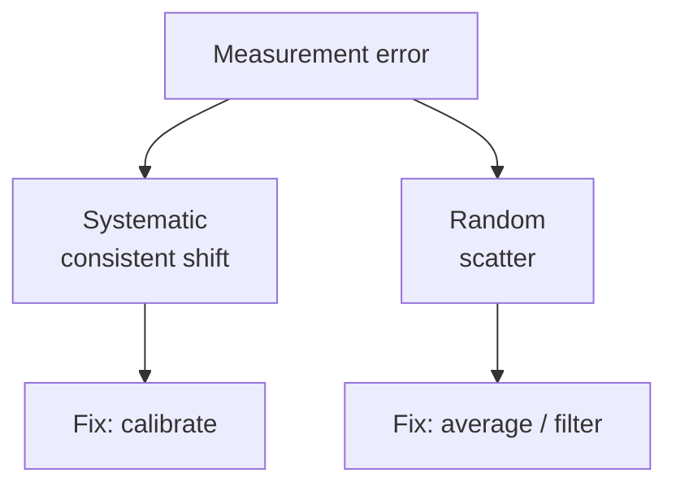

# Lesson 1.4 Measurement Error

## Why this matters

Every sensor is a little wrong. A camera may say a tomato is 1.20 m away when it's 1.23 m — a 3 cm error that can mean grabbing a leaf. The question isn't *whether* there's error, but how much, what kind, and whether the robot can still act well.

## The idea, visually

<figure markdown>
  { width="680" }
</figure>



## Key idea

**Absolute error** = measured − true; **relative error** = that, divided by true. **Systematic** error is a consistent shift (fix by calibration); **random** error is scatter (reduce by averaging).

## Notebook

!!! tip "Run the hands-on notebook"
    `modules/module01/notebooks/lesson04_*.ipynb` — run **Kernel → Restart & Run All**. NumPy + Matplotlib only.

## Knowledge check

Formative — unlimited attempts, immediate feedback; does not affect your grade.

<iframe src="../../quizzes/lesson04_quiz.html" title="1.4 Measurement Error knowledge check" style="width:100%;height:680px;border:1px solid #e2e8f0;border-radius:12px" loading="lazy"></iframe>

## Key takeaways

- **Error = measured − true**, and it's unavoidable.
- **Absolute** (in units) vs **relative** (fraction/percent).
- **Systematic** → calibrate; **random** → average.
- Treat every measurement as an estimate, not ground truth.


## AI Learning Companion

Copy any prompt below into ChatGPT, Claude, or another AI assistant.

**Tutor prompt** — explain it another way

```
Re-explain Lesson 1.4 (Measurement Error). Clarify absolute versus relative error and systematic versus random error, and give the matching fix for each (calibrate versus average).
```

**Practice prompt** — generate more exercises

```
Give me 5 problems computing absolute and relative error, plus 3 scenarios where I must decide whether an error is systematic or random and how to fix it. Include answers.
```

**Explore prompt** — connect it to the real world

```
Show me how real robot sensors (cameras, encoders, lidar) exhibit systematic and random error, and how engineers calibrate and filter them in practice.
```

## Global Learning Support

Need this lesson explained in another language? Copy one of the prompts below into an AI assistant. English remains the authoritative source; these give an AI-generated explanation in your preferred language.

**Supported languages (initial):** English · Español · 中文 (Simplified Chinese) · Türkçe

**Español**

```
I just completed Lesson 1.4 — Measurement Error.
Explain this lesson in Spanish. Keep robotics and mathematical terminology in English when appropriate.
Then provide: a summary, three practice questions, and one challenge problem.
```

**中文 (Simplified Chinese)**

```
I just completed Lesson 1.4 — Measurement Error.
Explain this lesson in Simplified Chinese. Keep mathematical notation unchanged.
Then provide: a summary, three practice questions, and one challenge problem.
```

**Türkçe**

```
I just completed Lesson 1.4 — Measurement Error.
Explain this lesson in Turkish. Keep robotics terminology in English where commonly used.
Then provide: a summary, three practice questions, and one challenge problem.
```


---

*Next: 1.5 — Accuracy and Precision*
