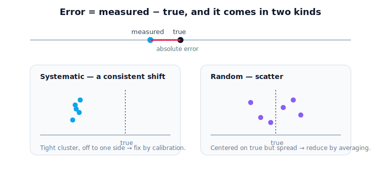
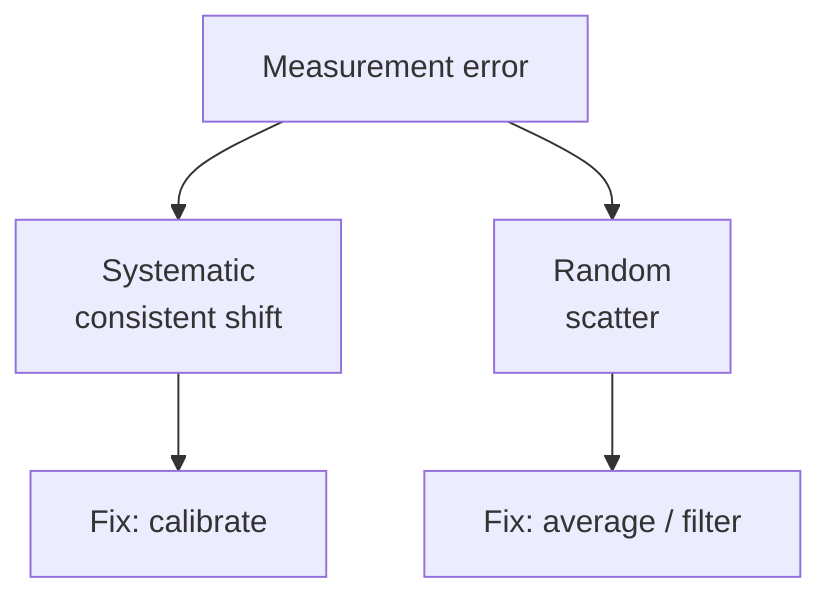

# Lesson 1.4 — Measurement Error

> Every sensor lies a little. A robot that trusts its measurements blindly will reach for where the tomato *seemed* to be — this lesson is about measuring how wrong "seemed" can be.

---

## 1. Why This Matters

The greenhouse robot's camera estimates the tomato is 1.20 m away. The true distance is 1.23 m. That 3 cm gap is **measurement error**, and it is not a defect to be eliminated — it is a permanent feature of operating in the physical world. No sensor is perfect. The question is never "is there error?" but "how much, of what kind, and can the robot still act well despite it?" A gripper aiming for a measured position that's 3 cm off may close on a leaf. Understanding error is the difference between a robot that works in a clean demo and one that works in a real, messy greenhouse.

## 2. Physical Intuition

Measure the same thing twice and you rarely get the identical number. Weigh a basket: 1.50 kg, then 1.51 kg. Read the camera's distance to a still tomato across ten frames: the value jitters by a centimeter or two. The thing didn't change — your *measurement* did. There is a **true value** out there (what you'd get with a perfect instrument) and a **measured value** (what your real instrument reported). The difference between them is the error.

Errors come in two flavors with very different cures. Some errors are **consistent** — the scale always reads 0.2 kg heavy because it wasn't zeroed. Others are **scattered** — random jitter that's sometimes high, sometimes low. The first you can correct by calibration; the second you manage by averaging or filtering.

## 3. Mathematical Foundations

Let $x_\text{true}$ be the true value and $x_\text{meas}$ the measured value.

**Absolute error** is the raw difference (in the quantity's units):
$$ E_\text{abs} = x_\text{meas} - x_\text{true}. $$
Its size is $|E_\text{abs}|$. For the tomato: $|1.20 - 1.23| = 0.03\ \text{m} = 3\ \text{cm}.$

**Relative error** expresses the error as a fraction of the true value, which makes errors at different scales comparable:
$$ E_\text{rel} = \frac{|x_\text{meas} - x_\text{true}|}{|x_\text{true}|}, \qquad \text{often as a percent.} $$
For the tomato: $0.03 / 1.23 \approx 0.024 = 2.4\%.$

**Systematic error** is a consistent offset or scaling in one direction (a mis-zeroed scale, an uncalibrated camera). It shifts every reading the same way and is, in principle, correctable.

**Random error** varies unpredictably between readings (sensor noise, vibration). It can't be removed by a fixed correction, but averaging many readings tends to cancel it, since the highs and lows partly offset.

## 4. Visual Explanation


<figure markdown>
  { width="680" }
</figure>
`[Visual: Number line showing true value, measured value, and the error gap; plus systematic vs random patterns]`

**Rendered asset:** `assets/diagrams/m01-l4-measurement-error.svg` (produced; embedded on the MkDocs page).

The two error types as a quick taxonomy:



**Diagram Specification**
- **Objective:** the viewer sees error as the gap between measured and true, and sees the difference between a consistent shift (systematic) and scatter (random).
- **Scene:** top — a number line with a marker at $x_\text{true}$ and another at $x_\text{meas}$, the gap labeled "error"; bottom — two clusters of repeated readings: one shifted off-true but tight (systematic), one centered on-true but spread (random).
- **Labels:** $x_\text{true}$, $x_\text{meas}$, "absolute error," "systematic (shift)," "random (scatter)."
- **Animation Notes:** repeated readings drop one by one; the systematic cluster lands consistently off to one side, the random cluster scatters around the true mark.

## 5. Engineering Example

The robot's depth camera has both error types. A **systematic** component: it consistently under-reports distance by ~2 cm because of an uncalibrated lens — fixable by a calibration offset (a topic that returns in Module 3). A **random** component: per-frame noise of ±1 cm from lighting and sensor electronics — managed by averaging several frames before committing to a grasp. Knowing which is which tells the engineer what to do: *calibrate the systematic part, filter the random part.* Treating random noise as if it were a fixed offset (or vice versa) wastes effort and leaves the robot missing fruit.

## 6. Worked Example

A joint encoder should read 45.00° but reports 45.30° on a known reference.

1. Absolute error: $E_\text{abs} = 45.30 - 45.00 = 0.30°.$
2. Relative error: $E_\text{rel} = \dfrac{0.30}{45.00} \approx 0.0067 = 0.67\%.$
3. Diagnosis: if the encoder reads 45.30° *every time* on this reference, the 0.30° is **systematic** — apply a −0.30° calibration offset. If it sometimes reads 45.1°, 45.4°, 44.9°, the spread is **random** — average multiple reads instead.

## 7. Interactive Demonstration

*(Conceptual; notebook version later.)* A "measure the tomato" widget: the true distance is fixed but hidden; pressing "measure" returns a noisy reading. The learner takes one reading (sees the error), then takes twenty and watches the running average settle close to the true value — making visible that averaging tames random error but would *not* remove a built-in systematic offset.

## 8. Coding Exercise


!!! tip "Run the hands-on notebook"
    `modules/module01/notebooks/lesson04_measurement_error.ipynb` — open in JupyterLab and run **Kernel → Restart & Run All**.
*(Snippet — full implementation in the notebook track.)*

```python
def absolute_error(measured, true):
    return abs(measured - true)

def relative_error(measured, true):
    return abs(measured - true) / abs(true)

print(absolute_error(1.20, 1.23))          # 0.03
print(relative_error(1.20, 1.23) * 100)    # ~2.44 (%)
```

**Your task:** given three readings of a 1.23 m target — `1.20, 1.25, 1.22` — compute each one's absolute error, then their average. In a comment, say whether averaging would help more against systematic or random error. (Statistics formalism comes later; this is reasoning, not derivation.)

## 9. Knowledge Check


Formative — unlimited attempts, immediate feedback; does not affect your grade.

<iframe src="../../quizzes/lesson04_quiz.html" title="Measurement Error knowledge check" style="width:100%;height:720px;border:1px solid #e2e8f0;border-radius:12px" loading="lazy"></iframe>
1. Define true value, measured value, and absolute error.
2. A reading is 9.8 for a true value of 10.0. Compute the absolute and relative error.
3. Which error type can be fixed by a fixed calibration offset?
4. Which error type does averaging many readings help against, and why?
5. True or false: a good sensor has zero error. Explain.

## 10. Challenge Problem

The greenhouse robot misses ripe tomatoes by grabbing slightly *low* almost every time, but by varying amounts. Decide whether this points to mainly **systematic** error, mainly **random** error, or both, and justify it from the pattern ("almost every time" + "varying amounts"). Then propose one concrete fix for each error component you identify.

## 11. Common Mistakes

- **Confusing absolute and relative error.** A 3 cm error is large for a 5 cm object and tiny for a 100 m distance; relative error captures that, absolute does not.
- **Trying to calibrate away random noise.** A fixed offset can't fix scatter; you need averaging or filtering.
- **Trying to average away a systematic offset.** Averaging a consistently biased reading just gives you the biased value, precisely.
- **Assuming the measured value is the truth.** It's an estimate; the robot should act knowing it could be off.

## 12. Key Takeaways

- **Error = measured − true**, and it is unavoidable in the physical world.
- **Absolute error** is in the quantity's units; **relative error** is a fraction/percent that compares across scales.
- **Systematic** error is a consistent shift — fix it by calibration. **Random** error is scatter — manage it by averaging/filtering.
- The engineer's job is to identify *which kind* and apply the matching remedy.
- A robot should treat every measurement as an estimate with known uncertainty, not as ground truth.


## AI Learning Companion

Copy any prompt below into ChatGPT, Claude, or another AI assistant.

**Tutor prompt** — explain it another way

```
Re-explain Lesson 1.4 (Measurement Error). Clarify absolute versus relative error and systematic versus random error, and give the matching fix for each (calibrate versus average).
```

**Practice prompt** — generate more exercises

```
Give me 5 problems computing absolute and relative error, plus 3 scenarios where I must decide whether an error is systematic or random and how to fix it. Include answers.
```

**Explore prompt** — connect it to the real world

```
Show me how real robot sensors (cameras, encoders, lidar) exhibit systematic and random error, and how engineers calibrate and filter them in practice.
```

## Global Learning Support

Need this lesson explained in another language? Copy one of the prompts below into an AI assistant. English remains the authoritative source; these give an AI-generated explanation in your preferred language.

**Supported languages (initial):** English · Español · 中文 (Simplified Chinese) · Türkçe

**Español**

```
I just completed Lesson 1.4 — Measurement Error.
Explain this lesson in Spanish. Keep robotics and mathematical terminology in English when appropriate.
Then provide: a summary, three practice questions, and one challenge problem.
```

**中文 (Simplified Chinese)**

```
I just completed Lesson 1.4 — Measurement Error.
Explain this lesson in Simplified Chinese. Keep mathematical notation unchanged.
Then provide: a summary, three practice questions, and one challenge problem.
```

**Türkçe**

```
I just completed Lesson 1.4 — Measurement Error.
Explain this lesson in Turkish. Keep robotics terminology in English where commonly used.
Then provide: a summary, three practice questions, and one challenge problem.
```


---

*Next lesson: 1.5 — Accuracy and Precision (two words people use as synonyms that mean very different things).*
