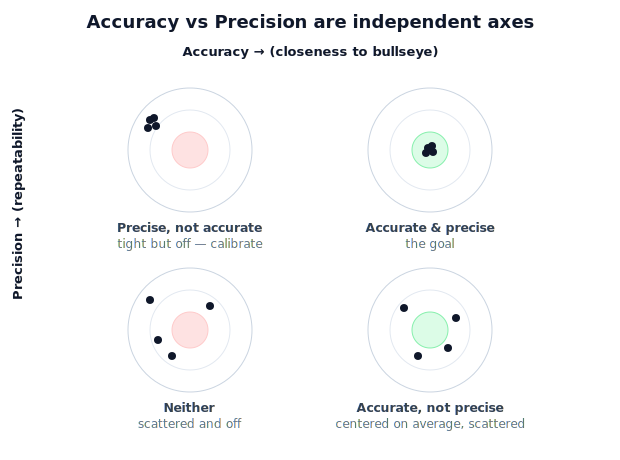

# Lesson 1.5 Accuracy and Precision

## Why this matters

Two grippers miss for opposite reasons: one scatters around the target (imprecise), one lands tightly but consistently 2 cm low (inaccurate). They need opposite fixes. In engineering, accuracy and precision are different axes.

## The idea, visually

<figure markdown>
  { width="680" }
</figure>

## Key idea

**Accuracy** = closeness to the true value (small **systematic** error). **Precision** = repeatability (small **random** error). They're independent — all four combinations exist. Precise-but-inaccurate is the friendly case: calibrate out the bias.

## Interactive demo

Adjust the controls and watch the concept change in real time.

<iframe src="../../demos/lesson05_accuracy_precision.html" title="1.5 Accuracy and Precision interactive demo" style="width:100%;height:430px;border:1px solid #e2e8f0;border-radius:12px" loading="lazy"></iframe>

## Notebook

!!! tip "Run the hands-on notebook"
    `modules/module01/notebooks/lesson05_*.ipynb` — run **Kernel → Restart & Run All**. NumPy + Matplotlib only.

## Knowledge check

Formative — unlimited attempts, immediate feedback; does not affect your grade.

<iframe src="../../quizzes/lesson05_quiz.html" title="1.5 Accuracy and Precision knowledge check" style="width:100%;height:680px;border:1px solid #e2e8f0;border-radius:12px" loading="lazy"></iframe>

## Key takeaways

- **Accuracy** = closeness to true; **precision** = tight clustering.
- Independent axes; all four combinations exist.
- Precise-but-inaccurate → calibrate; scatter → average.
- Robots exploit high precision to compensate for weaker accuracy.


## AI Learning Companion

Copy any prompt below into ChatGPT, Claude, or another AI assistant.

**Tutor prompt** — explain it another way

```
Re-explain Lesson 1.5 (Accuracy and Precision) using the dartboard idea. Stress that they are independent axes, and make clear which problem calibration can fix.
```

**Practice prompt** — generate more exercises

```
Give me 6 dartboard or sensor scenarios and ask me to label each as accurate and/or precise (cover all four combinations), then reveal the answers.
```

**Explore prompt** — connect it to the real world

```
Show me how robot-arm datasheets quote repeatability versus accuracy, and why industrial robots are often taught positions by demonstration.
```

## Global Learning Support

Need this lesson explained in another language? Copy one of the prompts below into an AI assistant. English remains the authoritative source; these give an AI-generated explanation in your preferred language.

**Supported languages (initial):** English · Español · 中文 (Simplified Chinese) · Türkçe

**Español**

```
I just completed Lesson 1.5 — Accuracy and Precision.
Explain this lesson in Spanish. Keep robotics and mathematical terminology in English when appropriate.
Then provide: a summary, three practice questions, and one challenge problem.
```

**中文 (Simplified Chinese)**

```
I just completed Lesson 1.5 — Accuracy and Precision.
Explain this lesson in Simplified Chinese. Keep mathematical notation unchanged.
Then provide: a summary, three practice questions, and one challenge problem.
```

**Türkçe**

```
I just completed Lesson 1.5 — Accuracy and Precision.
Explain this lesson in Turkish. Keep robotics terminology in English where commonly used.
Then provide: a summary, three practice questions, and one challenge problem.
```


---

*Next: 1.6 — Engineering Estimation*
