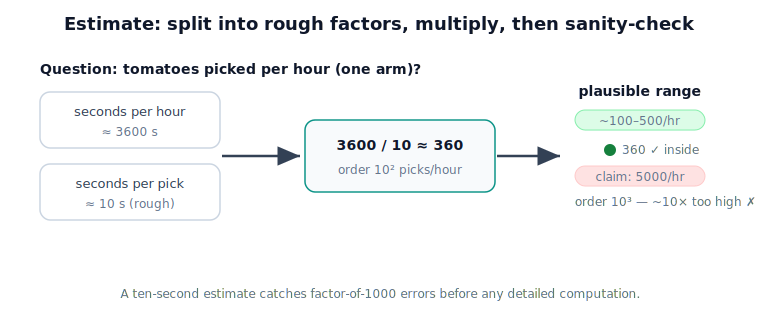

!!! abstract "You are here"
    **Module 1 — Mathematical Foundations**  ·  **Unit 1 — Physical Quantities & Measurement**  ·  **Lesson 1.6 — Engineering Estimation**

# Lesson 1.6 — Engineering Estimation

> Before you compute precisely, compute roughly. A ten-second estimate is the cheapest error-catcher an engineer owns — and it closes Unit 1 by tying measurement sense to judgment.

---

## 1. Why This Matters

Suppose a planner computes that the greenhouse arm must reach 8 meters to grab a tomato. You don't need a detailed model to know that's wrong — the arm is barely a meter long. A quick **estimate** caught a catastrophic error instantly. Engineers estimate constantly: not to replace exact calculation, but to know roughly what answer to expect, so that when the precise computation returns something absurd, they notice. A robot, and the people building it, that never sanity-checks magnitudes will eventually act confidently on a number that's off by a factor of a thousand. Estimation is the habit that prevents it.

## 2. Physical Intuition

Estimation is reasoning to the **order of magnitude** — the rough power of ten — rather than the exact figure. Is the answer about 1, about 10, about 100? Get *that* right and you'll catch the errors that matter most, because the dangerous mistakes in engineering are rarely "off by 3%"; they're "off by 1000×" from a unit slip or a misplaced decimal.

The technique is to break a hard quantity into easier pieces you can guess, then combine them. "How many tomatoes can the robot pick per hour?" feels unanswerable until you split it: how many seconds per pick? how many seconds in an hour? Divide, and you have an estimate good enough to judge whether a design target is plausible.

## 3. Mathematical Foundations

**Order of magnitude** is the nearest power of ten. 1.2 m and 0.8 m are both "order 1 m" (≈$10^0$); 8 m is "order 10 m" (≈$10^1$). Two quantities of different orders differ by roughly a factor of ten or more.

A **Fermi estimate** chains rough factors:
$$ \text{result} \approx (\text{factor}_1)\times(\text{factor}_2)\times\cdots, $$
where each factor is a defensible guess. Because over- and under-guesses partly cancel across factors, the product is usually right to within a factor of a few — plenty to sanity-check.

**Bounding** is the partner skill: instead of one estimate, find a value the answer must be *below* and one it must be *above*. "The arm is between 0.5 m and 1.5 m long" immediately rejects an 8 m reach. Bounds turn a vague intuition into a decisive check.

The mindset throughout: keep one or two significant figures, round aggressively, and never let the estimate masquerade as a precise result.

## 4. Visual Explanation

<figure markdown>
  { width="680" }
</figure>

## 5. Engineering Example

A greenhouse-robot proposal claims it will harvest **5,000 tomatoes per hour** on one arm. Estimate to test it: a careful pick — locate, reach, grip, place — is realistically ~10 seconds. An hour is 3,600 seconds. So one arm manages about $3600 / 10 = 360$ picks per hour, order $10^2$. The claim of 5,000 is order $10^3$ — roughly ten times too high. Without any detailed simulation, estimation says the proposal is implausible for a single arm; it would need ~14 arms, or a pick time under a second (unrealistic). This is how estimation guides design decisions early, before expensive modeling.

## 6. Worked Example

Estimate whether the greenhouse arm's motor, rated for a 5 kg payload, is comfortable picking tomatoes.

1. Mass of a tomato: order 0.1 kg (100 g is a reasonable guess).
2. Add the gripper and a margin: say up to ~0.5 kg total at the end-effector during a pick.
3. Compare to the 5 kg rating: $0.5 / 5 = 0.1$, i.e. using ~10% of capacity.
4. Conclusion: comfortably within rating — order-of-magnitude headroom. No precise dynamics needed to answer "is the motor grossly undersized?" — it isn't.

## 7. Interactive Demonstration

*(Conceptual; notebook version later.)* An "estimate-then-reveal" game: the learner is asked a greenhouse question (e.g. "how many liters of water per day for 200 plants?"), enters factor guesses, and the widget combines them into a ballpark. It then reveals a plausible range; the learner sees whether their estimate landed inside, reinforcing that rough reasoning gets you to the right order of magnitude.

## 8. Coding Exercise

!!! tip "Run the hands-on notebook"
    `modules/module01/notebooks/lesson06_engineering_estimation.ipynb` — open in JupyterLab and run **Kernel → Restart & Run All**.

*(Snippet — full implementation in the notebook track.)*

```python
seconds_per_pick = 10        # rough guess
seconds_per_hour = 3600

picks_per_hour = seconds_per_hour / seconds_per_pick
print(f"~{picks_per_hour:.0f} picks/hour per arm")   # ~360
```

**Your task:** change `seconds_per_pick` to a faster (and slower) guess and observe how the estimate shifts. In a comment, state the order of magnitude of picks-per-hour and whether a 5,000/hour claim is plausible on one arm.

## 9. Knowledge Check

Formative — unlimited attempts, immediate feedback; does not affect your grade.

<iframe src="../../quizzes/module01/lesson06_quiz.html" title="Engineering Estimation knowledge check" style="width:100%;height:720px;border:1px solid #e2e8f0;border-radius:12px"></iframe>

[Open this quiz in a new tab ↗](../quizzes/module01/lesson06_quiz.html)

1. What does "order of magnitude" mean?
2. Why are factor-of-1000 errors more dangerous than factor-of-1.03 errors in engineering?
3. Estimate the number of seconds in a day to one significant figure.
4. A computed arm reach comes out as 12 m. Without a model, why should you distrust it?
5. What is "bounding," and how does it help check an answer?

## 10. Challenge Problem

You're told the greenhouse robot's camera processes the scene at "real-time speed." Using only estimation, decide what frame rate (frames per second) would count as real-time for tracking a slowly moving gripper, and justify your number by reasoning about how far the gripper moves between frames at, say, 0.2 m/s. State your assumptions and give a plausible range rather than a single exact figure.

## 11. Common Mistakes

- **Skipping the sanity check** and trusting a precise-looking number that's wildly wrong.
- **Over-precision in an estimate** — carrying five digits through guesses implies a confidence you don't have. Round hard.
- **Forgetting units while estimating** — the fastest way to land three orders of magnitude off (see Lesson 1.2).
- **Treating the estimate as the final answer.** It's a check and a guide, not a substitute for the real computation when precision is needed.

## 12. Key Takeaways

- **Estimation** reasons to the order of magnitude, fast, to catch gross errors.
- A **Fermi estimate** breaks a hard quantity into rough factors and multiplies; errors largely cancel.
- **Bounding** (a value the answer must be above/below) gives a decisive sanity check.
- The dangerous engineering errors are factor-of-1000 mistakes — estimation is built to catch exactly those.
- This closes Unit 1: the robot's numbers carry **units, error, accuracy/precision, and a plausible magnitude.** Unit 2 now gives the quantities that need *direction* their proper tool — the **vector**.

## AI Learning Companion

Copy any prompt below into ChatGPT, Claude, or another AI assistant.

**Tutor prompt** — explain it another way

```
Re-explain Lesson 1.6 (Engineering Estimation). Show how order-of-magnitude and Fermi estimates catch big errors, using an example that is not the greenhouse robot.
```

**Practice prompt** — generate more exercises

```
Give me 5 Fermi estimation problems relevant to robotics, each with a rough-factor breakdown and a plausible range, then check my answers.
```

**Explore prompt** — connect it to the real world

```
Show me 3 real engineering decisions that were guided by quick estimation before detailed modeling, and what the estimate ruled in or out.
```

## Global Learning Support

Need this lesson explained in another language? Copy one of the prompts below into an AI assistant. English remains the authoritative source; these give an AI-generated explanation in your preferred language.

**Supported languages (initial):** English · Español · 中文 (Simplified Chinese) · Türkçe

**Español**

```
I just completed Lesson 1.6 — Engineering Estimation.
Explain this lesson in Spanish. Keep robotics and mathematical terminology in English when appropriate.
Then provide: a summary, three practice questions, and one challenge problem.
```

**中文 (Simplified Chinese)**

```
I just completed Lesson 1.6 — Engineering Estimation.
Explain this lesson in Simplified Chinese. Keep mathematical notation unchanged.
Then provide: a summary, three practice questions, and one challenge problem.
```

**Türkçe**

```
I just completed Lesson 1.6 — Engineering Estimation.
Explain this lesson in Turkish. Keep robotics terminology in English where commonly used.
Then provide: a summary, three practice questions, and one challenge problem.
```

---

*Next lesson: 2.1 — What Is a Vector? (Unit 2 begins: the quantities one number couldn't hold.)*
