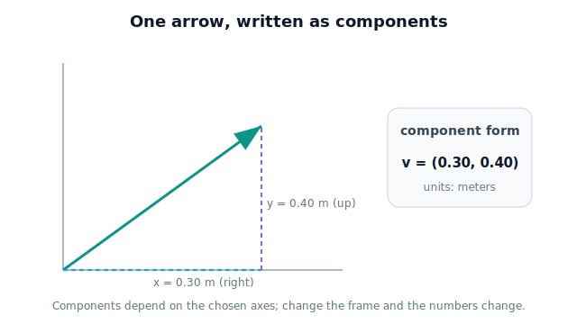

# Lesson 2.2 — Vector Representation

> An arrow is great for intuition, but a robot can't compute with a drawing. This lesson turns the arrow into numbers — components — without losing the geometry.

---

## 1. Why This Matters

The gripper→tomato arrow from Lesson 2.1 lives in a student's imagination. The robot's processor needs it as numbers it can add, scale, and transform millions of times a second. **Components** are how we write a vector as a short list of numbers while keeping every bit of its magnitude-and-direction meaning. Once a vector is components, all the operations in the rest of this unit become simple arithmetic — and all the matrix machinery of Unit 4 becomes possible. Representation is the hinge between the picture and the computation.

## 2. Physical Intuition

Go back to the arrow from the gripper to a tomato: 0.3 m to the right and 0.4 m up. Notice we just described the arrow with **two independent measurements along fixed reference directions** — "right" and "up." That's the whole idea of components: pick reference directions (axes), and report how far the arrow extends along each.

In 2D you need two numbers (right, up). In 3D — the real greenhouse — you need three (right, up, and depth/forward). Each number is a **component**: the vector's "shadow" along one axis. Stack the components and you've captured the arrow completely, because from "0.3 right, 0.4 up" you can redraw exactly the same arrow.

## 3. Mathematical Foundations

Choose axes (for now, a standard right-handed set: $x$ right, $y$ up, $z$ toward the viewer/forward). A vector's **components** are its extents along these axes. We write them as a **column vector**:

$$ \mathbf{v} = \begin{bmatrix} v_x \\ v_y \end{bmatrix} \quad (\text{2D}), \qquad \mathbf{v} = \begin{bmatrix} v_x \\ v_y \\ v_z \end{bmatrix} \quad (\text{3D}). $$

For the gripper→tomato arrow in 2D: $\mathbf{v} = \begin{bmatrix} 0.3 \\ 0.4 \end{bmatrix}$ m.

Conventions worth fixing now, because sloppiness here causes bugs later:
- **Column form** is standard in robotics because matrices (Unit 4) multiply columns on the right.
- **Order matters:** the first entry is always the $x$-component, etc. $\begin{bmatrix}0.3\\0.4\end{bmatrix} \neq \begin{bmatrix}0.4\\0.3\end{bmatrix}$.
- **Components depend on the chosen axes.** The same physical arrow has different components if you choose different axes — the seed of *reference frames* (Unit 3). For now we use one fixed set of axes.

## 4. Visual Explanation

<figure markdown>
  { width="680" }
</figure>

## 5. Engineering Example

Inside the greenhouse robot's software, every position and velocity is stored as a small array of components — typically three numbers for 3D. The camera's estimate of a tomato, the gripper's location, the target approach velocity: all are length-3 arrays in the same chosen axes. Because they share a representation, the robot can combine them with simple array arithmetic (next lessons). This is also why a length-3 array showing up where a length-2 array was expected — or components in the wrong axis order — is a frequent, frustrating robotics bug: the *representation contract* (which axes, what order, what units) must be consistent everywhere.

## 6. Worked Example

A tomato is 0.3 m right, 0.4 m up, and 0.6 m forward of the gripper. Write its displacement vector and confirm the components are interpretable.

1. Assign by axis: $v_x = 0.3$ (right), $v_y = 0.4$ (up), $v_z = 0.6$ (forward).
2. Column form: $\mathbf{v} = \begin{bmatrix} 0.3 \\ 0.4 \\ 0.6 \end{bmatrix}$ m.
3. Read it back: positive $x$ = right, positive $y$ = up, positive $z$ = forward — so the tomato is up-right-and-ahead, which matches the description. The representation is faithful.

## 7. Interactive Demonstration

*(Conceptual; notebook version later.)* A 2D grid where the learner drags an arrowhead; the panel live-updates the column vector $[v_x, v_y]$ and draws the dashed projection lines to each axis. A toggle adds a third axis to show how the same idea extends to 3D. Dragging straight up changes only $v_y$, reinforcing that each component is independent.

## 8. Coding Exercise

!!! tip "Run the hands-on notebook"
    `modules/module01/notebooks/lesson08_vector_representation.ipynb` — open in JupyterLab and run **Kernel → Restart & Run All**.
*(Snippet — full implementation in the notebook track; NumPy formalized in Unit 8.)*

```python
# Represent vectors as lists of components (x, y, z), in meters.
gripper_to_tomato = [0.3, 0.4, 0.6]

vx, vy, vz = gripper_to_tomato
print(f"x={vx} (right), y={vy} (up), z={vz} (forward)")
```

**Your task:** create a second vector for a tomato that is 0.5 m left, 0.1 m down, and 0.2 m forward (mind the signs), then print each labeled component. Confirm that swapping two components would describe a *different* arrow.

## 9. Knowledge Check

Formative — unlimited attempts, immediate feedback; does not affect your grade.

<iframe src="../../quizzes/lesson08_quiz.html" title="Vector Representation knowledge check" style="width:100%;height:720px;border:1px solid #e2e8f0;border-radius:12px" loading="lazy"></iframe>
1. How many components does a 3D vector have, and what does each represent?
2. Write the column vector for "0.2 m right, 0.5 m up."
3. Why does component order matter?
4. The same physical arrow can have different components. What determines them?
5. Why is consistent representation (axes, order, units) important across robot subsystems?

## 10. Challenge Problem

Two engineers store the greenhouse robot's vectors differently: one uses $(x=\text{right},\ y=\text{up},\ z=\text{forward})$, the other uses $(x=\text{forward},\ y=\text{right},\ z=\text{up})$. Both write the *same* tomato as a length-3 array, but the arrays differ. Explain why both can be "correct," what goes wrong when their code exchanges arrays without agreeing on axes, and how this previews the need for reference frames in Unit 3.

## 11. Common Mistakes

- **Scrambling component order.** $[v_x, v_y, v_z]$ is a contract; reorder it and the arrow changes.
- **Mixing 2D and 3D vectors** in the same calculation. Keep dimensionality consistent.
- **Forgetting components are axis-dependent.** "The components" only make sense once axes are fixed.
- **Dropping units.** Components are numbers *with units* (Lesson 1.2); 0.3 m and 0.3 mm are very different arrows.

## 12. Key Takeaways

- A vector's **components** are its extents along chosen axes; an ordered list of them captures the arrow completely.
- **2D needs two components, 3D needs three**, written as a column vector.
- **Order and axes are part of the meaning** — fix them and keep them consistent everywhere.
- Components turn geometry into arithmetic, enabling every operation in this unit and the matrices of Unit 4.
- Axis-dependence of components is the first hint of **reference frames** (Unit 3).

## AI Learning Companion

Copy any prompt below into ChatGPT, Claude, or another AI assistant.

**Tutor prompt** — explain it another way
```
Re-explain Lesson 2.2 (Vector Representation). Show how the same arrow becomes a list of components along axes, and why the choice of axes matters.
```

**Practice prompt** — generate more exercises
```
Give me 6 problems converting between an arrow description and component form in 2D and 3D, with answers.
```

**Explore prompt** — connect it to the real world
```
Show me how a robot stores positions as component vectors and why a consistent coordinate frame is essential.
```

## Global Learning Support

Need this lesson explained in another language? Copy one of the prompts below into an AI assistant. English remains the authoritative source.

**Supported languages (initial):** English · Español · 中文 (Simplified Chinese) · Türkçe

**Español**
```
I just completed Lesson 2.2 — Vector Representation.
Explain this lesson in Spanish. Keep robotics and mathematical terminology in English when appropriate.
Then provide: a summary, three practice questions, and one challenge problem.
```

**中文 (Simplified Chinese)**
```
I just completed Lesson 2.2 — Vector Representation.
Explain this lesson in Simplified Chinese. Keep mathematical notation unchanged.
Then provide: a summary, three practice questions, and one challenge problem.
```

**Türkçe**
```
I just completed Lesson 2.2 — Vector Representation.
Explain this lesson in Turkish. Keep robotics terminology in English where commonly used.
Then provide: a summary, three practice questions, and one challenge problem.
```

---

*Next lesson: 2.3 — Vector Addition (combining arrows, the way the robot chains its links).*
