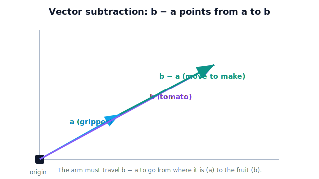

# Lesson 2.4 — Vector Subtraction

> "Where do I aim?" The arrow from the gripper to the fruit is the single most-used vector in the whole robot — and it's a subtraction.

---

## 1. Why This Matters

The greenhouse robot knows two positions: where its gripper is, and where the tomato is (both as position vectors from some origin). What it actually needs to *act* is the arrow **from the gripper to the tomato** — the direction and distance to move. That arrow is the tomato's position **minus** the gripper's position. Vector subtraction is how a robot converts "I know where two things are" into "here's how to get from one to the other." It appears every time the robot computes an error to correct, a direction to approach, or a relative position between parts — which is constantly.

## 2. Physical Intuition

Subtraction answers: *"to get from A to B, what's the move?"* If A is the gripper and B is the tomato, the move is "from A to B," and it equals B's position minus A's position.

A clean way to feel it: $\mathbf{a} - \mathbf{b}$ is the same as $\mathbf{a} + (-\mathbf{b})$, where $-\mathbf{b}$ is just $\mathbf{b}$ reversed (same length, opposite direction). So subtracting is adding the flipped arrow. Geometrically, the difference $\mathbf{b} - \mathbf{a}$ is the arrow that points **from the tip of $\mathbf{a}$ to the tip of $\mathbf{b}$** — exactly "from A to B."

## 3. Mathematical Foundations

**By components — subtract matching entries:**
$$ \mathbf{b} - \mathbf{a} = \begin{bmatrix} b_x - a_x \\ b_y - a_y \\ b_z - a_z \end{bmatrix}. $$

**The key robotics formula — displacement from point A to point B:**
$$ \mathbf{d}_{A\to B} = \mathbf{r}_B - \mathbf{r}_A, $$
where $\mathbf{r}_A, \mathbf{r}_B$ are the position vectors of A and B. Read it as **"target minus source."** This single relation is used everywhere: the aiming vector (fruit minus gripper), a tracking error (desired minus actual), the edge between two joints (one joint minus the previous).

**Negation:** $-\mathbf{b}$ has the same magnitude as $\mathbf{b}$ but points the opposite way; $\mathbf{a} - \mathbf{b} = \mathbf{a} + (-\mathbf{b})$.

Watch the order: $\mathbf{b} - \mathbf{a}$ points from A to B, while $\mathbf{a} - \mathbf{b}$ points from B to A — same length, opposite direction. Getting this backwards aims the robot the wrong way.

## 4. Visual Explanation

<figure markdown>
  { width="680" }
</figure>

## 5. Engineering Example

A position controller is, at heart, a subtraction. The greenhouse arm has a **desired** gripper position and an **actual** one; the controller computes the **error vector** = desired − actual, then drives the motors to shrink it toward zero. The aiming vector to a tomato is the same idea (tomato − gripper). Even multi-part reasoning uses it: "where is the wrist relative to the elbow?" is wrist-position − elbow-position. Subtraction is the operation that turns absolute positions into the *relative* quantities a robot acts on.

## 6. Worked Example

The gripper is at $\mathbf{r}_g = \begin{bmatrix} 0.2 \\ 0.5 \\ 0.3 \end{bmatrix}$ m and a tomato is at $\mathbf{r}_t = \begin{bmatrix} 0.5 \\ 0.9 \\ 0.4 \end{bmatrix}$ m (same origin/axes). Find the aiming vector from gripper to tomato.

1. Target minus source: $\mathbf{d} = \mathbf{r}_t - \mathbf{r}_g = \begin{bmatrix} 0.5 - 0.2 \\ 0.9 - 0.5 \\ 0.4 - 0.3 \end{bmatrix} = \begin{bmatrix} 0.3 \\ 0.4 \\ 0.1 \end{bmatrix}$ m.
2. Interpret: move 0.3 m right, 0.4 m up, 0.1 m forward to reach the tomato.
3. Order check: the reverse $\mathbf{r}_g - \mathbf{r}_t = \begin{bmatrix} -0.3 \\ -0.4 \\ -0.1 \end{bmatrix}$ would point from tomato back to gripper — wrong direction to aim. (How *far* to move — the magnitude — is Lesson 2.5.)

## 7. Interactive Demonstration

*(Conceptual; notebook version later.)* Two draggable points, "gripper" and "tomato," each with a position vector from the origin. The demo draws the aiming vector tomato − gripper between them and shows its components. A "reverse" toggle swaps the subtraction order and flips the arrow, hammering home that order sets direction. Dragging the points changes the aiming vector live.

## 8. Coding Exercise

!!! tip "Run the hands-on notebook"
    `modules/module01/notebooks/lesson10_vector_subtraction.ipynb` — open in JupyterLab and run **Kernel → Restart & Run All**.

*(Snippet — full implementation in the notebook track.)*

```python
def subtract(b, a):                 # returns vector from a to b
    return [b[i] - a[i] for i in range(len(a))]

gripper = [0.2, 0.5, 0.3]
tomato  = [0.5, 0.9, 0.4]
aim = subtract(tomato, gripper)     # target minus source
print(f"Aim (gripper→tomato): {aim} m")   # [0.3, 0.4, 0.1]
```

**Your task:** compute the reverse vector `subtract(gripper, tomato)` and confirm every component is negated. In a comment, state which of the two vectors the robot should follow to reach the tomato, and why.

## 9. Knowledge Check

Formative — unlimited attempts, immediate feedback; does not affect your grade.

<iframe src="../../quizzes/module01/lesson10_quiz.html" title="Vector Subtraction knowledge check" style="width:100%;height:720px;border:1px solid #e2e8f0;border-radius:12px"></iframe>

[Open this quiz in a new tab ↗](../quizzes/module01/lesson10_quiz.html)

1. Write the formula for the displacement from point A to point B.
2. Subtract $\begin{bmatrix}5\\2\end{bmatrix} - \begin{bmatrix}1\\3\end{bmatrix}$.
3. What is $-\mathbf{b}$ relative to $\mathbf{b}$?
4. Does $\mathbf{b}-\mathbf{a}$ point from A to B or B to A?
5. Why is subtraction central to a position controller?

## 10. Challenge Problem

A two-camera greenhouse setup reports the *same* tomato as $\mathbf{r}_1$ from camera 1's origin and $\mathbf{r}_2$ from camera 2's origin. The cameras are at known positions $\mathbf{c}_1$ and $\mathbf{c}_2$ in a shared world frame. Using only addition and subtraction, write expressions for the tomato's position in the world frame as seen by each camera, and explain what must be true for the two results to agree. (This is a preview of why consistent frames — Unit 3 — matter.)

## 11. Common Mistakes

- **Reversing the order.** Target − source, not source − target; the wrong order aims the robot backwards.
- **Subtracting points from different frames/origins.** The formula assumes both positions share an origin and axes (Unit 3 makes this explicit).
- **Confusing the difference vector's *direction* with *distance*.** Subtraction gives the arrow; its length (how far) is Lesson 2.5.
- **Sign slips in components.** A single wrong sign sends one axis the wrong way.

## 12. Key Takeaways

- **Subtract component-wise**; $\mathbf{a}-\mathbf{b} = \mathbf{a} + (-\mathbf{b})$.
- The workhorse formula: **displacement A→B = position_B − position_A** ("target minus source").
- This yields the **aiming vector** (fruit − gripper) and the **error vector** (desired − actual).
- **Order sets direction** — reversing it flips the arrow.
- Subtraction converts absolute positions into the relative quantities robots act on.

## AI Learning Companion

Copy any prompt below into ChatGPT, Claude, or another AI assistant.

**Tutor prompt** — explain it another way
```
Re-explain Lesson 2.4 (Vector Subtraction). Make clear that b minus a is the vector pointing from a to b, with a concrete example.
```

**Practice prompt** — generate more exercises
```
Give me 6 problems computing b minus a and interpreting its direction, with answers.
```

**Explore prompt** — connect it to the real world
```
Show me how a robot uses vector subtraction to compute the move from where the gripper is to where the tomato is.
```

## Global Learning Support

Need this lesson explained in another language? Copy one of the prompts below into an AI assistant. English remains the authoritative source.

**Supported languages (initial):** English · Español · 中文 (Simplified Chinese) · Türkçe

**Español**
```
I just completed Lesson 2.4 — Vector Subtraction.
Explain this lesson in Spanish. Keep robotics and mathematical terminology in English when appropriate.
Then provide: a summary, three practice questions, and one challenge problem.
```

**中文 (Simplified Chinese)**
```
I just completed Lesson 2.4 — Vector Subtraction.
Explain this lesson in Simplified Chinese. Keep mathematical notation unchanged.
Then provide: a summary, three practice questions, and one challenge problem.
```

**Türkçe**
```
I just completed Lesson 2.4 — Vector Subtraction.
Explain this lesson in Turkish. Keep robotics terminology in English where commonly used.
Then provide: a summary, three practice questions, and one challenge problem.
```

---

*Next lesson: 2.5 — Magnitude and Direction (how *far* and how to say *which way* with numbers).*
