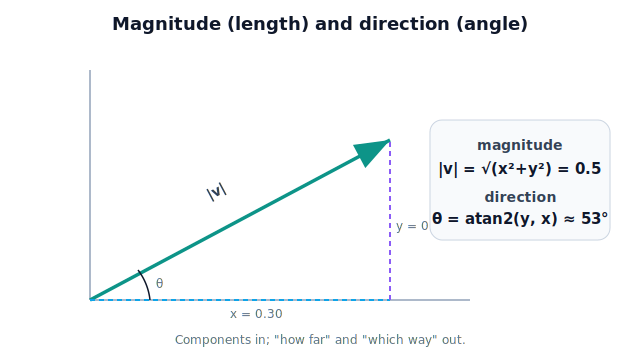

!!! abstract "You are here"
    **Module 1 — Mathematical Foundations**  ·  **Unit 2 — Vectors**  ·  **Lesson 2.5 — Magnitude and Direction**

# Lesson 2.5 — Magnitude and Direction

> A vector bundles "how far" and "which way." This lesson extracts each as a number: magnitude for distance, direction for heading.

---

## 1. Why This Matters

The aiming vector from Lesson 2.4 tells the greenhouse robot which way to move — but two more questions decide whether it *can*: how far is the tomato, and is that within reach? The **magnitude** of a vector is its length, and length is distance. The robot uses it constantly: distance to a target, the size of a tracking error, the speed implied by a velocity vector. **Direction**, the other half, is what the robot turns toward. Splitting a vector into magnitude and direction lets the robot answer "is it reachable?" (magnitude) and "where do I point?" (direction) separately — and it sets up unit vectors (2.6) and the dot product (2.7).

## 2. Physical Intuition

Picture the gripper→tomato arrow again. Its **length** is the straight-line distance you'd travel to reach the tomato — and that comes straight from the Pythagorean theorem applied to the components. In 2D, an arrow that goes 3 right and 4 up has length 5 (the 3-4-5 triangle). In 3D you add the third component the same way.

**Direction** is "which way the arrow points." You can express it as the set of components themselves (after stripping out length — that's the unit vector, next lesson) or, in 2D, as an **angle** from a reference axis. Magnitude is a single non-negative number; direction is what's left once you ignore length.

## 3. Mathematical Foundations

The **magnitude** (or **norm**, or **length**) of a vector uses the Pythagorean theorem in each added dimension:

$$ \|\mathbf{v}\| = \sqrt{v_x^2 + v_y^2} \quad (\text{2D}), \qquad \|\mathbf{v}\| = \sqrt{v_x^2 + v_y^2 + v_z^2} \quad (\text{3D}). $$

It is always $\ge 0$, and it's $0$ only for the zero vector. Its units are the components' units (meters in, meters out).

Crucially, combined with Lesson 2.4, the **distance between two points** is the magnitude of their difference:
$$ \text{distance}(A, B) = \|\mathbf{r}_B - \mathbf{r}_A\|. $$
(We make this its own lesson, 2.9, because it's so heavily used.)

**Direction** in 2D can be given as an angle from the $+x$-axis:
$$ \theta = \operatorname{atan2}(v_y, v_x), $$
where `atan2` is the two-argument arctangent that returns the correct angle in all four quadrants (a function you'll meet again in trigonometry, Unit 6). In 3D, direction is usually carried as the unit vector (Lesson 2.6) rather than a single angle.

## 4. Visual Explanation

<figure markdown>
  { width="680" }
</figure>

## 5. Engineering Example

Before the greenhouse arm commits to a grasp, it computes the magnitude of the aiming vector — the distance to the tomato — and compares it to the arm's reach. If the distance exceeds the maximum reach, the tomato is **unreachable** from the current base position, and the robot must reposition or skip it. The direction, meanwhile, feeds the approach: the controller turns the gripper to point along the aiming vector. Magnitude gates the decision (can I?), direction guides the motion (which way?). This split — feasibility vs heading — recurs throughout motion planning (Module 7).

## 6. Worked Example

The aiming vector to a tomato is $\mathbf{d} = \begin{bmatrix} 0.3 \\ 0.4 \\ 0.1 \end{bmatrix}$ m (from Lesson 2.4). Find the distance to the tomato, and check reach against a 0.7 m arm.

1. Magnitude: $\|\mathbf{d}\| = \sqrt{0.3^2 + 0.4^2 + 0.1^2} = \sqrt{0.09 + 0.16 + 0.01} = \sqrt{0.26} \approx 0.51$ m.
2. Reachability: $0.51\ \text{m} < 0.7\ \text{m}$ → within reach. The robot can attempt the grasp.
3. Direction is carried by the components (or, after Lesson 2.6, by the unit vector $\mathbf{d}/\|\mathbf{d}\|$).

## 7. Interactive Demonstration

<iframe src="../../demos/module01/lesson11_magnitude_direction.html" title="Magnitude and Direction interactive demo" style="width:100%;height:520px;border:1px solid #e2e8f0;border-radius:12px"></iframe>

[Open this demo in a new tab ↗](../demos/module01/lesson11_magnitude_direction.html)

A draggable arrow with a live readout of its magnitude and its angle (2D). A circle of radius = "arm reach" is drawn; when the arrowhead is inside the circle, a green "reachable" badge shows; outside, red "out of reach." Rotating the arrow at fixed length keeps the magnitude constant while the angle changes — reinforcing the magnitude/direction split.

## 8. Coding Exercise

!!! tip "Run the hands-on notebook"
    `modules/module01/notebooks/M01_U02_L2_5_Magnitude_And_Direction.ipynb` — open in JupyterLab and run **Kernel → Restart & Run All**.

```python
import math

def magnitude(v):
    return math.sqrt(sum(c*c for c in v))

aim = [0.3, 0.4, 0.1]
dist = magnitude(aim)
reach = 0.7
print(f"distance = {dist:.2f} m -> {'reachable' if dist <= reach else 'too far'}")
```

**Your task:** compute the magnitude of `[0.3, 0.4]` (expect 0.5) and of a vector you choose that should be *out of reach* for the 0.7 m arm. Confirm the reachability message flips.

## 9. Knowledge Check

Formative — unlimited attempts, immediate feedback; does not affect your grade.

<iframe src="../../quizzes/module01/lesson11_quiz.html" title="Magnitude and Direction knowledge check" style="width:100%;height:720px;border:1px solid #e2e8f0;border-radius:12px"></iframe>

[Open this quiz in a new tab ↗](../quizzes/module01/lesson11_quiz.html)

1. Write the magnitude formula for a 3D vector.
2. Compute $\left\|\begin{bmatrix}6\\8\end{bmatrix}\right\|$.
3. What does the magnitude of an aiming vector physically represent?
4. Can a magnitude be negative? Why or why not?
5. How does the robot use magnitude to decide reachability?

## 10. Challenge Problem

Two tomatoes have aiming vectors $\begin{bmatrix}0.5\\0.0\\0.0\end{bmatrix}$ and $\begin{bmatrix}0.3\\0.3\\0.2\end{bmatrix}$ m. Without a calculator, reason about which is farther, then verify with the magnitude formula. Next, suppose the arm's reach is 0.45 m: state which tomatoes are reachable, and explain why direction is irrelevant to the reachability decision but essential once the arm starts moving.

## 11. Common Mistakes

- **Forgetting to square *and* root.** Magnitude is $\sqrt{\sum v_i^2}$, not $\sum |v_i|$ (that would be a different, "taxicab" length).
- **Adding magnitudes of separate vectors** as if distance were additive along axes — it isn't (3 and 4 give 5, not 7).
- **Using `atan` instead of `atan2`,** which loses quadrant information and points the robot the wrong way.
- **Treating magnitude as having direction.** It's a non-negative scalar; direction is the separate half.

## 12. Key Takeaways

- **Magnitude** $\|\mathbf{v}\| = \sqrt{\sum v_i^2}$ is the vector's length — a non-negative scalar in the components' units.
- **Distance between points** = magnitude of their difference (formalized in 2.9).
- **Direction** is the heading, expressible as components, a unit vector (2.6), or an angle via `atan2`.
- Magnitude answers **"is it reachable?"**; direction answers **"which way?"**
- Splitting a vector into magnitude and direction lets the robot reason about feasibility and heading separately.

## AI Learning Companion

Copy any prompt below into ChatGPT, Claude, or another AI assistant.

**Tutor prompt** — explain it another way
```
Re-explain Lesson 2.5 (Magnitude and Direction). Connect magnitude to Pythagorean length and direction to an angle, with an example.
```

**Practice prompt** — generate more exercises
```
Give me 6 problems computing a vector's magnitude and direction angle from its components, with answers.
```

**Explore prompt** — connect it to the real world
```
Show me how a robot uses magnitude (how far) and direction (which way) separately when planning a reach.
```

## Global Learning Support

Need this lesson explained in another language? Copy one of the prompts below into an AI assistant. English remains the authoritative source.

**Supported languages (initial):** English · Español · 中文 (Simplified Chinese) · Türkçe

**Español**
```
I just completed Lesson 2.5 — Magnitude and Direction.
Explain this lesson in Spanish. Keep robotics and mathematical terminology in English when appropriate.
Then provide: a summary, three practice questions, and one challenge problem.
```

**中文 (Simplified Chinese)**
```
I just completed Lesson 2.5 — Magnitude and Direction.
Explain this lesson in Simplified Chinese. Keep mathematical notation unchanged.
Then provide: a summary, three practice questions, and one challenge problem.
```

**Türkçe**
```
I just completed Lesson 2.5 — Magnitude and Direction.
Explain this lesson in Turkish. Keep robotics terminology in English where commonly used.
Then provide: a summary, three practice questions, and one challenge problem.
```

---

*Next lesson: 2.6 — Unit Vectors (pure direction, length stripped away).*
