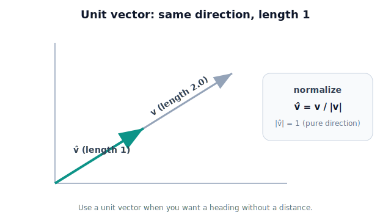

# Lesson 2.6 — Unit Vectors

> Sometimes the robot needs only the *direction* — "which way," with the "how far" set aside. A unit vector is pure direction: length exactly 1.

---

## 1. Why This Matters

When the greenhouse arm approaches a tomato, the controller often wants to move *a small, fixed step* toward it each cycle — not the whole distance at once. To do that it needs the **direction** to the tomato, separated from the distance. A **unit vector** is exactly that: an arrow of length 1 that carries direction only. Multiply it by any distance and you get "that far, in that direction." Unit vectors let a robot specify headings, build motions of controlled size, and define the axes of reference frames (Unit 3). They're also the backbone of the dot product (2.7). Stripping magnitude from direction is a small idea with enormous reach.

## 2. Physical Intuition

Take the gripper→tomato arrow. It has a length (say 0.5 m) and a direction. If you shrink it — keeping its direction but rescaling it to length 1 — you get a little arrow pointing the same way. That little arrow is the **unit vector** for that direction. It answers "which way?" with no opinion about "how far."

Why bother? Because "which way" and "how far" are often decided separately. The direction comes from where the tomato is; the step size comes from how cautiously the robot wants to move. A unit vector holds the first so you can choose the second freely: `step = step_size × direction`.

## 3. Mathematical Foundations

A **unit vector** has magnitude 1: $\|\hat{\mathbf{u}}\| = 1$. The hat ($\hat{\ }$) marks it as a unit vector.

To **normalize** any nonzero vector (turn it into a unit vector pointing the same way), divide by its magnitude:
$$ \hat{\mathbf{v}} = \frac{\mathbf{v}}{\|\mathbf{v}\|}. $$
This rescales the length to 1 without changing direction. (It fails for the zero vector — there's no direction to keep.)

To rebuild a full vector from a direction and a distance, multiply back:
$$ \mathbf{v} = \|\mathbf{v}\|\,\hat{\mathbf{v}}, \qquad \text{or generally} \quad \text{(distance)} \times \hat{\mathbf{v}}. $$

The **standard basis vectors** are the unit vectors along the axes:
$$ \hat{\mathbf{i}} = \begin{bmatrix}1\\0\\0\end{bmatrix},\quad \hat{\mathbf{j}} = \begin{bmatrix}0\\1\\0\end{bmatrix},\quad \hat{\mathbf{k}} = \begin{bmatrix}0\\0\\1\end{bmatrix}. $$
Any vector is a sum of scaled basis vectors: $\mathbf{v} = v_x\hat{\mathbf{i}} + v_y\hat{\mathbf{j}} + v_z\hat{\mathbf{k}}$ — which is just the components again, viewed as "how much along each axis-direction."

## 4. Visual Explanation

<figure markdown>
  { width="680" }
</figure>

## 5. Engineering Example

A greenhouse arm's approach controller computes the aiming vector to the tomato, normalizes it to a unit vector (pure heading), then commands a step of fixed size each control cycle: `move = 0.02 m × heading`. As the gripper closes in, the heading is recomputed (the direction shifts slightly), but the step size stays controlled — giving a smooth, safe approach instead of one giant lunge. Unit vectors also define the **axes of a coordinate frame** (Unit 3): each axis is a unit vector, and together they orient the frame in space.

## 6. Worked Example

Normalize the aiming vector $\mathbf{d} = \begin{bmatrix} 0.3 \\ 0.4 \\ 0.0 \end{bmatrix}$ m and build a 2 cm step toward the tomato.

1. Magnitude: $\|\mathbf{d}\| = \sqrt{0.3^2 + 0.4^2 + 0} = 0.5$ m.
2. Normalize: $\hat{\mathbf{d}} = \dfrac{1}{0.5}\begin{bmatrix}0.3\\0.4\\0.0\end{bmatrix} = \begin{bmatrix}0.6\\0.8\\0.0\end{bmatrix}$. Check: $\sqrt{0.6^2+0.8^2}=1$. ✓
3. A 2 cm step: $0.02 \times \hat{\mathbf{d}} = \begin{bmatrix}0.012\\0.016\\0.0\end{bmatrix}$ m — a small move in the tomato's direction.

## 7. Interactive Demonstration

*(Conceptual; notebook version later.)* A draggable aiming arrow shown alongside its normalized version (always length 1) on the same line. A "step size" slider multiplies the unit vector to produce a step arrow; the learner sees that changing step size rescales the move while the direction (the unit vector) stays put unless the target moves.

## 8. Coding Exercise

!!! tip "Run the hands-on notebook"
    `modules/module01/notebooks/lesson12_unit_vectors.ipynb` — open in JupyterLab and run **Kernel → Restart & Run All**.
*(Snippet — full implementation in the notebook track.)*

```python
import math

def normalize(v):
    m = math.sqrt(sum(c*c for c in v))
    return [c / m for c in v]        # assumes v is not the zero vector

d = [0.3, 0.4, 0.0]
heading = normalize(d)
step = [0.02 * c for c in heading]
print("heading:", [round(c, 3) for c in heading])   # ~[0.6, 0.8, 0.0]
print("2 cm step:", [round(c, 4) for c in step])
```

**Your task:** verify the heading has magnitude 1 (compute it). Then explain in a comment why `normalize` must guard against the zero vector.

## 9. Knowledge Check

Formative — unlimited attempts, immediate feedback; does not affect your grade.

<iframe src="../../quizzes/lesson12_quiz.html" title="Unit Vectors knowledge check" style="width:100%;height:720px;border:1px solid #e2e8f0;border-radius:12px" loading="lazy"></iframe>
1. What is the magnitude of a unit vector?
2. How do you normalize a vector?
3. Write the three standard basis vectors in 3D.
4. How do you turn a unit vector and a distance into a full displacement?
5. Why does normalization fail for the zero vector?

## 10. Challenge Problem

A robot must move toward a target but never faster than 0.1 m per cycle. It computes a raw aiming vector each cycle whose magnitude varies (far at first, small near the end). Design — in words and a little math — a rule using normalization that moves at the **full 0.1 m** when far away but **slows down** as it gets within 0.1 m of the target (so it doesn't overshoot). Explain how unit vectors make "direction" and "speed" independent here.

## 11. Common Mistakes

- **Forgetting to divide by the magnitude** — leaving a vector that isn't actually length 1.
- **Normalizing the zero vector** — undefined; always guard against it.
- **Assuming normalization changes direction** — it doesn't; it only rescales length.
- **Confusing a unit vector with a component.** A component is a number; a unit vector is a length-1 arrow (the basis vectors are special unit vectors).

## 12. Key Takeaways

- A **unit vector** has length 1 and carries **direction only**.
- **Normalize** by dividing a vector by its magnitude: $\hat{\mathbf{v}} = \mathbf{v}/\|\mathbf{v}\|$ (not for the zero vector).
- Rebuild a displacement as **distance × unit vector**, separating "how far" from "which way."
- The **standard basis vectors** î, ĵ, k̂ are the unit vectors along the axes; components are amounts along them.
- Unit vectors define headings, controlled steps, and the **axes of coordinate frames** (Unit 3).

## AI Learning Companion

Copy any prompt below into ChatGPT, Claude, or another AI assistant.

**Tutor prompt** — explain it another way
```
Re-explain Lesson 2.6 (Unit Vectors). Explain why dividing a vector by its length keeps only direction, with an example.
```

**Practice prompt** — generate more exercises
```
Give me 6 problems normalizing vectors to unit length and using unit vectors as directions, with answers.
```

**Explore prompt** — connect it to the real world
```
Show me where unit vectors appear in robotics (pointing directions, axes, surface normals) and why length one matters.
```

## Global Learning Support

Need this lesson explained in another language? Copy one of the prompts below into an AI assistant. English remains the authoritative source.

**Supported languages (initial):** English · Español · 中文 (Simplified Chinese) · Türkçe

**Español**
```
I just completed Lesson 2.6 — Unit Vectors.
Explain this lesson in Spanish. Keep robotics and mathematical terminology in English when appropriate.
Then provide: a summary, three practice questions, and one challenge problem.
```

**中文 (Simplified Chinese)**
```
I just completed Lesson 2.6 — Unit Vectors.
Explain this lesson in Simplified Chinese. Keep mathematical notation unchanged.
Then provide: a summary, three practice questions, and one challenge problem.
```

**Türkçe**
```
I just completed Lesson 2.6 — Unit Vectors.
Explain this lesson in Turkish. Keep robotics terminology in English where commonly used.
Then provide: a summary, three practice questions, and one challenge problem.
```

---

*Next lesson: 2.7 — Dot Product (measuring how much two vectors agree in direction).*
