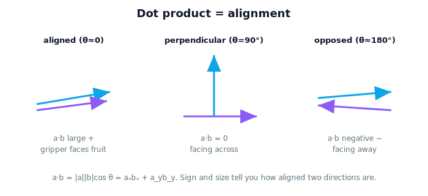

# Lesson 2.7 — Dot Product

> The dot product answers "how much do these two vectors point the same way?" — alignment as a single number. It's the first operation that turns two vectors into a scalar with deep meaning.

---

## 1. Why This Matters

The greenhouse gripper has an approach direction; the tomato has a direction from the gripper. Are they aligned? If the gripper points straight at the fruit, good; if it's 90° off, it'll swipe past. The **dot product** measures exactly this alignment, and it does far more: it computes the angle between two vectors, tests whether they're perpendicular, and projects one vector onto another. These show up everywhere in robotics — checking whether a sensor is facing a target, decomposing a force into useful and wasted parts, and (critically) defining the **orthogonal axes** of the coordinate frames in Unit 3. The dot product is the workhorse that converts geometric relationships into numbers a robot can act on.

## 2. Physical Intuition

Two arrows can point the same way, opposite ways, or somewhere between. The dot product captures "how much they agree":

- Pointing the **same** direction → large positive value.
- **Perpendicular** (90°) → exactly zero. (This is the property to remember.)
- Pointing **opposite** ways → negative.

So the *sign* alone tells you a lot: positive means "generally same direction," zero means "at right angles," negative means "generally opposing." Picture pushing a cart: push along its direction of travel and all your effort helps (high dot product); push sideways and none of it moves the cart forward (zero); push backward and you fight it (negative). The dot product quantifies that.

## 3. Mathematical Foundations

Two equivalent definitions — the bridge between them is the dot product's power.

**Component form (easy to compute):**
$$ \mathbf{a} \cdot \mathbf{b} = a_x b_x + a_y b_y + a_z b_z. $$
Multiply matching components, add them up — the result is a **scalar**.

**Geometric form (easy to interpret):**
$$ \mathbf{a} \cdot \mathbf{b} = \|\mathbf{a}\|\,\|\mathbf{b}\|\cos\theta, $$
where $\theta$ is the angle between the vectors. Because $\cos 90° = 0$, this gives the headline property: **perpendicular vectors have a dot product of zero.**

Setting the two forms equal lets you solve for the angle:
$$ \cos\theta = \frac{\mathbf{a}\cdot\mathbf{b}}{\|\mathbf{a}\|\,\|\mathbf{b}\|}, \qquad \theta = \arccos\!\left(\frac{\mathbf{a}\cdot\mathbf{b}}{\|\mathbf{a}\|\,\|\mathbf{b}\|}\right). $$

If $\mathbf{b}$ is a unit vector, $\mathbf{a}\cdot\hat{\mathbf{b}}$ is the **projection** of $\mathbf{a}$ onto $\hat{\mathbf{b}}$ — "how much of $\mathbf{a}$ lies along $\hat{\mathbf{b}}$." The dot product is commutative ($\mathbf{a}\cdot\mathbf{b} = \mathbf{b}\cdot\mathbf{a}$).

## 4. Visual Explanation

<figure markdown>
  { width="680" }
</figure>

## 5. Engineering Example

The greenhouse gripper has a "facing" unit vector (where it points) and there's a unit vector from the gripper to the tomato. Their dot product tells the robot whether the gripper is aimed at the fruit: a value near 1 means well-aligned, near 0 means pointing 90° away, negative means facing away entirely. The controller can drive this dot product toward 1 to orient the gripper. The perpendicularity test also matters structurally: when Unit 3 builds coordinate frames, the axes must be mutually perpendicular — and the check is simply that each pair's dot product is zero.

## 6. Worked Example

Gripper facing direction $\mathbf{a} = \begin{bmatrix}1\\0\\0\end{bmatrix}$; direction to tomato $\mathbf{b} = \begin{bmatrix}0.6\\0.8\\0\end{bmatrix}$ (already unit length). Find the angle between them.

1. Dot product (components): $\mathbf{a}\cdot\mathbf{b} = (1)(0.6) + (0)(0.8) + (0)(0) = 0.6$.
2. Magnitudes: $\|\mathbf{a}\| = 1$, $\|\mathbf{b}\| = 1$.
3. Angle: $\cos\theta = 0.6/(1\cdot1) = 0.6$, so $\theta = \arccos(0.6) \approx 53°$.
4. Interpret: the gripper is about 53° off from pointing at the tomato — it must rotate to reduce that angle (drive the dot product up toward 1).

## 7. Interactive Demonstration

<iframe src="../../demos/lesson13_dot_product.html" title="Dot Product interactive demo" style="width:100%;height:520px;border:1px solid #e2e8f0;border-radius:12px" loading="lazy"></iframe>
*(Conceptual; notebook version later.)* Two draggable vectors from a shared origin. A readout shows their dot product and the angle between them, color-coded: green when aligned (positive), yellow at perpendicular (zero), red when opposed (negative). As the learner rotates one vector, the projection "shadow" on the other grows, vanishes at 90°, then flips — making the sign's meaning visible.

## 8. Coding Exercise

!!! tip "Run the hands-on notebook"
    `modules/module01/notebooks/lesson13_dot_product.ipynb` — open in JupyterLab and run **Kernel → Restart & Run All**.
*(Snippet — full implementation in the notebook track.)*

```python
import math

def dot(a, b):
    return sum(a[i]*b[i] for i in range(len(a)))

def angle_between(a, b):
    ma = math.sqrt(dot(a, a)); mb = math.sqrt(dot(b, b))
    return math.degrees(math.acos(dot(a, b) / (ma * mb)))

facing = [1, 0, 0]
to_tomato = [0.6, 0.8, 0]
print("dot:", dot(facing, to_tomato))                 # 0.6
print("angle:", round(angle_between(facing, to_tomato), 1), "deg")  # ~53.1
```

**Your task:** test two perpendicular vectors, e.g. `[1,0,0]` and `[0,1,0]`, and confirm the dot product is 0 and the angle 90°. Then find any vector whose dot product with `[1,0,0]` is negative and state what that means about its direction.

## 9. Knowledge Check

Formative — unlimited attempts, immediate feedback; does not affect your grade.

<iframe src="../../quizzes/lesson13_quiz.html" title="Dot Product knowledge check" style="width:100%;height:720px;border:1px solid #e2e8f0;border-radius:12px" loading="lazy"></iframe>
1. Write the component formula for the dot product.
2. What is the dot product of two perpendicular vectors?
3. What does a negative dot product tell you about two vectors' directions?
4. Compute $\begin{bmatrix}2\\3\end{bmatrix}\cdot\begin{bmatrix}4\\-1\end{bmatrix}$.
5. How do you get the angle between two vectors from their dot product?

## 10. Challenge Problem

A solar-tracking panel on the greenhouse should face the sun for maximum energy. Given the panel's normal (facing) unit vector and a unit vector toward the sun, explain how the dot product quantifies how well the panel is aimed, what value means "perfectly aimed," and what value means "edge-on / useless." Then describe a control rule that uses the dot product to decide which way to rotate the panel — and connect it to how the greenhouse gripper aims at fruit.

## 11. Common Mistakes

- **Expecting a vector result.** The dot product returns a **scalar**, not a vector (that's the cross product, next lesson).
- **Forgetting to normalize before reading alignment as cos θ.** The angle formula divides by both magnitudes; skipping that conflates length with alignment.
- **Sign confusion.** Negative dot product means *opposing* directions, not "small."
- **Using degrees where radians are expected (or vice versa)** in `acos`/`arccos` (Lesson 1.2's units trap, again).

## 12. Key Takeaways

- The **dot product** is a scalar measuring alignment: $\mathbf{a}\cdot\mathbf{b} = \sum a_i b_i = \|\mathbf{a}\|\|\mathbf{b}\|\cos\theta$.
- **Perpendicular ⇒ dot product 0** — the single most useful fact, and the basis of orthogonal frame axes (Unit 3).
- Sign reveals direction: **+** aligned, **0** perpendicular, **−** opposed.
- It yields the **angle between vectors** and the **projection** of one onto another.
- Robots use it to check and control aiming/alignment.

## AI Learning Companion

Copy any prompt below into ChatGPT, Claude, or another AI assistant.

**Tutor prompt** — explain it another way
```
Re-explain Lesson 2.7 (Dot Product) in terms of alignment: large when vectors point the same way, zero when perpendicular. Use a gripper-alignment example.
```

**Practice prompt** — generate more exercises
```
Give me 6 dot-product problems including aligned, partially aligned, and perpendicular cases, with answers.
```

**Explore prompt** — connect it to the real world
```
Show me how a robot uses the dot product to check alignment, such as whether the gripper faces the fruit.
```

## Global Learning Support

Need this lesson explained in another language? Copy one of the prompts below into an AI assistant. English remains the authoritative source.

**Supported languages (initial):** English · Español · 中文 (Simplified Chinese) · Türkçe

**Español**
```
I just completed Lesson 2.7 — Dot Product.
Explain this lesson in Spanish. Keep robotics and mathematical terminology in English when appropriate.
Then provide: a summary, three practice questions, and one challenge problem.
```

**中文 (Simplified Chinese)**
```
I just completed Lesson 2.7 — Dot Product.
Explain this lesson in Simplified Chinese. Keep mathematical notation unchanged.
Then provide: a summary, three practice questions, and one challenge problem.
```

**Türkçe**
```
I just completed Lesson 2.7 — Dot Product.
Explain this lesson in Turkish. Keep robotics terminology in English where commonly used.
Then provide: a summary, three practice questions, and one challenge problem.
```

---

*Next lesson: 2.8 — Cross Product (the vector perpendicular to two others — direction and area at once).*
