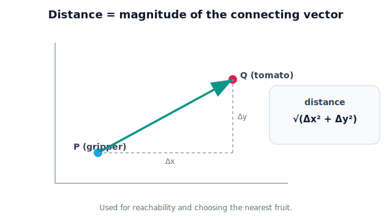

!!! abstract "You are here"
    **Module 1 — Mathematical Foundations**  ·  **Unit 2 — Vectors**  ·  **Lesson 2.9 — Distance Between Points**

# Lesson 2.9 — Distance Between Points

> The unit's capstone idea, assembled from two earlier ones: subtract to get the connecting arrow, take its magnitude to get the distance. And it raises the question that opens Unit 3 — *distance in whose frame?*

---

## 1. Why This Matters

"How far is that tomato?" and "which tomato is closest?" are questions the greenhouse robot asks on every cycle. Distance decides reachability (can the arm get there?), prioritization (pick the nearest ripe fruit first), and collision checks (is the gripper too close to a stem?). This lesson combines subtraction (Lesson 2.4) and magnitude (Lesson 2.5) into the single most-used spatial computation in robotics — and then surfaces a subtlety that the whole next unit is built to resolve: a distance is only meaningful when both points are expressed in the **same** reference frame.

## 2. Physical Intuition

To find how far apart two things are, you'd connect them with a straight line and measure it. With vectors that's two steps you already know: the **arrow between the points** is one position minus the other (subtraction), and the **distance** is that arrow's **length** (magnitude). Nothing new — just composition. The straight-line ("Euclidean") distance is what a tape measure would read between the two points, ignoring any path around obstacles.

## 3. Mathematical Foundations

Given points A and B with position vectors $\mathbf{r}_A$ and $\mathbf{r}_B$ (in the **same** frame and units), the distance between them is:

$$ \text{distance}(A,B) = \|\mathbf{r}_B - \mathbf{r}_A\| = \sqrt{(b_x-a_x)^2 + (b_y-a_y)^2 + (b_z-a_z)^2}. $$

This is just magnitude (2.5) applied to the difference (2.4). Properties:
- **Non-negative**, and zero only when the points coincide.
- **Symmetric:** distance(A,B) = distance(B,A) — note this even though the *direction* reverses; length doesn't care about order.
- **Units** match the coordinates (meters in, meters out).

The quiet but crucial assumption is "**same frame**." If A's coordinates are measured from the camera's origin and B's from the robot's base, subtracting them produces a meaningless arrow and a wrong distance. Components are frame-dependent (Lesson 2.2), so this formula is only valid once both points live in one shared coordinate system — exactly the machinery Unit 3 provides.

## 4. Visual Explanation

<figure markdown>
  { width="680" }
</figure>

## 5. Engineering Example

The greenhouse robot detects several ripe tomatoes and must choose one to pick. It computes the distance from the gripper to each (magnitude of each aiming vector) and selects the **nearest reachable** one — minimizing travel and time. It also uses distance for safety: if the gripper comes within a threshold distance of a stem it shouldn't touch, the planner intervenes. All of this assumes every position is expressed in the robot's working frame. In practice the camera reports fruit in *its* frame, so the robot must first transform those positions into the common frame before any distance is trustworthy — the recurring theme that Unit 3 formalizes.

## 6. Worked Example

Two ripe tomatoes have positions (in the robot's base frame, meters): $\mathbf{r}_1 = \begin{bmatrix}0.3\\0.4\\0.1\end{bmatrix}$, $\mathbf{r}_2 = \begin{bmatrix}0.2\\0.2\\0.5\end{bmatrix}$. The gripper is at the origin. Which is closer, and are both within a 0.7 m reach?

1. Distances from the gripper (origin), so just magnitudes:
   $\|\mathbf{r}_1\| = \sqrt{0.09+0.16+0.01} = \sqrt{0.26} \approx 0.51$ m.
   $\|\mathbf{r}_2\| = \sqrt{0.04+0.04+0.25} = \sqrt{0.33} \approx 0.57$ m.
2. Nearest: tomato 1 (0.51 m < 0.57 m) → pick first.
3. Reach: both < 0.7 m → both reachable.
4. (If the gripper weren't at the origin, we'd use $\|\mathbf{r}_i - \mathbf{r}_\text{gripper}\|$ — the full formula.)

## 7. Interactive Demonstration

*(Conceptual; notebook version later.)* A scene with a gripper and several draggable tomatoes. The demo draws the connecting arrow to each, labels each distance, highlights the **nearest** one in green, and greys out any beyond a "reach" slider. A toggle "use wrong frame for one tomato" deliberately offsets a point's origin to show how a frame mismatch produces a nonsensical distance — motivating Unit 3.

## 8. Coding Exercise

!!! tip "Run the hands-on notebook"
    `modules/module01/notebooks/lesson15_distance_between_points.ipynb` — open in JupyterLab and run **Kernel → Restart & Run All**.

*(Snippet — full implementation in the notebook track.)*

```python
import math

def distance(a, b):
    return math.sqrt(sum((b[i]-a[i])**2 for i in range(len(a))))

gripper = [0.0, 0.0, 0.0]
tomatoes = [[0.3, 0.4, 0.1], [0.2, 0.2, 0.5]]

dists = [distance(gripper, t) for t in tomatoes]
nearest = dists.index(min(dists))
print("distances:", [round(d, 2) for d in dists])
print("nearest tomato index:", nearest)
```

**Your task:** add a third tomato that is *out of reach* for a 0.7 m arm, then print which tomatoes are reachable. In a comment, state the one assumption this code makes about all the coordinates (hint: frame).

## 9. Knowledge Check

Formative — unlimited attempts, immediate feedback; does not affect your grade.

<iframe src="../../quizzes/module01/lesson15_quiz.html" title="Distance Between Points knowledge check" style="width:100%;height:720px;border:1px solid #e2e8f0;border-radius:12px"></iframe>

[Open this quiz in a new tab ↗](../quizzes/module01/lesson15_quiz.html)

1. Write the distance formula in terms of two position vectors.
2. Compute the distance between $(1,2,2)$ and $(4,6,2)$.
3. Is distance symmetric in its two points? Is the direction between them?
4. What must be true about two points' coordinates for the distance to be meaningful?
5. How does the robot use distance to choose which fruit to pick?

## 10. Challenge Problem

The greenhouse camera reports two tomatoes in the **camera frame**, while the robot plans in its **base frame**. The camera sits at a known position and orientation relative to the base. Explain, using only this unit's tools, why directly computing the distance between one camera-frame point and one base-frame point gives a wrong answer, and outline what operation (to be built in Unit 3) must happen first. Then argue whether the *distance between the two tomatoes* (both in the camera frame) is still valid without any transformation — and why.

## 11. Common Mistakes

- **Mixing frames/origins** before computing distance — the headline pitfall this lesson flags.
- **Forgetting to square the differences** or to take the root — it's the magnitude of the difference, not the sum of differences.
- **Confusing straight-line distance with path length** — obstacles aren't accounted for here (that's motion planning, Module 7).
- **Sign or order worries.** Distance is symmetric; only the *direction* arrow cares about order.

## 12. Key Takeaways

- **Distance = ‖difference‖**: subtract the position vectors, take the magnitude.
- It's **non-negative and symmetric**, with units matching the coordinates.
- Robots use distance for **reachability, nearest-target selection, and safety**.
- The formula is only valid when both points share a **frame and units** — a mismatch silently corrupts it.
- That frame requirement is precisely what **Unit 3 (Coordinate Systems and Reference Frames)** exists to handle — the natural next step.

## AI Learning Companion

Copy any prompt below into ChatGPT, Claude, or another AI assistant.

**Tutor prompt** — explain it another way
```
Re-explain Lesson 2.9 (Distance Between Points): it is the magnitude of the vector between them. Use a reachability example.
```

**Practice prompt** — generate more exercises
```
Give me 6 problems computing the distance between two points in 2D and 3D, with answers.
```

**Explore prompt** — connect it to the real world
```
Show me how a robot uses point-to-point distance for reachability checks and choosing the nearest fruit.
```

## Global Learning Support

Need this lesson explained in another language? Copy one of the prompts below into an AI assistant. English remains the authoritative source.

**Supported languages (initial):** English · Español · 中文 (Simplified Chinese) · Türkçe

**Español**
```
I just completed Lesson 2.9 — Distance Between Points.
Explain this lesson in Spanish. Keep robotics and mathematical terminology in English when appropriate.
Then provide: a summary, three practice questions, and one challenge problem.
```

**中文 (Simplified Chinese)**
```
I just completed Lesson 2.9 — Distance Between Points.
Explain this lesson in Simplified Chinese. Keep mathematical notation unchanged.
Then provide: a summary, three practice questions, and one challenge problem.
```

**Türkçe**
```
I just completed Lesson 2.9 — Distance Between Points.
Explain this lesson in Turkish. Keep robotics terminology in English where commonly used.
Then provide: a summary, three practice questions, and one challenge problem.
```

---

*Next lesson: 3.1 — Why Coordinate Frames Matter (Unit 3 begins: making "in whose frame?" precise).*
