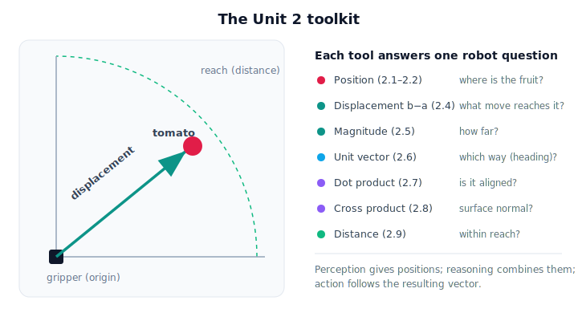

# Lesson 2.10 — Vectors in Physical AI (Unit 2 Recap)

*A short synthesis lesson. No new mathematics — just tying Unit 2 together before Unit 3.*

---

## Why do robots need vectors?

A greenhouse robot's whole job is physical: *find* a tomato, *decide* if it can reach it, *move* to it without damage. Every one of those steps is a question about **where**, **how far**, and **which way** — and a plain number can't answer those. "0.5" doesn't tell the arm where to go; "0.5 m up-and-to-the-right" does.

A **vector** is the robot's language for exactly that: a quantity that carries both size and direction, written as components it can compute with. Unit 2 built that language one operation at a time. Coordinate frames (Unit 3) will then ask the deeper question this raises — *0.5 m to the right of **whom**?*

## The vector toolkit at a glance

Each tool you built answers one concrete robot question:

| Concept | Lesson | The question it answers |
|---|---|---|
| Vector (position) | 2.1 | Where is the tomato, relative to an origin? |
| Components | 2.2 | How do I store that as numbers the robot computes with? |
| Addition | 2.3 | If I make two moves, where do I end up? |
| Subtraction | 2.4 | What move takes the gripper from here to the fruit? |
| Magnitude & direction | 2.5 | How far is it, and which way? |
| Unit vectors | 2.6 | What's the pure heading, without the distance? |
| Dot product | 2.7 | Is the gripper aligned with / facing the target? |
| Cross product | 2.8 | Which way does the surface face (its normal)? |
| Distance | 2.9 | Is it within reach? Which fruit is nearest? |

Notice the pattern: **perception** gives positions (vectors), **reasoning** combines them (subtract to plan a move, dot to check alignment, distance to check reach), and **action** follows the resulting vector. That's the loop from Lesson 1.1, now expressed in math the robot can run.

## Visual Explanation

<figure markdown>
  { width="680" }
</figure>

## Coding Exercise

!!! tip "Run the hands-on notebook"
    `modules/module01/notebooks/lesson16_vectors_recap.ipynb` — open in JupyterLab and run **Kernel → Restart & Run All**.

A short capstone that uses the whole toolkit in one greenhouse scenario — position, displacement, distance, direction, alignment, and a surface normal — in a single script.

## Knowledge Check

Formative — unlimited attempts, immediate feedback; does not affect your grade.

<iframe src="../../quizzes/lesson16_quiz.html" title="Vectors in Physical AI (Unit 2 Recap) knowledge check" style="width:100%;height:720px;border:1px solid #e2e8f0;border-radius:12px"></iframe>

[Open this quiz in a new tab ↗](../quizzes/lesson16_quiz.html)

A brief consolidation quiz spanning the unit (formative — unlimited attempts).

## Key Takeaways

- A **vector** is the robot's language for *where / how far / which way*.
- Unit 2's operations map directly onto robot questions: subtract to plan a move, dot to check alignment, cross for surface direction, magnitude/distance for reach.
- Vectors turn the perception → reasoning → action loop into something a computer can actually run.
- Open question for Unit 3: a position is only meaningful **relative to a frame** — *the same tomato has different coordinates depending on who is looking.*

---

## AI Learning Companion

Copy any prompt below into ChatGPT, Claude, or another AI assistant.

**Tutor prompt** — explain it another way
```
Summarize Unit 2 (vectors for robotics) as one connected story: how position, displacement, magnitude, direction, unit vectors, dot product, cross product, and distance each answer a question a greenhouse robot faces during one reach.
```

**Practice prompt** — generate more exercises
```
Give me a 10-question mixed review of vector operations (addition, subtraction, magnitude, direction, unit vectors, dot product, cross product, distance) in a robotics context, with answers.
```

**Explore prompt** — connect it to the real world
```
Show me a real robot pick-and-place task and point out exactly where each vector operation from Unit 2 is used in its perception → reasoning → action loop.
```

## Global Learning Support

Need this lesson explained in another language? Copy one of the prompts below into an AI assistant. English remains the authoritative source.

**Supported languages (initial):** English · Español · 中文 (Simplified Chinese) · Türkçe

**Español**
```
I just completed Lesson 2.10 — Vectors in Physical AI (Unit 2 Recap).
Explain this lesson in Spanish. Keep robotics and mathematical terminology in English when appropriate.
Then provide: a summary, three practice questions, and one challenge problem.
```

**中文 (Simplified Chinese)**
```
I just completed Lesson 2.10 — Vectors in Physical AI (Unit 2 Recap).
Explain this lesson in Simplified Chinese. Keep mathematical notation unchanged.
Then provide: a summary, three practice questions, and one challenge problem.
```

**Türkçe**
```
I just completed Lesson 2.10 — Vectors in Physical AI (Unit 2 Recap).
Explain this lesson in Turkish. Keep robotics terminology in English where commonly used.
Then provide: a summary, three practice questions, and one challenge problem.
```

---

*Next: Unit 3 — Coordinate Systems and Reference Frames. Where we ask: the same tomato, but whose coordinates?*
