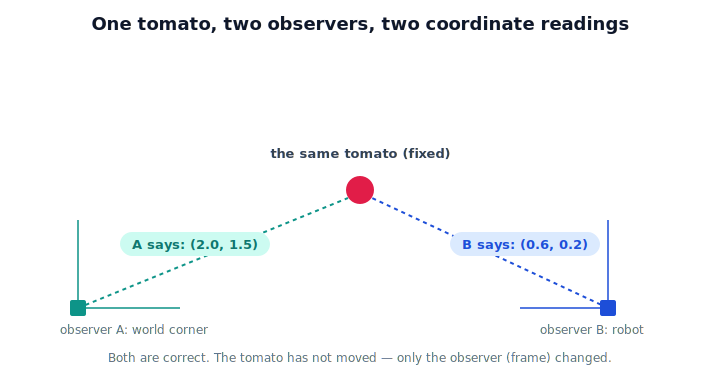

!!! abstract "You are here"
    **Module 1 — Mathematical Foundations**  ·  **Unit 3 — Coordinate Systems & Reference Frames**  ·  **Lesson 3.1 — Why Coordinate Frames Matter**

# Lesson 3.1 — Why Coordinate Frames Matter

## 1. Why This Matters

In Unit 2 you learned to describe a tomato's position as a vector — say, $(0.3, 0.4)$ meters. But a question was quietly hiding under every one of those numbers: **0.3 meters to the right of *what*?**

The robot's camera might say the tomato is 0.3 m ahead and 0.1 m left *of the lens*. The robot's base might say it's 0.5 m forward and 0.2 m up *of its shoulder*. A map of the greenhouse might say it's at row 12, plant 7. **Three different sets of numbers — all describing the exact same tomato.** None is wrong. They simply answer "where?" from different points of view.

A **coordinate frame** is that point of view: an origin and a set of axes that says "measure from here." Get frames wrong and the arm reaches confidently to the wrong place. This unit is about the single most important spatial idea in robotics — and it isn't an equation.

## 2. Physical Intuition

Stand in a room with a friend across from you. You point and say "the cup is on my right." From your friend's view, the same cup is on their *left*. Neither of you is lying — you're using different frames (your body vs theirs). The cup hasn't moved; the **observer** changed.

This is the signature insight of the entire unit:

> **The tomato has not moved. Only the observer changed.**

Hold onto that sentence. Everything in Unit 3 is a careful unpacking of it.

## 3. Mathematical Foundations

Lightly: a point $P$ in the world is physical and fixed. A **frame** $F$ is an origin $O_F$ plus axes. The *coordinates* of $P$ are the numbers you read when you measure $P$ from $O_F$ along $F$'s axes. Change the frame and the coordinates change, even though $P$ does not:

$$P \text{ (physical point)} \;\longrightarrow\; \text{coordinates depend on frame } F$$

There is no single "true" coordinate for $P$ — only "coordinates in frame $F$." We will write things like "the tomato in the camera frame" vs "the tomato in the robot frame." No transformation math yet; just the idea that a coordinate always comes with a frame attached.

## 4. Visual Explanation

<figure markdown>
  { width="680" }
</figure>

## 5. Engineering Example

A harvesting robot's camera reports a tomato at $(0.0, 0.3)$ m — dead ahead, 0.3 m out *from the lens*. But the arm is bolted to the robot's base, not the camera. If the software hands $(0.0, 0.3)$ straight to the arm, the arm measures from its *own* origin and reaches to the wrong spot. The fix isn't a better camera — it's knowing which frame each number lives in, and converting between them (Lesson 3.6). Every multi-sensor robot lives or dies by this.

## 6. Worked Example

A tomato sits 2 m east and 1 m north of the greenhouse's southwest corner (the **world** frame): coordinates $(2, 1)$.
The robot is parked 1 m east and 1 m north of that same corner. Measured from the **robot** (same ax: east/north), the tomato is $(2-1,\; 1-1) = (1, 0)$ — 1 m east, 0 m north of the robot.
Same tomato. World says $(2,1)$; robot says $(1,0)$. Both correct; different origins.

## 7. Interactive Demonstration

<iframe src="../../demos/module01/lesson17_why_frames_matter.html" title="Why Coordinate Frames Matter interactive demo" style="width:100%;height:520px;border:1px solid #e2e8f0;border-radius:12px"></iframe>

[Open this demo in a new tab ↗](../demos/module01/lesson17_why_frames_matter.html)

*(See Lesson 3.5 for the interactive frame-switcher; here the idea is introduced with the static figure above and the worked example.)*

## 8. Coding Exercise

!!! tip "Run the hands-on notebook"
    `modules/module01/notebooks/M01_U03_L3_1_Why_Coordinate_Frames_Matter.ipynb` — open in JupyterLab and run **Kernel → Restart & Run All**.

Describe one fixed point from two different origins and confirm you get two different coordinate pairs.

## 9. Knowledge Check

Formative — unlimited attempts, immediate feedback; does not affect your grade.

<iframe src="../../quizzes/module01/lesson17_quiz.html" title="Why Coordinate Frames Matter knowledge check" style="width:100%;height:720px;border:1px solid #e2e8f0;border-radius:12px"></iframe>

[Open this quiz in a new tab ↗](../quizzes/module01/lesson17_quiz.html)

A short check on the core idea: coordinates require a frame; one point has many correct coordinate descriptions.

## 10. Challenge Problem

Three observers (world corner, robot base, overhead camera) each report the same tomato. Without any formulas, describe in words why all three coordinate readings differ yet none is wrong — and what single physical fact they all agree on.

## 11. Common Mistakes

- Treating a coordinate as if it were absolute ("the tomato is *at* $(0.3, 0.4)$") instead of frame-relative ("...in the camera frame").
- Passing one sensor's coordinates to another subsystem without converting frames.
- Believing a different coordinate means the object moved. It usually means the *frame* changed.

## 12. Key Takeaways

- A coordinate is meaningless without a **frame** (an origin + axes).
- The **same point** has **many correct coordinate descriptions** — one per frame.
- World, robot, and camera are different frames in one robot.
- The unit's signature insight: *the tomato has not moved; only the observer changed.*

---

## AI Learning Companion

Copy any prompt below into ChatGPT, Claude, or another AI assistant.

**Tutor prompt** — explain it another way
```
Re-explain Lesson 3.1 (Why Coordinate Frames Matter) using two people describing the same object from across a room. Make clear why both coordinate descriptions are correct and the object never moved.
```

**Practice prompt** — generate more exercises
```
Give me 6 exercises where one fixed point is described from two different origins, and I must give both coordinate pairs and confirm the point hasn't moved. Include answers.
```

**Explore prompt** — connect it to the real world
```
Show me 3 real robots that use multiple coordinate frames (e.g. camera, base, world) and what would go wrong if they confused one frame's coordinates for another's.
```

## Global Learning Support

Need this lesson explained in another language? Copy one of the prompts below into an AI assistant. English remains the authoritative source.

**Supported languages (initial):** English · Español · 中文 (Simplified Chinese) · Türkçe

**Español**
```
I just completed Lesson 3.1 — Why Coordinate Frames Matter.
Explain this lesson in Spanish. Keep robotics and mathematical terminology in English when appropriate.
Then provide: a summary, three practice questions, and one challenge problem.
```

**中文 (Simplified Chinese)**
```
I just completed Lesson 3.1 — Why Coordinate Frames Matter.
Explain this lesson in Simplified Chinese. Keep mathematical notation unchanged.
Then provide: a summary, three practice questions, and one challenge problem.
```

**Türkçe**
```
I just completed Lesson 3.1 — Why Coordinate Frames Matter.
Explain this lesson in Turkish. Keep robotics terminology in English where commonly used.
Then provide: a summary, three practice questions, and one challenge problem.
```

---

*Next lesson: 3.5 — Local and Global Frames (where the same tomato gets three different coordinate readouts you can switch between).*
