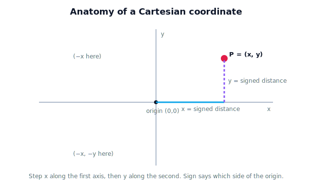

# Lesson 3.2 — Cartesian Coordinates

## 1. Why This Matters

In 3.1 and 3.5 you read coordinates off different frames without worrying about what a coordinate *is*. Now we name the machinery. The **Cartesian** coordinate system — origin, perpendicular axes, signed distances — is the quiet workhorse under every robot position, every camera pixel mapped to space, every waypoint. It is the formal answer to "what exactly are those two (or three) numbers?"

Unit 3's question stays in view: a coordinate system is owned by *someone* (a frame). Cartesian coordinates are *how* that someone writes down a position.

## 2. Physical Intuition

Tape two rulers to the greenhouse floor at a right angle, meeting at a corner. That corner is the **origin**. The rulers are the **axes**. To name where a tomato is, walk along the first ruler until you're level with it (that distance is $x$), then out along the second (that's $y$). Two numbers, in order, pin the spot. Step the other way past the origin and the numbers go **negative** — the sign says "which side."

That's all a Cartesian coordinate is: *how far along each axis, with a sign.* The fancy name hides a very physical act of measuring.

## 3. Mathematical Foundations

A 2D Cartesian frame is an origin $O$ and two perpendicular axes ($x$, $y$). A point's coordinates $(x, y)$ are its signed distances from $O$ along each axis:

$$P = (x, y), \qquad x, y \in \mathbb{R}$$

Perpendicular (orthogonal) axes mean the two numbers are independent — moving along $x$ doesn't change $y$. In 3D we add a third axis $z$ and write $(x, y, z)$. The signs encode direction along each axis; the origin is simply the point $(0, 0)$ (or $(0,0,0)$). Different frame ⇒ different $O$ and axes ⇒ different coordinates for the same physical point — the thread from 3.1.

## 4. Visual Explanation

<figure markdown>
  { width="680" }
</figure>

## 5. Engineering Example

A robot's controller stores every waypoint as Cartesian coordinates in its base frame: $(x, y, z)$ in meters. The gripper target, the home position, the safe-retreat point — all are just signed distances from the base origin along three perpendicular axes. When the controller says "go to $(0.35, 0.15, 0.20)$," it means: 0.35 m forward, 0.15 m left, 0.20 m up — from *its* origin.

## 6. Worked Example

Origin at the greenhouse corner; $x$ points east, $y$ points north (meters). A tomato is 2.0 m east and 1.5 m north: $(2.0, 1.5)$. A drainage grate is 0.5 m **west** and 1.0 m north: since west is the $-x$ direction, that's $(-0.5, 1.0)$. The sign is doing real work — it says which side of the origin you're on.

## 7. Interactive Demonstration

*(No new demo here; the 3.5 viewpoint switcher and the 3.6 transform demo cover the interactive coordinate work for this unit.)*

## 8. Coding Exercise

!!! tip "Run the hands-on notebook"
    `modules/module01/notebooks/lesson18_cartesian_coordinates.ipynb` — open in JupyterLab and run **Kernel → Restart & Run All**.

Given an origin and axis directions, convert a few "so-many-meters-this-way" descriptions into signed Cartesian coordinates and back.

## 9. Knowledge Check

Formative — unlimited attempts, immediate feedback; does not affect your grade.

<iframe src="../../quizzes/lesson18_quiz.html" title="Cartesian Coordinates knowledge check" style="width:100%;height:720px;border:1px solid #e2e8f0;border-radius:12px"></iframe>

[Open this quiz in a new tab ↗](../quizzes/lesson18_quiz.html)

A check on origin/axes/signed-distance and reading coordinates including negatives.

## 10. Challenge Problem

Two robots use Cartesian frames whose axes point in different compass directions. Describe, without transformation math, why a tomato at "2 m east, 1 m north" has different $(x, y)$ numbers for each — and what stays the same.

## 11. Common Mistakes

- Dropping signs (treating $(-0.5, 1.0)$ as $(0.5, 1.0)$) and reaching to the wrong side.
- Forgetting coordinates are ordered — $(2, 1)$ is not $(1, 2)$.
- Assuming everyone's axes point the same way; they belong to a frame.

## 12. Key Takeaways

- A Cartesian coordinate = **signed distances from an origin along perpendicular axes**.
- Order and sign both carry meaning.
- 2D uses $(x, y)$; 3D adds $z$ → $(x, y, z)$.
- The system belongs to a frame — *who* owns the axes decides the numbers.

---

## AI Learning Companion

Copy any prompt below into ChatGPT, Claude, or another AI assistant.

**Tutor prompt** — explain it another way
```
Explain Lesson 3.2 (Cartesian Coordinates) using two rulers taped at a right angle on a floor. Make clear what the origin, axes, and signs mean, and why coordinates are ordered.
```

**Practice prompt** — generate more exercises
```
Give me 8 exercises converting "so many meters east/west/north/south" descriptions into signed Cartesian (x, y) coordinates and back, with answers.
```

**Explore prompt** — connect it to the real world
```
Show me how robot controllers and image coordinates both use Cartesian systems, and where the origin and axes are placed in each.
```

## Global Learning Support

Need this lesson explained in another language? Copy one of the prompts below into an AI assistant. English remains the authoritative source.

**Supported languages (initial):** English · Español · 中文 (Simplified Chinese) · Türkçe

**Español**
```
I just completed Lesson 3.2 — Cartesian Coordinates.
Explain this lesson in Spanish. Keep robotics and mathematical terminology in English when appropriate.
Then provide: a summary, three practice questions, and one challenge problem.
```

**中文 (Simplified Chinese)**
```
I just completed Lesson 3.2 — Cartesian Coordinates.
Explain this lesson in Simplified Chinese. Keep mathematical notation unchanged.
Then provide: a summary, three practice questions, and one challenge problem.
```

**Türkçe**
```
I just completed Lesson 3.2 — Cartesian Coordinates.
Explain this lesson in Turkish. Keep robotics terminology in English where commonly used.
Then provide: a summary, three practice questions, and one challenge problem.
```

---

*Next lesson: 3.3 — 2D Coordinate Systems (axes, quadrants, and locating any point in a plane).*
