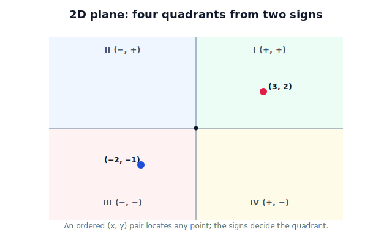

!!! abstract "You are here"
    **Module 1 — Mathematical Foundations**  ·  **Unit 3 — Coordinate Systems & Reference Frames**  ·  **Lesson 3.3 — 2D Coordinate Systems**

# Lesson 3.3 — 2D Coordinate Systems

## 1. Why This Matters

A lot of robot reasoning happens on a flat map: a top-down view of the greenhouse, the floor the robot drives on, the image plane of a camera. A **2D coordinate system** is the tool for "where on this plane?" — and it's the stepping stone to 3D. Master the plane and the third dimension is just one more axis.

Unit 3's question persists: the plane's origin and axes belong to *some* observer, so the same spot reads differently on the robot's map than on the greenhouse's map.

## 2. Physical Intuition

Lay a sheet of graph paper over the greenhouse floor. Pick a corner as origin, an across-direction as $x$, an up-the-page direction as $y$. Every point on the floor now has an address: go right $x$, go up $y$. The two axes cut the plane into four regions — the **quadrants** — and which quadrant a point is in is decided purely by the **signs** of $x$ and $y$: (+,+) upper right, (−,+) upper left, (−,−) lower left, (+,−) lower right.

## 3. Mathematical Foundations

A 2D coordinate system: origin $O$, perpendicular axes $x$ and $y$, and every point as $(x, y)$. The quadrants:

$$\text{I}:(+,+)\quad \text{II}:(-,+)\quad \text{III}:(-,-)\quad \text{IV}:(+,-)$$

Distance and the vector tools from Unit 2 all live here: the displacement between $(x_1,y_1)$ and $(x_2,y_2)$ is $(x_2-x_1,\ y_2-y_1)$, and its length is $\sqrt{(x_2-x_1)^2+(y_2-y_1)^2}$. A 2D frame is the natural home for the greenhouse map.

## 4. Visual Explanation

<figure markdown>
  { width="680" }
</figure>

## 5. Engineering Example

The robot's navigation map is a 2D frame anchored at a greenhouse corner. Plant rows, charging dock, and detected fruit are all $(x, y)$ entries on it. Path planning — "drive from the dock to row 12" — is computed entirely in this 2D frame, using exactly the displacement and distance tools from Unit 2.

## 6. Worked Example

Origin at the southwest corner; $x$ east, $y$ north. Dock at $(0.5, 0.5)$, a ripe tomato at $(3.0, 2.0)$. Displacement dock→tomato: $(3.0-0.5,\ 2.0-0.5) = (2.5, 1.5)$; distance $\sqrt{2.5^2+1.5^2}\approx 2.92$ m. Both points are in quadrant I (both coordinates positive).

## 7. Interactive Demonstration

*(Covered by the 3.5 and 3.6 demos; this lesson uses the static plane figure above.)*

## 8. Coding Exercise

!!! tip "Run the hands-on notebook"
    `modules/module01/notebooks/lesson19_2d_coordinate_systems.ipynb` — open in JupyterLab and run **Kernel → Restart & Run All**.

Place several points on a 2D greenhouse map, classify each by quadrant from its signs, and compute a couple of displacements/distances.

## 9. Knowledge Check

Formative — unlimited attempts, immediate feedback; does not affect your grade.

<iframe src="../../quizzes/module01/lesson19_quiz.html" title="2D Coordinate Systems knowledge check" style="width:100%;height:720px;border:1px solid #e2e8f0;border-radius:12px"></iframe>

[Open this quiz in a new tab ↗](../quizzes/module01/lesson19_quiz.html)

A check on (x, y) location, quadrant-from-signs, and 2D displacement/distance.

## 10. Challenge Problem

The robot redefines its map origin to its charging dock instead of the corner. Without transformation math, describe how every fruit's $(x, y)$ changes and which fruits move into a different quadrant.

## 11. Common Mistakes

- Mixing up quadrant II and IV (swapping which sign is negative).
- Forgetting that displacement subtracts in order (end − start).
- Treating the map's axes as universal rather than belonging to a chosen frame.

## 12. Key Takeaways

- A 2D system locates any planar point with an ordered $(x, y)$ pair.
- The four **quadrants** follow directly from the two signs.
- Unit 2's displacement and distance tools work unchanged in a 2D frame.
- The plane is owned by a frame — change the origin/axes and the numbers change.

---

## AI Learning Companion

Copy any prompt below into ChatGPT, Claude, or another AI assistant.

**Tutor prompt** — explain it another way
```
Explain Lesson 3.3 (2D Coordinate Systems) using graph paper laid over a floor. Make the four quadrants and their sign patterns intuitive, and show how to locate a point.
```

**Practice prompt** — generate more exercises
```
Give me 8 exercises: locate points on a 2D map, name their quadrant from the signs, and compute displacement and distance between pairs. Include answers.
```

**Explore prompt** — connect it to the real world
```
Show me how a mobile robot's 2D navigation map works: where the origin sits, what the axes mean, and how path planning uses (x, y) coordinates.
```

## Global Learning Support

Need this lesson explained in another language? Copy one of the prompts below into an AI assistant. English remains the authoritative source.

**Supported languages (initial):** English · Español · 中文 (Simplified Chinese) · Türkçe

**Español**
```
I just completed Lesson 3.3 — 2D Coordinate Systems.
Explain this lesson in Spanish. Keep robotics and mathematical terminology in English when appropriate.
Then provide: a summary, three practice questions, and one challenge problem.
```

**中文 (Simplified Chinese)**
```
I just completed Lesson 3.3 — 2D Coordinate Systems.
Explain this lesson in Simplified Chinese. Keep mathematical notation unchanged.
Then provide: a summary, three practice questions, and one challenge problem.
```

**Türkçe**
```
I just completed Lesson 3.3 — 2D Coordinate Systems.
Explain this lesson in Turkish. Keep robotics terminology in English where commonly used.
Then provide: a summary, three practice questions, and one challenge problem.
```

---

*Next lesson: 3.4 — 3D Coordinate Systems (add the third axis and the right-hand rule).*
