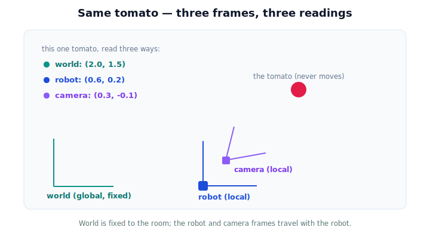

# Lesson 3.5 — Local and Global Frames

## 1. Why This Matters

A greenhouse has a fixed map — a **global** frame, usually called the **world** frame, anchored to a corner of the room. The robot rolls around inside it carrying its own **local** frame (the **robot** frame, anchored to its base), and on the robot sits a camera with *its* own local frame (the **camera** frame), offset and tilted from the base.

One tomato. Three frames. Three different coordinate readouts — all correct. This lesson makes that switch between viewpoints something you can *see* and operate, because every real robot juggles exactly these frames at once.

## 2. Physical Intuition

Picture the tomato pinned in space. Now ask three observers for its coordinates:

- **World:** "It's 2.0 m east, 1.5 m north of the southwest corner." (Never changes — the room doesn't move.)
- **Robot:** "It's 0.6 m ahead and 0.2 m to my left." (Changes when the robot drives.)
- **Camera:** "It's 0.3 m ahead and 0.1 m down from my lens." (Changes with the robot *and* with how the camera is mounted.)

Drive the robot forward 0.1 m and the robot's and camera's numbers shift — but the **world** numbers don't, and **the tomato never moved.** Global frames are the steady reference; local frames are personal viewpoints that travel with their owner.

## 3. Mathematical Foundations

Lightly, and still no matrices. A **global frame** is fixed to the environment. A **local frame** is attached to a moving body (robot, camera) and carries an **offset** (where its origin sits) and an **orientation** (which way its axes point) relative to the world. The coordinates of a fixed point $P$:

- in the world frame: constant.
- in a local frame: depend on that body's current offset and orientation.

We only *describe* this now; computing the conversion is Lesson 3.6. The takeaway is structural: world = anchored, local = attached-and-moving.

## 4. Visual Explanation

<figure markdown>
  { width="680" }
</figure>

## 5. Engineering Example

The camera detects a ripe tomato and reports it in the **camera** frame. To move the arm (bolted to the base) the robot needs it in the **robot** frame. To remember where ripe fruit is for later — even after driving away — it stores the **world** frame coordinates, which stay valid regardless of where the robot goes. Choosing the right frame for each job is everyday robotics.

## 6. Worked Example

World frame: tomato at $(2.0, 1.5)$; robot base at $(1.4, 1.3)$, axes aligned with the world (no rotation, to keep it simple).
Robot-frame coordinates of the tomato: $(2.0-1.4,\; 1.5-1.3) = (0.6, 0.2)$.
Now the robot drives 0.2 m east → base at $(1.6, 1.3)$. Robot-frame coordinates become $(0.4, 0.2)$. World coordinates? Still $(2.0, 1.5)$. The tomato didn't move; the robot did.

## 7. Interactive Demonstration

<iframe src="../../demos/lesson21_frames_viewpoint.html" title="Local and Global Frames interactive demo" style="width:100%;height:520px;border:1px solid #e2e8f0;border-radius:12px"></iframe>

[Open this demo in a new tab ↗](../demos/lesson21_frames_viewpoint.html)

Switch the active frame and watch the tomato's coordinates change while the tomato stays put. Drive the robot and see the robot/camera readings update as the world reading holds.

## 8. Coding Exercise

!!! tip "Run the hands-on notebook"
    `modules/module01/notebooks/lesson21_local_and_global_frames.ipynb` — open in JupyterLab and run **Kernel → Restart & Run All**.

Given a fixed world point and a robot offset, print the tomato's coordinates in the world and robot frames; move the robot and show only the local reading changes.

## 9. Knowledge Check

Formative — unlimited attempts, immediate feedback; does not affect your grade.

<iframe src="../../quizzes/lesson21_quiz.html" title="Local and Global Frames knowledge check" style="width:100%;height:720px;border:1px solid #e2e8f0;border-radius:12px"></iframe>

[Open this quiz in a new tab ↗](../quizzes/lesson21_quiz.html)

A check that global = fixed reference, local = attached/moving, and that one point yields different per-frame coordinates.

## 10. Challenge Problem

The robot drives in a full circle and returns to where it started. Describe, without formulas, how the tomato's robot-frame coordinates behave during the trip and why the world-frame coordinates never change.

## 11. Common Mistakes

- Storing a fruit's *robot-frame* coordinates and expecting them to still be valid after the robot moves.
- Forgetting the camera frame is offset/rotated from the robot frame (they're not the same local frame).
- Thinking a changing local coordinate means the object moved.

## 12. Key Takeaways

- **Global (world)** frames are fixed to the environment; **local** frames (robot, camera) travel with their body.
- One fixed point has a different coordinate reading in each frame — all correct.
- Moving the robot changes local readings; world readings stay put.
- Store world coordinates for memory; convert to local frames to act.

---

## AI Learning Companion

Copy any prompt below into ChatGPT, Claude, or another AI assistant.

**Tutor prompt** — explain it another way
```
Re-explain Lesson 3.5 (Local and Global Frames) using a person walking through a building with a fixed floor map. Contrast the fixed map (global) with the person's "ahead/left" view (local), using one fixed landmark.
```

**Practice prompt** — generate more exercises
```
Give me 6 exercises where a fixed point is read in world, robot, and camera frames, including cases where the robot moves. Ask which readings change and which stay. Include answers.
```

**Explore prompt** — connect it to the real world
```
Show me how a real mobile robot uses a world/map frame, a base frame, and a camera frame together, and what each frame is best used for (memory, motion, perception).
```

## Global Learning Support

Need this lesson explained in another language? Copy one of the prompts below into an AI assistant. English remains the authoritative source.

**Supported languages (initial):** English · Español · 中文 (Simplified Chinese) · Türkçe

**Español**
```
I just completed Lesson 3.5 — Local and Global Frames.
Explain this lesson in Spanish. Keep robotics and mathematical terminology in English when appropriate.
Then provide: a summary, three practice questions, and one challenge problem.
```

**中文 (Simplified Chinese)**
```
I just completed Lesson 3.5 — Local and Global Frames.
Explain this lesson in Simplified Chinese. Keep mathematical notation unchanged.
Then provide: a summary, three practice questions, and one challenge problem.
```

**Türkçe**
```
I just completed Lesson 3.5 — Local and Global Frames.
Explain this lesson in Turkish. Keep robotics terminology in English where commonly used.
Then provide: a summary, three practice questions, and one challenge problem.
```

---

*Next lesson: 3.7 — Robot and Camera Frames (a real pick shown in world, robot, and camera frames at once).*
