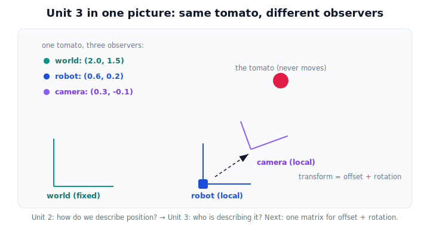

# Lesson 3.8 — Coordinate Frames in Physical AI (Unit 3 Recap)

*A short synthesis lesson — no new mathematics. It ties Unit 3 together and sets up Unit 4.*

---

## Who is describing the position?

Unit 2 gave you vectors and asked **"how do we describe position?"** Unit 3 asked the deeper question hiding underneath: **"who is describing it?"** The answer reshapes how you think about space:

> **The tomato has not moved. Only the observer changed.**

A position is never absolute. It is always a description made by *some* observer — a **frame** — and different frames give different, equally correct numbers for the same physical point.

## What you can now do

| Idea | Lesson | What it gave you |
|---|---|---|
| Why frames matter | 3.1 | A coordinate is meaningless without "relative to whom." |
| Cartesian coordinates | 3.2 | Signed distances from an origin along perpendicular axes. |
| 2D systems | 3.3 | Locate any planar point with (x, y); quadrants from signs. |
| 3D systems | 3.4 | Add z and the right-hand rule for real space. |
| Local vs global frames | 3.5 | World is fixed; robot and camera frames travel. |
| Conceptual transformations | 3.6 | Move between frames via offset + rotation — no matrices. |
| Robot and camera frames | 3.7 | A pick is a chain: camera → robot → world. |

Put together: **perception** happens in the camera frame, **action** in the robot frame, **memory** in the world frame, and **transformations** carry a point between them — all describing one tomato that never moved.

## Why this matters: the answer to the unit's question

*Why can the same tomato have multiple correct coordinates?* Because each frame measures from its own origin, along its own axes, possibly rotated from the others. Change the observer and you change the numbers — not the point. That single idea underwrites multi-sensor robots, camera geometry, and the kinematics ahead.

## Visual Explanation

<figure markdown>
  { width="680" }
</figure>

## Coding Exercise

!!! tip "Run the hands-on notebook"
    `modules/module01/notebooks/lesson24_coordinate_frames_recap.ipynb` — open in JupyterLab and run **Kernel → Restart & Run All**.

A short capstone: describe one fixed point in world, robot, and camera frames and convert between two of them with an offset (and optionally a simple rotation) — confirming the point is unchanged.

## Knowledge Check

Formative — unlimited attempts, immediate feedback; does not affect your grade.

<iframe src="../../quizzes/module01/lesson24_quiz.html" title="Coordinate Frames in Physical AI (Unit 3 Recap) knowledge check" style="width:100%;height:720px;border:1px solid #e2e8f0;border-radius:12px"></iframe>

[Open this quiz in a new tab ↗](../quizzes/module01/lesson24_quiz.html)

A brief consolidation quiz across the unit (formative — unlimited attempts).

## Key Takeaways

- Unit 3's question: **who is describing the position?** Answer: a frame — and the choice of frame sets the numbers.
- The same point has **many correct coordinates**, one per frame.
- Local frames (robot, camera) move; the global (world) frame stays put.
- A **transformation** re-describes a point between frames as **offset + rotation**.
- Next: Unit 4 packages that offset + rotation into a single **matrix** — the compact language for everything you just learned.

---

## AI Learning Companion

Copy any prompt below into ChatGPT, Claude, or another AI assistant.

**Tutor prompt** — explain it another way
```
Summarize Unit 3 (coordinate frames) as one story: how Cartesian/2D/3D coordinates, local vs global frames, robot/camera frames, and conceptual transformations all answer "who is describing the position?" Use one fixed tomato throughout.
```

**Practice prompt** — generate more exercises
```
Give me a 10-question mixed review of Unit 3: Cartesian coordinates, quadrants, 3D distance, local vs global frames, and converting a point between frames with offset (and simple rotations). Include answers.
```

**Explore prompt** — connect it to the real world
```
Show me a real robot pipeline where one detected object is described in camera, robot, and world frames, and point out exactly where a frame transformation happens.
```

## Global Learning Support

Need this lesson explained in another language? Copy one of the prompts below into an AI assistant. English remains the authoritative source.

**Supported languages (initial):** English · Español · 中文 (Simplified Chinese) · Türkçe

**Español**
```
I just completed Lesson 3.8 — Coordinate Frames in Physical AI (Unit 3 Recap).
Explain this lesson in Spanish. Keep robotics and mathematical terminology in English when appropriate.
Then provide: a summary, three practice questions, and one challenge problem.
```

**中文 (Simplified Chinese)**
```
I just completed Lesson 3.8 — Coordinate Frames in Physical AI (Unit 3 Recap).
Explain this lesson in Simplified Chinese. Keep mathematical notation unchanged.
Then provide: a summary, three practice questions, and one challenge problem.
```

**Türkçe**
```
I just completed Lesson 3.8 — Coordinate Frames in Physical AI (Unit 3 Recap).
Explain this lesson in Turkish. Keep robotics terminology in English where commonly used.
Then provide: a summary, three practice questions, and one challenge problem.
```

---

*Next: Unit 4 — where coordinate frames become matrix transformations, and the offset + rotation you now understand gets a single, powerful notation.*
