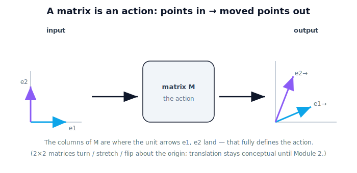

!!! abstract "You are here"
    **Module 1 — Mathematical Foundations**  ·  **Unit 4 — Matrices as Transformations**  ·  **Lesson 4.1 — Matrices as Operators**

# Lesson 4.1 — Matrices as Operators

## 1. Why This Matters

Unit 3 asked *who* describes a position. Unit 4 asks a new question: **what can we do to that position?** The tool for "doing something to space" is the **matrix** — but forget, for now, that it looks like a grid of numbers. A matrix is an **action**: hand it a point and it hands back a moved point. Rotating a gripper, rescaling a camera's pixels into meters, mirroring a left-hand view into a right-hand one — all are matrices *acting* on space. Meet the matrix as a verb, not a table.

## 2. Physical Intuition

Think of a matrix as a **machine** with an in-slot and an out-slot. Drop a point in; a transformed point comes out. The *same* machine transforms every point the same way, so a whole shape (the outline of a fruit cluster, the gripper's footprint) goes in and a consistently moved shape comes out. Different machines do different things — turn, stretch, flip — but every one of them is "points in, moved points out." That machine is what a matrix *is*.

We will still write the grid of numbers (it's how we tell the machine what to do), but the grid is the *settings*; the **action** is the point.

## 3. Mathematical Foundations

A 2D linear operator is a $2\times2$ matrix $M$ acting on a point $\mathbf{p}=(x,y)$:

$$M\mathbf{p} = \begin{bmatrix} a & b \\ c & d \end{bmatrix}\begin{bmatrix} x \\ y \end{bmatrix} = \begin{bmatrix} ax + by \\ cx + dy \end{bmatrix}$$

Read this as: the output's first coordinate is $ax+by$, the second is $cx+dy$. The columns of $M$ are where the basis arrows $(1,0)$ and $(0,1)$ land — so a matrix is fully described by "where do the two unit arrows go?" Different $(a,b,c,d)$ ⇒ different action. (Pure $2\times2$ matrices rotate/scale/reflect/shear about the origin; **translation** is handled conceptually here and formalized in Module 2 — Unit 3's boundary continues.)

## 4. Visual Explanation

<figure markdown>
  { width="680" }
</figure>

## 5. Engineering Example

A camera delivers detections in pixel units along its own tilted axes. A single $2\times2$ matrix can rescale and reorient those into the robot's metric axes — one operator applied to every detected point. The robot doesn't think of it as arithmetic; it thinks "apply the camera-to-robot operator," and space is transformed consistently for every fruit in view.

## 6. Worked Example

Let $M=\begin{bmatrix}0 & -1\\ 1 & 0\end{bmatrix}$ act on $\mathbf{p}=(2,0)$:
$M\mathbf{p}=(0\cdot2 + (-1)\cdot0,\ 1\cdot2 + 0\cdot0) = (0, 2)$.
The point $(2,0)$ (pointing east) became $(0,2)$ (pointing north) — this matrix's *action* is a 90° turn about the origin. We'll name it formally in 4.5; here, notice we learned what it does by *applying* it.

## 7. Interactive Demonstration

<iframe src="../../demos/module01/lesson25_matrices_as_operators.html" title="Matrices as Operators interactive demo" style="width:100%;height:520px;border:1px solid #e2e8f0;border-radius:12px"></iframe>

[Open this demo in a new tab ↗](../demos/module01/lesson25_matrices_as_operators.html)

**Guided prediction.** Treat the matrix as a machine. Predict where the unit arrows (1, 0) and (0, 1) land after the operator [[0, −1], [1, 0]], then describe in words what that machine does to *any* shape fed through it. Confirm with the worked example — the columns are exactly where the arrows go.
## 8. Coding Exercise

!!! tip "Run the hands-on notebook"
    `modules/module01/notebooks/M01_U04_L4_1_Matrices_As_Operators.ipynb` — open in JupyterLab and run **Kernel → Restart & Run All**.

Apply a couple of $2\times2$ matrices to a set of points with NumPy and describe, in words, what each one *did* to the shape.

## 9. Knowledge Check

Formative — unlimited attempts, immediate feedback; does not affect your grade.

<iframe src="../../quizzes/module01/lesson25_quiz.html" title="Matrices as Operators knowledge check" style="width:100%;height:720px;border:1px solid #e2e8f0;border-radius:12px"></iframe>

[Open this quiz in a new tab ↗](../quizzes/module01/lesson25_quiz.html)

A check that a matrix is an operator (points in → moved points out) and that its columns are the images of the unit arrows.

## 10. Challenge Problem

You apply some unknown $2\times2$ matrix and observe that $(1,0)\to(2,0)$ and $(0,1)\to(0,2)$. Without computing anything further, describe what this operator does to *any* shape, and write the matrix.

## 11. Common Mistakes

- Reading a matrix as static data rather than an action on space.
- Forgetting the order inside $M\mathbf{p}$ (rows hit the point's coordinates: $ax+by$, then $cx+dy$).
- Expecting a $2\times2$ matrix to translate — it can't; that's conceptual here, formal in Module 2.

## 12. Key Takeaways

- A matrix is an **action applied to space**, not a table of numbers.
- Apply it to a point: $M\mathbf{p}=(ax+by,\ cx+dy)$.
- Its **columns** are where the unit arrows $(1,0)$ and $(0,1)$ land — that fully defines the action.
- Unit 4's question: *what can we do to a position?*

---

## AI Learning Companion

Copy any prompt below into ChatGPT, Claude, or another AI assistant.

**Tutor prompt** — explain it another way
```
Explain Lesson 4.1 (Matrices as Operators) using the idea of a machine: points go in, transformed points come out. Make clear why a matrix is an action on space, not just a grid of numbers, and what its columns mean.
```

**Practice prompt** — generate more exercises
```
Give me 6 exercises applying 2x2 matrices to points and shapes, where I describe in words what each matrix DID (turned/stretched/flipped). Include answers.
```

**Explore prompt** — connect it to the real world
```
Show me where robots apply a single matrix as an operator to many points at once (e.g. converting camera-frame detections to robot-frame coordinates).
```

## Global Learning Support

Need this lesson explained in another language? Copy one of the prompts below into an AI assistant. English remains the authoritative source.

**Supported languages (initial):** English · Español · 中文 (Simplified Chinese) · Türkçe

**Español**
```
I just completed Lesson 4.1 — Matrices as Operators.
Explain this lesson in Spanish. Keep robotics and mathematical terminology in English when appropriate.
Then provide: a summary, three practice questions, and one challenge problem.
```

**中文 (Simplified Chinese)**
```
I just completed Lesson 4.1 — Matrices as Operators.
Explain this lesson in Simplified Chinese. Keep mathematical notation unchanged.
Then provide: a summary, three practice questions, and one challenge problem.
```

**Türkçe**
```
I just completed Lesson 4.1 — Matrices as Operators.
Explain this lesson in Turkish. Keep robotics terminology in English where commonly used.
Then provide: a summary, three practice questions, and one challenge problem.
```

---

*Next lesson: 4.4 — The Identity Matrix (the operator that does nothing).*
