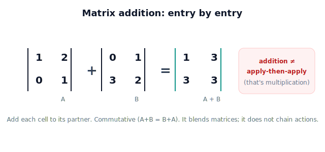

# Lesson 4.2 — Matrix Addition

*A short, lightweight lesson. The big idea of Unit 4 is composition (4.3, 4.8); addition is a simpler operation worth knowing but not the star.*

## 1. Why This Matters

You can **add** two matrices, entry by entry. It's the simplest matrix operation and occasionally useful — blending two influences, averaging, accumulating small adjustments. But a caution up front: adding two transformation matrices does **not** mean "do one action then the other." That's *composition* (multiplication, coming in 4.3). Keep addition in its lane: it combines matrices entry-wise; it doesn't chain actions.

## 2. Physical Intuition

Think of two matrices as two sets of dials. Addition lines them up and adds each dial to its partner: top-left to top-left, and so on. The result is a new set of dials that's the entry-by-entry sum. It's like adding two grids of numbers cell by cell — straightforward, but notice it has no "first this, then that" meaning; it just merges the entries.

## 3. Mathematical Foundations

For same-size matrices, addition is entry-wise:

$$A + B = \begin{bmatrix} a_1 & b_1 \\ c_1 & d_1 \end{bmatrix} + \begin{bmatrix} a_2 & b_2 \\ c_2 & d_2 \end{bmatrix} = \begin{bmatrix} a_1+a_2 & b_1+b_2 \\ c_1+c_2 & d_1+d_2 \end{bmatrix}.$$

It's **commutative** ($A+B=B+A$) and **associative**, and only defined when the matrices have the same shape. Important contrast: applying transformation $A$ then $B$ to a point is **not** $(A+B)\mathbf{p}$ — it's $B(A\mathbf{p})$, which is *multiplication* (Lesson 4.3). Addition blends entries; it does not sequence actions.

## 4. Visual Explanation

<figure markdown>
  { width="680" }
</figure>

## 5. Engineering Example

Matrix addition shows up when *blending* or *accumulating* numeric grids — e.g. averaging two calibration correction matrices, or summing small incremental adjustments. It does **not** model "rotate then scale"; that pipeline is composition. Knowing the difference prevents a common bug: adding transforms when you meant to chain them.

## 6. Worked Example

$\begin{bmatrix}1&2\\0&1\end{bmatrix} + \begin{bmatrix}0&1\\3&2\end{bmatrix} = \begin{bmatrix}1&3\\3&3\end{bmatrix}$. Each entry is the sum of the corresponding entries. Swapping the order gives the same result (addition is commutative) — unlike composition, where order will matter (4.8).

## 7. Interactive Demonstration

*(No demo for this lightweight lesson; the figure above and the worked example suffice. Composition gets the flagship demo in 4.8.)*

## 8. Coding Exercise

!!! tip "Run the hands-on notebook"
    `modules/module01/notebooks/lesson26_matrix_addition.ipynb` — open in JupyterLab and run **Kernel → Restart & Run All**.

Add two matrices with NumPy, confirm it's commutative, and verify that $(A+B)\mathbf{p} \neq B(A\mathbf{p})$ in general (addition is not composition).

## 9. Knowledge Check

Formative — unlimited attempts, immediate feedback; does not affect your grade.

<iframe src="../../quizzes/module01/lesson26_quiz.html" title="Matrix Addition knowledge check" style="width:100%;height:720px;border:1px solid #e2e8f0;border-radius:12px"></iframe>

[Open this quiz in a new tab ↗](../quizzes/module01/lesson26_quiz.html)

A check that addition is entry-wise, commutative, same-shape-only, and distinct from composition.

## 10. Challenge Problem

Give a concrete pair of matrices and a point showing that $(A+B)\mathbf{p}$ differs from "apply A then B." Explain in one sentence why this proves addition isn't how you chain transformations.

## 11. Common Mistakes

- Treating $A+B$ as "do A then B" (that's multiplication, 4.3).
- Trying to add matrices of different shapes.
- Overusing addition where composition is meant.

## 12. Key Takeaways

- Matrix **addition** is **entry-wise** and requires equal shapes.
- It's **commutative** and **associative**.
- It **blends** matrices; it does **not** sequence actions.
- Chaining transformations is composition (multiplication), covered next.

---

## AI Learning Companion

Copy any prompt below into ChatGPT, Claude, or another AI assistant.

**Tutor prompt** — explain it another way
```
Explain Lesson 4.2 (Matrix Addition) as adding two grids of dials cell by cell. Emphasize that addition blends matrices and is NOT the same as applying one transformation then another.
```

**Practice prompt** — generate more exercises
```
Give me 5 entry-wise matrix addition exercises, plus one that shows (A+B)p is not the same as applying A then B. Include answers.
```

**Explore prompt** — connect it to the real world
```
Show me a case where matrix addition is the right tool (blending/averaging grids) versus where composition is needed (chaining transformations).
```

## Global Learning Support

Need this lesson explained in another language? Copy one of the prompts below into an AI assistant. English remains the authoritative source.

**Supported languages (initial):** English · Español · 中文 (Simplified Chinese) · Türkçe

**Español**
```
I just completed Lesson 4.2 — Matrix Addition.
Explain this lesson in Spanish. Keep robotics and mathematical terminology in English when appropriate.
Then provide: a summary, three practice questions, and one challenge problem.
```

**中文 (Simplified Chinese)**
```
I just completed Lesson 4.2 — Matrix Addition.
Explain this lesson in Simplified Chinese. Keep mathematical notation unchanged.
Then provide: a summary, three practice questions, and one challenge problem.
```

**Türkçe**
```
I just completed Lesson 4.2 — Matrix Addition.
Explain this lesson in Turkish. Keep robotics terminology in English where commonly used.
Then provide: a summary, three practice questions, and one challenge problem.
```

---

*Next lesson: 4.3 — Matrix Multiplication (combining transformations: do this, then that).*
