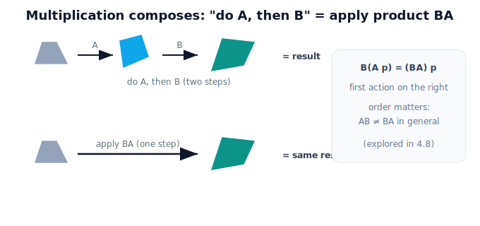

# Lesson 4.3 — Matrix Multiplication

## 1. Why This Matters

Here is the operation that makes matrices powerful: **multiplication combines transformations**. If $A$ turns space and $B$ stretches it, the single matrix $BA$ is the one operator that does "$A$ then $B$" in one shot. Don't start with the row-times-column arithmetic — start with the meaning: *do this action, then that action.* The arithmetic is simply the bookkeeping that computes the combined operator. This is the gateway to composition (4.8) and, later, to chains of robot joints.

## 2. Physical Intuition

You want to rotate the gripper, then scale the result. You could apply the rotation to every point, then apply the scaling to every result — two passes. Matrix multiplication lets you **precompute one operator** that does both at once: multiply the two matrices and you get a single machine equivalent to running both in order. "Apply A then B" becomes "apply the product." The order you multiply in records the order of the actions — and swapping it generally gives a different machine (the heart of 4.8).

## 3. Mathematical Foundations

Applying $A$ then $B$ to a point $\mathbf{p}$ is $B(A\mathbf{p})$, which equals $(BA)\mathbf{p}$ — so the **combined operator is the product $BA$** (note the right-to-left order: the first action sits on the right). For $2\times2$ matrices the product is:

$$BA = \begin{bmatrix} b_{11} & b_{12} \\ b_{21} & b_{22} \end{bmatrix}\begin{bmatrix} a_{11} & a_{12} \\ a_{21} & a_{22} \end{bmatrix}, \quad (BA)_{ij} = \sum_k b_{ik}\,a_{kj}$$

(each entry is a row of $B$ dotted with a column of $A$). The key property: multiplication is **not commutative** — $AB \neq BA$ in general — because doing actions in a different order generally lands somewhere different. It *is* associative, so longer chains are unambiguous once the order is fixed.

## 4. Visual Explanation

<figure markdown>
  { width="680" }
</figure>

## 5. Engineering Example

To convert and reorient a camera detection in one step, the software multiplies the scaling (pixels→meters) and rotation (camera→robot tilt) matrices into a single operator applied to every point — faster and cleaner than two passes. Robot arms take this further: each joint contributes a transformation, and multiplying them composes the whole arm's motion (the kinematic chain of Module 2).

## 6. Worked Example

Let $A=R(90°)=\begin{bmatrix}0&-1\\1&0\end{bmatrix}$ (rotate) and $B=\begin{bmatrix}2&0\\0&2\end{bmatrix}$ (scale ×2). Apply A then B to $\mathbf{p}=(1,0)$: $A\mathbf{p}=(0,1)$, then $B(0,1)=(0,2)$. Via the product: $BA=\begin{bmatrix}0&-2\\2&0\end{bmatrix}$, and $(BA)(1,0)=(0,2)$ — same answer. Reverse the order ($AB$) and you'd get a different operator; we explore that in 4.8.

## 7. Interactive Demonstration

*(The flagship 4.8 composition demo lets you chain actions and swap their order; this lesson uses the figure and worked example.)*

## 8. Coding Exercise

!!! tip "Run the hands-on notebook"
    `modules/module01/notebooks/lesson27_matrix_multiplication.ipynb` — open in JupyterLab and run **Kernel → Restart & Run All**.

Multiply two matrices in NumPy; verify $(BA)\mathbf{p}$ equals applying $A$ then $B$; and show $AB \neq BA$ for a rotation and a non-uniform scale.

## 9. Knowledge Check

Formative — unlimited attempts, immediate feedback; does not affect your grade.

<iframe src="../../quizzes/module01/lesson27_quiz.html" title="Matrix Multiplication knowledge check" style="width:100%;height:720px;border:1px solid #e2e8f0;border-radius:12px"></iframe>

[Open this quiz in a new tab ↗](../quizzes/module01/lesson27_quiz.html)

A check that multiplication composes transformations (do A then B = apply BA), that order matters, and that the first action is on the right.

## 10. Challenge Problem

Pick a rotation and a non-uniform scale. Compute both $AB$ and $BA$, apply each to the same point, and explain geometrically why the two results differ.

## 11. Common Mistakes

- Starting from arithmetic instead of the meaning ("do A, then B").
- Getting the order backwards — the **first** action is on the **right** in $BA$.
- Assuming $AB = BA$ (it usually doesn't).

## 12. Key Takeaways

- Matrix **multiplication composes transformations**: $B(A\mathbf{p}) = (BA)\mathbf{p}$.
- The combined operator is the **product**; the **first action is on the right**.
- Multiplication is **not commutative** — order matters (the theme of 4.8).
- Chaining joint transforms this way is the basis of robot kinematics (Module 2).

---

## AI Learning Companion

Copy any prompt below into ChatGPT, Claude, or another AI assistant.

**Tutor prompt** — explain it another way
```
Explain Lesson 4.3 (Matrix Multiplication) starting from "do this action, then that action," not arithmetic. Show why applying A then B equals applying the product BA, and why the first action is on the right.
```

**Practice prompt** — generate more exercises
```
Give me 6 exercises composing two 2x2 transformations (rotation, scaling) by multiplication, checking against applying them in sequence, including a case where AB != BA. Include answers.
```

**Explore prompt** — connect it to the real world
```
Show me how multiplying transformation matrices composes steps in a robot pipeline, and how chaining joint transforms builds a robot arm's motion.
```

## Global Learning Support

Need this lesson explained in another language? Copy one of the prompts below into an AI assistant. English remains the authoritative source.

**Supported languages (initial):** English · Español · 中文 (Simplified Chinese) · Türkçe

**Español**
```
I just completed Lesson 4.3 — Matrix Multiplication.
Explain this lesson in Spanish. Keep robotics and mathematical terminology in English when appropriate.
Then provide: a summary, three practice questions, and one challenge problem.
```

**中文 (Simplified Chinese)**
```
I just completed Lesson 4.3 — Matrix Multiplication.
Explain this lesson in Simplified Chinese. Keep mathematical notation unchanged.
Then provide: a summary, three practice questions, and one challenge problem.
```

**Türkçe**
```
I just completed Lesson 4.3 — Matrix Multiplication.
Explain this lesson in Turkish. Keep robotics terminology in English where commonly used.
Then provide: a summary, three practice questions, and one challenge problem.
```

---

*Next lesson: 4.8 — Composition of Transformations (chaining actions; order matters).*
