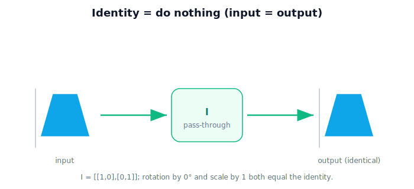

!!! abstract "You are here"
    **Module 1 — Mathematical Foundations**  ·  **Unit 4 — Matrices as Transformations**  ·  **Lesson 4.4 — The Identity Matrix**

# Lesson 4.4 — The Identity Matrix

## 1. Why This Matters

Before the dramatic actions — turning, stretching, flipping — meet the operator that does **nothing**. The **identity matrix** takes every point and hands it back unchanged. That sounds trivial, but it's the anchor of the whole system: it's the "leave it alone" action, the starting point of any sequence, and the thing every transformation is measured against (a rotation by 0°, a scale by 1× — both *are* the identity). Internalize one phrase: **identity = do nothing.**

## 2. Physical Intuition

Run the matrix-machine from 4.1, but with a machine wired to pass points straight through. A point goes in at $(2,1)$ and comes out at $(2,1)$. The fruit cluster you feed it looks identical coming out — same position, same size, same orientation. Nothing moved. That pass-through machine is the identity.

Why care about a do-nothing machine? Because "do nothing" is a real, necessary action: it's where every transformation chain starts, and it's what you get when a rotation or scale is set to "no change."

## 3. Mathematical Foundations

The 2D identity matrix is

$$I = \begin{bmatrix} 1 & 0 \\ 0 & 1 \end{bmatrix}, \qquad I\mathbf{p} = \mathbf{p} \text{ for every } \mathbf{p}.$$

Check it: $I(x,y) = (1\cdot x + 0\cdot y,\ 0\cdot x + 1\cdot y) = (x, y)$. Its columns are exactly the unit arrows $(1,0)$ and $(0,1)$ — they land on themselves, so nothing changes (recall from 4.1 that columns are where the unit arrows go). The identity is the **neutral element**: for any matrix $M$, $IM = MI = M$ — applying "do nothing" before or after $M$ leaves $M$ unchanged, just like multiplying a number by 1.

## 4. Visual Explanation

<figure markdown>
  { width="680" }
</figure>

## 5. Engineering Example

A transformation pipeline often starts from the identity and *accumulates* operations: begin with "do nothing," then optionally rotate, scale, etc. If a step is disabled (e.g. "no rotation this time"), it contributes the identity — the pipeline still runs, that step just changes nothing. The identity is also the sanity check: applying your camera-to-robot operator to a point already in the robot frame should be the identity (it shouldn't move).

## 6. Worked Example

Apply $I$ to three points: $(0,0)\to(0,0)$, $(2,1)\to(2,1)$, $(-3,4)\to(-3,4)$. Every output equals its input. Compare to a non-identity like $\begin{bmatrix}2&0\\0&2\end{bmatrix}$, which sends $(2,1)\to(4,2)$ — *that* one does something; the identity does not.

## 7. Interactive Demonstration

<iframe src="../../demos/module01/lesson28_identity.html" title="The Identity Matrix interactive demo" style="width:100%;height:520px;border:1px solid #e2e8f0;border-radius:12px"></iframe>

[Open this demo in a new tab ↗](../demos/module01/lesson28_identity.html)

Apply the identity to a greenhouse object and watch nothing happen — then toggle in a non-identity matrix to feel the contrast.

## 8. Coding Exercise

!!! tip "Run the hands-on notebook"
    `modules/module01/notebooks/lesson28_identity_matrix.ipynb` — open in JupyterLab and run **Kernel → Restart & Run All**.

Build the identity with NumPy, apply it to several points, and assert each point is unchanged; then apply a non-identity and show it differs.

## 9. Knowledge Check

Formative — unlimited attempts, immediate feedback; does not affect your grade.

<iframe src="../../quizzes/module01/lesson28_quiz.html" title="The Identity Matrix knowledge check" style="width:100%;height:720px;border:1px solid #e2e8f0;border-radius:12px"></iframe>

[Open this quiz in a new tab ↗](../quizzes/module01/lesson28_quiz.html)

A check that the identity leaves points unchanged and acts as the neutral element.

## 10. Challenge Problem

A rotation by 0° and a scale by factor 1 are both "do nothing." Write each as a matrix and explain why they both equal the identity — and what that says about the identity's role among all transformations.

## 11. Common Mistakes

- Thinking the identity is pointless — it's the neutral starting point and the "no change" setting of other transforms.
- Writing the identity with the off-diagonal ones (that's a different operator).
- Forgetting that "no rotation / no scale" contributes the identity in a pipeline.

## 12. Key Takeaways

- The **identity** $I=\begin{bmatrix}1&0\\0&1\end{bmatrix}$ leaves every point unchanged: $I\mathbf{p}=\mathbf{p}$.
- It is the **neutral element**: $IM = MI = M$.
- Rotation by 0° and scale by 1 both *are* the identity.
- **Identity = do nothing** — the anchor of every transformation sequence.

---

## AI Learning Companion

Copy any prompt below into ChatGPT, Claude, or another AI assistant.

**Tutor prompt** — explain it another way
```
Explain Lesson 4.4 (The Identity Matrix) as a "pass-through machine" that returns every point unchanged. Make clear why a do-nothing operator matters and why rotation by 0 degrees and scale by 1 both equal the identity.
```

**Practice prompt** — generate more exercises
```
Give me 5 exercises applying the identity matrix to points (confirming no change) and contrasting with simple non-identity matrices. Include answers.
```

**Explore prompt** — connect it to the real world
```
Show me where a robotics transformation pipeline uses the identity as a neutral starting point or a disabled step, with a concrete example.
```

## Global Learning Support

Need this lesson explained in another language? Copy one of the prompts below into an AI assistant. English remains the authoritative source.

**Supported languages (initial):** English · Español · 中文 (Simplified Chinese) · Türkçe

**Español**
```
I just completed Lesson 4.4 — The Identity Matrix.
Explain this lesson in Spanish. Keep robotics and mathematical terminology in English when appropriate.
Then provide: a summary, three practice questions, and one challenge problem.
```

**中文 (Simplified Chinese)**
```
I just completed Lesson 4.4 — The Identity Matrix.
Explain this lesson in Simplified Chinese. Keep mathematical notation unchanged.
Then provide: a summary, three practice questions, and one challenge problem.
```

**Türkçe**
```
I just completed Lesson 4.4 — The Identity Matrix.
Explain this lesson in Turkish. Keep robotics terminology in English where commonly used.
Then provide: a summary, three practice questions, and one challenge problem.
```

---

*Next lesson: 4.5 — Rotation Matrices (turning space about the origin).*
