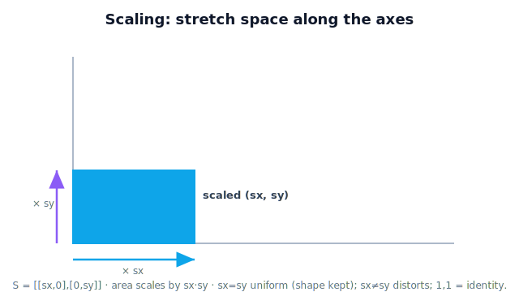

!!! abstract "You are here"
    **Module 1 — Mathematical Foundations**  ·  **Unit 4 — Matrices as Transformations**  ·  **Lesson 4.6 — Scaling Transformations**

# Lesson 4.6 — Scaling Transformations

## 1. Why This Matters

A **scaling** matrix stretches or shrinks space along the axes. It's how a system zooms, how pixel counts convert to millimeters, how a model is resized to match the real workpiece. Scaling is one of the most intuitive matrix actions: a number bigger than 1 enlarges, between 0 and 1 shrinks, and you can scale the two axes by different amounts. Where rotation kept size fixed, scaling is *all* about size.

## 2. Physical Intuition

Imagine the plane drawn on a rubber sheet. Grab the sides and stretch horizontally by a factor $s_x$ and vertically by $s_y$. Every point's $x$ multiplies by $s_x$, its $y$ by $s_y$. A fruit cluster gets wider/taller (or narrower/shorter). If $s_x=s_y$ the stretch is **uniform** — same shape, new size. If they differ, it's **non-uniform** — the shape distorts (a circle becomes an ellipse). Set both to 1 and nothing changes (the identity again).

## 3. Mathematical Foundations

The 2D scaling matrix with factors $s_x, s_y$:

$$S = \begin{bmatrix} s_x & 0 \\ 0 & s_y \end{bmatrix}, \qquad S\,(x,y) = (s_x\,x,\ s_y\,y).$$

Its columns are $(s_x,0)$ and $(0,s_y)$ — the unit arrows stretched, still along their axes (so axis-aligned scaling doesn't rotate). **Area** scales by the product $s_x\,s_y$ (a useful check: that product is the determinant). Uniform scaling $s_x=s_y=s$ multiplies all lengths by $s$ and area by $s^2$. $s=1$ on both axes gives the identity; a factor of $0$ collapses that axis (information lost).

## 4. Visual Explanation

<figure markdown>
  { width="680" }
</figure>

## 5. Engineering Example

A camera reports a tomato's size in pixels; multiplying by a known scale (meters-per-pixel) converts to real dimensions — a scaling transformation. Non-uniform scaling appears when horizontal and vertical pixel scales differ (anisotropic sensors), and the system must apply $s_x \neq s_y$ to avoid distorting measured shapes.

## 6. Worked Example

Scale $\mathbf{p}=(2,3)$ by $s_x=2,\ s_y=0.5$: $S\mathbf{p}=(2\cdot2,\ 0.5\cdot3)=(4,1.5)$ — wider, shorter. A unit square (area 1) under this $S$ becomes a $2\times0.5$ rectangle, area $1.0$ (since $s_x s_y = 2\cdot0.5 = 1$ here). Uniform scale $s_x=s_y=3$ would turn area 1 into area 9.

## 7. Interactive Demonstration

<iframe src="../../demos/module01/lesson30_scaling.html" title="Scaling Transformations interactive demo" style="width:100%;height:520px;border:1px solid #e2e8f0;border-radius:12px"></iframe>

[Open this demo in a new tab ↗](../demos/module01/lesson30_scaling.html)

Use two sliders ($s_x$, $s_y$) to stretch and shrink a greenhouse object; watch uniform vs non-uniform scaling and the live area factor, with the scaling matrix shown.

## 8. Coding Exercise

!!! tip "Run the hands-on notebook"
    `modules/module01/notebooks/lesson30_scaling_transformations.ipynb` — open in JupyterLab and run **Kernel → Restart & Run All**.

Build a scaling matrix in NumPy, scale a shape's points, and verify the area scales by $s_x\,s_y$.

## 9. Knowledge Check

Formative — unlimited attempts, immediate feedback; does not affect your grade.

<iframe src="../../quizzes/module01/lesson30_quiz.html" title="Scaling Transformations knowledge check" style="width:100%;height:720px;border:1px solid #e2e8f0;border-radius:12px"></iframe>

[Open this quiz in a new tab ↗](../quizzes/module01/lesson30_quiz.html)

A check that scaling multiplies coordinates by the factors, that area scales by $s_x s_y$, and that $s_x=s_y=1$ is the identity.

## 10. Challenge Problem

Find a scaling matrix that doubles a shape's area without distorting its proportions, and another that keeps area the same while making it twice as wide. Explain the difference.

## 11. Common Mistakes

- Confusing uniform and non-uniform scaling (distorting a shape unintentionally).
- Forgetting area scales by the **product** $s_x s_y$, not the sum.
- Using a factor of 0 and collapsing an axis (irreversible).

## 12. Key Takeaways

- A **scaling matrix** $S=\begin{bmatrix}s_x&0\\0&s_y\end{bmatrix}$ stretches/shrinks along the axes.
- **Uniform** ($s_x=s_y$) preserves shape; **non-uniform** distorts it.
- **Area** scales by $s_x s_y$; $s_x=s_y=1$ is the identity.
- Scaling is how systems zoom and convert pixel units to real size.

---

## AI Learning Companion

Copy any prompt below into ChatGPT, Claude, or another AI assistant.

**Tutor prompt** — explain it another way
```
Explain Lesson 4.6 (Scaling Transformations) using a rubber sheet stretched by different amounts horizontally and vertically. Make clear uniform vs non-uniform scaling and why area scales by sx*sy.
```

**Practice prompt** — generate more exercises
```
Give me 6 exercises applying scaling matrices to points and shapes, predicting the new size and area, including uniform and non-uniform cases. Include answers.
```

**Explore prompt** — connect it to the real world
```
Show me how scaling appears in robot vision: converting pixel measurements to real-world meters and handling different horizontal/vertical pixel scales.
```

## Global Learning Support

Need this lesson explained in another language? Copy one of the prompts below into an AI assistant. English remains the authoritative source.

**Supported languages (initial):** English · Español · 中文 (Simplified Chinese) · Türkçe

**Español**
```
I just completed Lesson 4.6 — Scaling Transformations.
Explain this lesson in Spanish. Keep robotics and mathematical terminology in English when appropriate.
Then provide: a summary, three practice questions, and one challenge problem.
```

**中文 (Simplified Chinese)**
```
I just completed Lesson 4.6 — Scaling Transformations.
Explain this lesson in Simplified Chinese. Keep mathematical notation unchanged.
Then provide: a summary, three practice questions, and one challenge problem.
```

**Türkçe**
```
I just completed Lesson 4.6 — Scaling Transformations.
Explain this lesson in Turkish. Keep robotics terminology in English where commonly used.
Then provide: a summary, three practice questions, and one challenge problem.
```

---

*Next lesson: 4.7 — Reflection Transformations (mirroring space across an axis).*
