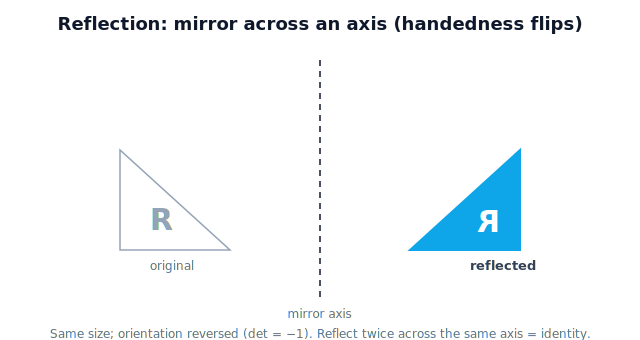

!!! abstract "You are here"
    **Module 1 — Mathematical Foundations**  ·  **Unit 4 — Matrices as Transformations**  ·  **Lesson 4.7 — Reflection Transformations**

# Lesson 4.7 — Reflection Transformations

## 1. Why This Matters

A **reflection** mirrors space across a line — flipping left-to-right or top-to-bottom. It's the action behind a mirrored camera image, a part flipped to its mirror-image twin, and the difference between a left-handed and right-handed coordinate frame. Like rotation, reflection preserves size; unlike rotation, it flips **orientation** (handedness) — a subtle but important property a robot must track so it doesn't, say, try to grasp a left-handed version of a right-handed part.

## 2. Physical Intuition

Hold a shape up to a mirror. The reflection is the same size and shape, but **handedness** is reversed — what curled clockwise now curls counterclockwise; a right hand looks like a left hand. Reflect across the vertical axis and left/right swap; reflect across the horizontal axis and up/down swap. Reflect twice across the same line and you're back to the original (that's the identity again).

## 3. Mathematical Foundations

Reflection across the $x$-axis (flip $y$) and across the $y$-axis (flip $x$):

$$F_x = \begin{bmatrix} 1 & 0 \\ 0 & -1 \end{bmatrix}, \qquad F_y = \begin{bmatrix} -1 & 0 \\ 0 & 1 \end{bmatrix}.$$

$F_x(x,y) = (x, -y)$; $F_y(x,y) = (-x, y)$. Reflections preserve length (a mirror doesn't resize) but **reverse orientation** — formally, the determinant is $-1$ (rotations have $+1$). That negative determinant is the algebraic signature of a flip. Reflecting twice across the same axis returns the original: $F_x F_x = I$.

## 4. Visual Explanation

<figure markdown>
  { width="680" }
</figure>

## 5. Engineering Example

A camera mounted to image a scene through a mirror (to fit a tight space) delivers a horizontally flipped picture; the software applies a reflection to un-mirror it before detection. Handedness also matters when matching a detected part to a CAD model — a left-handed bracket is not the same as its right-handed mirror image, and a reflection is what relates the two.

## 6. Worked Example

Reflect $\mathbf{p}=(2,3)$ across the $x$-axis: $F_x(2,3) = (2,-3)$ — same horizontal position, flipped vertically. Across the $y$-axis: $F_y(2,3)=(-2,3)$. Distance from the origin is unchanged ($\sqrt{13}$ in both). Apply $F_x$ twice: $(2,3)\to(2,-3)\to(2,3)$ — back to start, confirming $F_xF_x=I$.

## 7. Interactive Demonstration

<iframe src="../../demos/module01/lesson31_reflection_transformations.html" title="Reflection Transformations interactive demo" style="width:100%;height:520px;border:1px solid #e2e8f0;border-radius:12px"></iframe>

[Open this demo in a new tab ↗](../demos/module01/lesson31_reflection_transformations.html)

**Guided prediction.** Predict where (2, 3) lands after reflecting across the x-axis, then across the y-axis. Predict whether reflecting twice across the same axis returns the original point. Confirm the handedness flip using the mirrored shape in the figure above — same size, reversed orientation.
## 8. Coding Exercise

!!! tip "Run the hands-on notebook"
    `modules/module01/notebooks/M01_U04_L4_7_Reflection_Transformations.ipynb` — open in JupyterLab and run **Kernel → Restart & Run All**.

Reflect a shape across each axis with NumPy; confirm size is preserved (distances unchanged) and the determinant is $-1$ (orientation flip).

## 9. Knowledge Check

Formative — unlimited attempts, immediate feedback; does not affect your grade.

<iframe src="../../quizzes/module01/lesson31_quiz.html" title="Reflection Transformations knowledge check" style="width:100%;height:720px;border:1px solid #e2e8f0;border-radius:12px"></iframe>

[Open this quiz in a new tab ↗](../quizzes/module01/lesson31_quiz.html)

A check that reflection mirrors across an axis, preserves size, flips orientation (det $= -1$), and that reflecting twice is the identity.

## 10. Challenge Problem

Explain why a reflection cannot be achieved by any rotation, using the idea of handedness (and, if you like, the determinant sign). What does this mean for matching a part to its mirror-image twin?

## 11. Common Mistakes

- Confusing a 180° rotation with a reflection (rotation keeps handedness; reflection flips it).
- Forgetting reflection preserves size — it's a flip, not a resize.
- Missing that the determinant of a reflection is $-1$.

## 12. Key Takeaways

- A **reflection** mirrors space across an axis/line.
- It **preserves size** but **flips orientation** (handedness); determinant $= -1$.
- Reflecting twice across the same axis is the identity.
- Reflection relates left- and right-handed versions — important for views and part matching.

---

## AI Learning Companion

Copy any prompt below into ChatGPT, Claude, or another AI assistant.

**Tutor prompt** — explain it another way
```
Explain Lesson 4.7 (Reflection Transformations) using a mirror. Make clear that reflection keeps size but flips handedness, and why a 180-degree rotation is not the same as a reflection.
```

**Practice prompt** — generate more exercises
```
Give me 6 exercises reflecting points and shapes across the x- and y-axes, confirming size is preserved and orientation flips. Include answers.
```

**Explore prompt** — connect it to the real world
```
Show me where reflection appears in robot vision (mirrored camera images) and in matching parts to left/right-handed CAD models.
```

## Global Learning Support

Need this lesson explained in another language? Copy one of the prompts below into an AI assistant. English remains the authoritative source.

**Supported languages (initial):** English · Español · 中文 (Simplified Chinese) · Türkçe

**Español**
```
I just completed Lesson 4.7 — Reflection Transformations.
Explain this lesson in Spanish. Keep robotics and mathematical terminology in English when appropriate.
Then provide: a summary, three practice questions, and one challenge problem.
```

**中文 (Simplified Chinese)**
```
I just completed Lesson 4.7 — Reflection Transformations.
Explain this lesson in Simplified Chinese. Keep mathematical notation unchanged.
Then provide: a summary, three practice questions, and one challenge problem.
```

**Türkçe**
```
I just completed Lesson 4.7 — Reflection Transformations.
Explain this lesson in Turkish. Keep robotics terminology in English where commonly used.
Then provide: a summary, three practice questions, and one challenge problem.
```

---

*Next lesson: 4.2 — Matrix Addition (combining actions, lightweight).*
