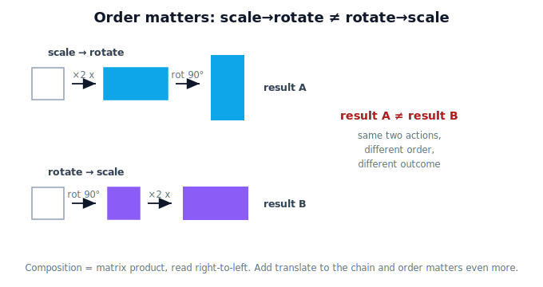

# Lesson 4.8 — Composition of Transformations

## 1. Why This Matters

This is the payoff of Unit 4. Real motion is rarely a single action — it's a **chain**: scale, then rotate, then move. **Composition** combines those into one operation. And the headline insight, the one to carry out of Module 1: **order matters.** Rotate-then-scale is generally *not* the same as scale-then-rotate. Get the order wrong in a robot pipeline and the gripper ends up in the wrong place at the wrong angle. Composition — and its sensitivity to order — is the conceptual seed of the kinematic chains you'll meet in Module 2.

## 2. Physical Intuition

Try it with your hands. Take a shape: **rotate** it 90°, then **scale** it ×2 horizontally — the stretch happens along the world's horizontal, after the turn. Now do it the other way: **scale** ×2 horizontally first, then **rotate** 90° — the stretch was baked in *before* the turn, so it ends up stretched along a different direction. Same two actions, different order, **different result.** Add a **translate** (a move) into the chain and the order matters even more: where you move relative to when you rotate completely changes the outcome.

> Unit 3 taught: *the same point can have different coordinates.* Unit 4 teaches: *the same point can be transformed in different ways* — and the order of those transformations is part of the answer.

## 3. Mathematical Foundations

Composing transformations is multiplying their matrices (Lesson 4.3), applied **right-to-left**: "scale then rotate" is $R\,S$ (S acts first, on the right). Because matrix multiplication is **not commutative**, $RS \neq SR$ in general — which is exactly "order matters" in algebra. For rotation/scale/reflection about the origin this is pure $2\times2$ products. **Translation** (a shift that doesn't fix the origin) can't be written as a $2\times2$ matrix; here we treat it as an action in the chain conceptually — Module 2 introduces homogeneous coordinates that fold translation into a single matrix so the whole chain (including moves) multiplies uniformly.

## 4. Visual Explanation

<figure markdown>
  { width="680" }
</figure>

## 5. Engineering Example

A vision-to-action pipeline composes several transforms: scale pixels to meters, rotate camera→robot, then position relative to the base. Apply them in the wrong order and the tomato's computed location is wrong. In a robot arm, each joint's rotation composes with the next; the end-effector's pose is the ordered product of all joint transforms — reorder them and you describe a different arm. Composition's order-sensitivity is not a technicality; it's the structure of how robots move.

## 6. Worked Example

Let $R=R(90°)=\begin{bmatrix}0&-1\\1&0\end{bmatrix}$ and $S=\begin{bmatrix}2&0\\0&1\end{bmatrix}$ (stretch x only). Apply to $\mathbf{p}=(1,0)$.
- **Scale then rotate** ($RS$): $S(1,0)=(2,0)$, then $R(2,0)=(0,2)$.
- **Rotate then scale** ($SR$): $R(1,0)=(0,1)$, then $S(0,1)=(0,1)$.
Results $(0,2)$ vs $(0,1)$ — **different.** Same two actions; the order changed the outcome.

## 7. Interactive Demonstration

<iframe src="../../demos/module01/lesson32_composition.html" title="Composition of Transformations interactive demo" style="width:100%;height:520px;border:1px solid #e2e8f0;border-radius:12px"></iframe>

[Open this demo in a new tab ↗](../demos/module01/lesson32_composition.html)

Build a chain — scale, rotate, translate — and watch it apply step by step; then swap the order and see the result land somewhere different. The combined effect and the current order are shown so "order matters" is something you *see*.

## 8. Coding Exercise

!!! tip "Run the hands-on notebook"
    `modules/module01/notebooks/lesson32_composition_of_transformations.ipynb` — open in JupyterLab and run **Kernel → Restart & Run All**.

Compose rotation, scaling, and a (conceptual) translation in NumPy; show scale→rotate ≠ rotate→scale on a sample point, and apply a full chain to a shape.

## 9. Knowledge Check

Formative — unlimited attempts, immediate feedback; does not affect your grade.

<iframe src="../../quizzes/module01/lesson32_quiz.html" title="Composition of Transformations knowledge check" style="width:100%;height:720px;border:1px solid #e2e8f0;border-radius:12px"></iframe>

[Open this quiz in a new tab ↗](../quizzes/module01/lesson32_quiz.html)

A check that composition chains transformations, that order changes the result (non-commutative), and that the first action applies on the right.

## 10. Challenge Problem

Design a scale, a rotation, and a translation, and find two different orders that move a given point to two clearly different places. Explain, in words, why a robot pipeline must fix the order.

## 11. Common Mistakes

- Assuming order doesn't matter — it almost always does.
- Getting the right-to-left order wrong (first action is rightmost).
- Forgetting translation isn't a $2\times2$ matrix (it's an action here; formalized in Module 2).

## 12. Key Takeaways

- **Composition** chains transformations into one combined action (matrix product).
- **Order matters**: scale→rotate ≠ rotate→scale (multiplication isn't commutative).
- The **first action is applied on the right**; chains are read right-to-left.
- Ordered composition is the structure behind robot pipelines and kinematic chains (Module 2).

---

## AI Learning Companion

Copy any prompt below into ChatGPT, Claude, or another AI assistant.

**Tutor prompt** — explain it another way
```
Explain Lesson 4.8 (Composition of Transformations) by walking through scale-then-rotate versus rotate-then-scale on the same shape, showing the results differ. Emphasize that order matters and why.
```

**Practice prompt** — generate more exercises
```
Give me 6 exercises composing rotation, scaling, and translation in different orders, where I show the results differ. Include answers and a sentence each on why order changed the outcome.
```

**Explore prompt** — connect it to the real world
```
Show me how composition order matters in a real robot vision-to-action pipeline and in chaining a robot arm's joint transforms.
```

## Global Learning Support

Need this lesson explained in another language? Copy one of the prompts below into an AI assistant. English remains the authoritative source.

**Supported languages (initial):** English · Español · 中文 (Simplified Chinese) · Türkçe

**Español**
```
I just completed Lesson 4.8 — Composition of Transformations.
Explain this lesson in Spanish. Keep robotics and mathematical terminology in English when appropriate.
Then provide: a summary, three practice questions, and one challenge problem.
```

**中文 (Simplified Chinese)**
```
I just completed Lesson 4.8 — Composition of Transformations.
Explain this lesson in Simplified Chinese. Keep mathematical notation unchanged.
Then provide: a summary, three practice questions, and one challenge problem.
```

**Türkçe**
```
I just completed Lesson 4.8 — Composition of Transformations.
Explain this lesson in Turkish. Keep robotics terminology in English where commonly used.
Then provide: a summary, three practice questions, and one challenge problem.
```

---

*Next lesson: 4.9 — Transformations in Physical AI (Unit 4 recap).*
