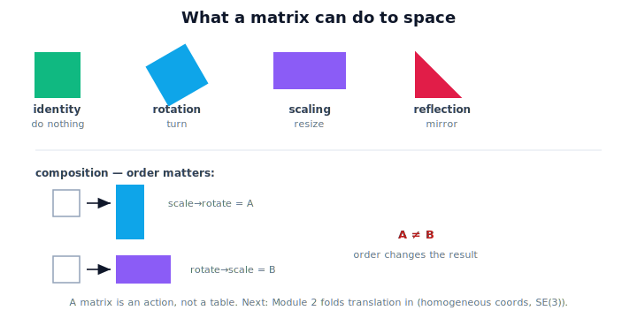

!!! abstract "You are here"
    **Module 1 — Mathematical Foundations**  ·  **Unit 4 — Matrices as Transformations**  ·  **Lesson 4.9 — Transformations in Physical AI (Unit 4 Recap)**

# Lesson 4.9 — Transformations in Physical AI (Unit 4 Recap)

*A short synthesis lesson — no new mathematics. It ties Unit 4 together and points toward Module 2.*

---

## What can a matrix do to space?

Unit 3 taught that *the same point can have different coordinates*. Unit 4 taught the complementary idea:

> **The same point can be transformed in different ways — and a matrix is the action that does it.**

A matrix is not a table of numbers. It is a verb: it *does something* to space. You met the core actions and the rule for chaining them.

## The actions you now have

| Action | Lesson | What it does to space |
|---|---|---|
| Identity | 4.4 | Nothing — leaves every point unchanged (the neutral action). |
| Rotation | 4.5 | Turns space about the origin; size preserved, orientation changes. |
| Scaling | 4.6 | Stretches/shrinks along the axes; area scales by sx·sy. |
| Reflection | 4.7 | Mirrors across an axis; size preserved, handedness flips. |
| Composition | 4.3, 4.8 | Chains actions into one (matrix product) — **order matters**. |

And one supporting operation: **addition** (4.2) blends matrices entry-by-entry — useful, but *not* how you chain actions (that's multiplication).

The single most important takeaway: **composition is ordered.** Rotate-then-scale is not scale-then-rotate. That order-sensitivity is the structure behind every robot pipeline and every kinematic chain.

## Why this matters: the bridge to Module 2

A robot arm is a *chain* of transformations — one per joint — composed in order to place the gripper. A vision-to-action pipeline composes scale, rotation, and position in a fixed order. Everything you did in Unit 4 — actions on space, combined in order — is exactly the language of robot motion. Module 2 adds the one missing piece: **homogeneous coordinates**, which fold translation into a matrix so the *entire* chain (including moves) multiplies uniformly as **SE(3)** transforms.

## Visual Explanation

<figure markdown>
  { width="680" }
</figure>

## Interactive Demonstration

<iframe src="../../demos/module01/lesson33_transformations_recap.html" title="Transformations in Physical AI (Unit 4 Recap) interactive demo" style="width:100%;height:520px;border:1px solid #e2e8f0;border-radius:12px"></iframe>

[Open this demo in a new tab ↗](../demos/module01/lesson33_transformations_recap.html)

Bring Unit 4 together: rotate, scale, and reflect a shape and watch the single combined matrix that captures every move.

## Coding Exercise

!!! tip "Run the hands-on notebook"
    `modules/module01/notebooks/M01_U04_L4_9_Transformations_In_Physical_AI_Unit_4_Recap.ipynb` — open in JupyterLab and run **Kernel → Restart & Run All**.

A short capstone: apply identity, rotation, scaling, and reflection to one shape, then compose two of them in both orders and confirm the results differ.

## Knowledge Check

Formative — unlimited attempts, immediate feedback; does not affect your grade.

<iframe src="../../quizzes/module01/lesson33_quiz.html" title="Transformations in Physical AI (Unit 4 Recap) knowledge check" style="width:100%;height:720px;border:1px solid #e2e8f0;border-radius:12px"></iframe>

[Open this quiz in a new tab ↗](../quizzes/module01/lesson33_quiz.html)

A brief consolidation quiz across the unit (formative — unlimited attempts).

## Key Takeaways

- A **matrix is an action applied to space**, not a table of numbers.
- **Identity** does nothing; **rotation** turns; **scaling** resizes; **reflection** mirrors.
- **Composition** chains actions (matrix product) and is **order-dependent**.
- Next: **Module 2** adds homogeneous coordinates and translation to build full **SE(3)** transforms and robot kinematics.

---

## AI Learning Companion

Copy any prompt below into ChatGPT, Claude, or another AI assistant.

**Tutor prompt** — explain it another way
```
Summarize Unit 4 (transformations) as one story: how identity, rotation, scaling, reflection, and composition are all actions a matrix applies to space, and why composition order matters. Use one shape throughout.
```

**Practice prompt** — generate more exercises
```
Give me a 10-question mixed review of Unit 4: identifying what a matrix does (identity/rotation/scaling/reflection), applying them to points, and composing two actions in both orders. Include answers.
```

**Explore prompt** — connect it to the real world
```
Show me how a robot arm's motion is a composition of per-joint transformations, and why getting the order right matters.
```

## Global Learning Support

Need this lesson explained in another language? Copy one of the prompts below into an AI assistant. English remains the authoritative source.

**Supported languages (initial):** English · Español · 中文 (Simplified Chinese) · Türkçe

**Español**
```
I just completed Lesson 4.9 — Transformations in Physical AI (Unit 4 Recap).
Explain this lesson in Spanish. Keep robotics and mathematical terminology in English when appropriate.
Then provide: a summary, three practice questions, and one challenge problem.
```

**中文 (Simplified Chinese)**
```
I just completed Lesson 4.9 — Transformations in Physical AI (Unit 4 Recap).
Explain this lesson in Simplified Chinese. Keep mathematical notation unchanged.
Then provide: a summary, three practice questions, and one challenge problem.
```

**Türkçe**
```
I just completed Lesson 4.9 — Transformations in Physical AI (Unit 4 Recap).
Explain this lesson in Turkish. Keep robotics terminology in English where commonly used.
Then provide: a summary, three practice questions, and one challenge problem.
```

---

*Next: Module 2 — homogeneous coordinates, translation as a matrix, and SE(3) transforms for robot kinematics.*
