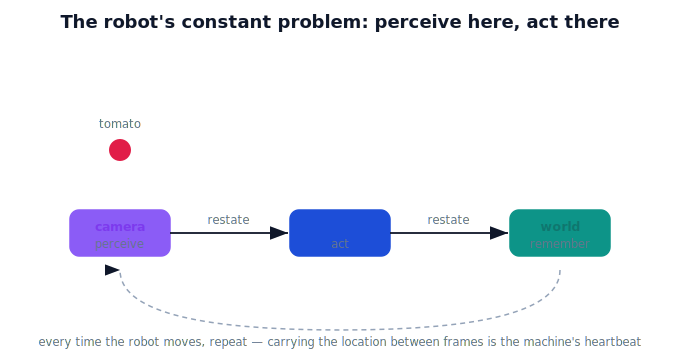

!!! abstract "You are here"
    **Module 2 — Spatial Transformations and SE(3)**  ·  **Unit 1 — Why Transformations Matter**  ·  **Lesson 1.1 — The Robot's Constant Problem**

# Lesson 1.1 — The Robot's Constant Problem

## 1. Why This Matters

Module 1 ended with a robot that understands frames (who is describing a point) and transformations (what we can do to space). Module 2 starts from the realization that a working robot does **one thing over and over, all day**: it senses the world in one frame and must act in another. The camera sees a tomato; the arm lives somewhere else; the map remembers a third place. This isn't an occasional puzzle — it's the heartbeat of the machine. Before any math, let's feel why a robot needs **one dependable way** to carry spatial information across frames.

## 2. Physical Intuition

Watch the harvesting robot for ten seconds. Its camera spots a ripe tomato and reports "there." But the gripper isn't at the camera — it's mounted on an arm at the base. So the robot must restate "there" in the *arm's* terms before it can move. Then, to remember the fruit for later, it restates it again in the *greenhouse's* terms. Sense, restate, restate, act — and then the robot rolls forward 10 cm and every "there" needs restating again.

The problem never stops. A robot that can't fluidly carry a location from one frame to another is blind in a very specific way: it can *see* but can't *act* on what it sees. Module 2 is about building that fluency into a single tool.

## 3. Mathematical Foundations

Lightly, as a promise of what's coming. Each "restate it in another frame" is a **transformation** between frames (Module 1, Unit 3). In Module 1 we could rotate space with a matrix, but we couldn't *move* (translate) space with a matrix — and crossing between a camera and an arm always involves a move. So the robot's constant problem demands a representation that handles **rotation and translation together**, repeatedly, by composition. That representation — homogeneous coordinates and rigid-body transforms (SE(2)/SE(3)) — is the subject of this module. Here we only establish the need.

## 4. Visual Explanation

<figure markdown>
  { width="680" }
</figure>

## 5. Engineering Example

In real robot software, a "transform system" runs continuously, publishing the current relationship between every pair of frames (camera, arm, base, world) many times a second. Every perception result is immediately passed through it to become actionable. If that system stalls or a single frame relationship is wrong, the arm reaches confidently to the wrong place — a failure that looks like "bad vision" but is really a frame-handling problem.

## 6. Worked Example

The camera reports a tomato "0.3 m ahead of the lens." The arm is 0.05 m behind and 0.25 m below the lens. Even with no rotation, the arm's version of "there" is a *different* set of numbers — and getting it requires a move (a translation), not just a turn. Multiply that by every fruit, every second, every time the robot repositions, and you see why one reusable tool is essential.

## 7. Interactive Demonstration

*(Unit 2's translation-as-a-matrix demo and later SE(2)/SE(3) demos make this concrete; here the static figure and example establish the need.)*

## 8. Coding Exercise

!!! tip "Run the hands-on notebook"
    `modules/module02/notebooks/lesson01_robots_constant_problem.ipynb` — open in JupyterLab and run **Kernel → Restart & Run All**.

List the frames in a harvesting robot (camera, arm/base, world) and, for one tomato, write by hand the three different "there" descriptions — no transforms yet, just to feel the restating.

## 9. Knowledge Check

Formative — unlimited attempts, immediate feedback; does not affect your grade.

<iframe src="../../quizzes/module02/lesson01_quiz.html" title="The Robot's Constant Problem knowledge check" style="width:100%;height:720px;border:1px solid #e2e8f0;border-radius:12px"></iframe>

[Open this quiz in a new tab ↗](../quizzes/module02/lesson01_quiz.html)

A check that perception and action live in different frames and that carrying a location between them is constant.

## 10. Challenge Problem

Describe a full pick (see → reach → place in a bin → log on the map) and count how many times a single tomato's location is restated in a different frame. What happens to that count when the robot drives to a new row?

## 11. Common Mistakes

- Treating frame conversion as a one-time setup rather than a continuous operation.
- Assuming the camera and arm share a frame (they don't — there's always an offset, usually a rotation too).
- Blaming "the vision system" for what is actually a frame-relationship error.

## 12. Key Takeaways

- A robot **constantly** perceives in one frame and acts in another.
- Carrying a location between frames is the machine's heartbeat, not an edge case.
- Crossing camera↔arm always involves **translation**, which Module 1 couldn't put in a matrix.
- Module 2 builds the single reusable tool for this: rigid-body transforms.

---

## AI Learning Companion

Copy any prompt below into ChatGPT, Claude, or another AI assistant.

**Tutor prompt** — explain it another way
```
Explain Lesson 1.1 (The Robot's Constant Problem) using a harvesting robot that sees with a camera but acts with an arm in a different place. Make clear why restating a location between frames happens constantly, not once.
```

**Practice prompt** — generate more exercises
```
Give me 5 scenarios of a robot perceiving in one frame and acting in another; for each, identify the frames involved and how many times a location must be restated. Include answers.
```

**Explore prompt** — connect it to the real world
```
Show me how real robots run a continuous transform system between camera, arm, base, and world frames, and what goes wrong when one frame relationship is incorrect.
```

## Global Learning Support

Need this lesson explained in another language? Copy one of the prompts below into an AI assistant. English remains the authoritative source.

**Supported languages (initial):** English · Español · 中文 (Simplified Chinese) · Türkçe

**Español**
```
I just completed Lesson 1.1 (Module 2) — The Robot's Constant Problem.
Explain this lesson in Spanish. Keep robotics and mathematical terminology in English when appropriate.
Then provide: a summary, three practice questions, and one challenge problem.
```

**中文 (Simplified Chinese)**
```
I just completed Lesson 1.1 (Module 2) — The Robot's Constant Problem.
Explain this lesson in Simplified Chinese. Keep mathematical notation unchanged.
Then provide: a summary, three practice questions, and one challenge problem.
```

**Türkçe**
```
I just completed Lesson 1.1 (Module 2) — The Robot's Constant Problem.
Explain this lesson in Turkish. Keep robotics terminology in English where commonly used.
Then provide: a summary, three practice questions, and one challenge problem.
```

---

*Next lesson: 1.2 — Why Position and Orientation Must Travel Together (pose).*
