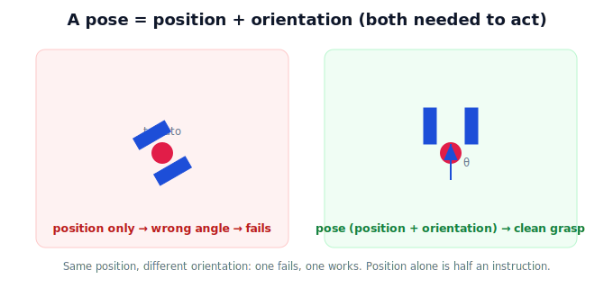

!!! abstract "You are here"
    **Module 2 — Spatial Transformations and SE(3)**  ·  **Unit 1 — Why Transformations Matter**  ·  **Lesson 1.2 — Why Position and Orientation Must Travel Together**

# Lesson 1.2 — Why Position and Orientation Must Travel Together

## 1. Why This Matters

Knowing *where* a tomato is isn't enough to pick it. The gripper also has to approach at the right **angle** — square to the stem, not sideways into a neighbor. "Where" is position; "which way" is orientation. A robot needs both, bundled into one idea it can carry between frames: a **pose**. This lesson establishes that position and orientation are inseparable for action, which is exactly why the coming representation (rigid-body transforms) carries both at once.

## 2. Physical Intuition

Try to hand someone a coffee mug while telling them only the *position* of your hand — not which way it's tilted. They can't take it cleanly; they need your hand's **orientation** too. Same for the robot: to grasp, it must place the gripper *at* the fruit (position) *and* aligned to it (orientation). To dock at a charging station, it must arrive *at* the dock and *facing* it correctly. Position without orientation is half an instruction.

So whenever the robot describes "where the gripper should be," it really means a **pose**: a position *and* an orientation, glued together as one object that moves through the world as a unit.

## 3. Mathematical Foundations

Lightly. A **pose** in 2D is a position $(x, y)$ plus an orientation angle $\theta$; in 3D it's a position $(x, y, z)$ plus a 3D orientation. The key idea for this module: a pose is not two separate facts to track independently — it is **one object**. And a pose can be read as a **transformation**: "the gripper's pose in the robot frame" is exactly the rigid transform that takes the robot frame to the gripper frame (rotation + translation). We'll make that precise in Units 3–6; here we just bind position and orientation into one inseparable thing.

## 4. Visual Explanation

<figure markdown>
  { width="680" }
</figure>

## 5. Engineering Example

A pick-and-place target is always a pose, never just a point: the planner is handed "go to this position *with this orientation*." A bin-placing step specifies the drop pose so the fruit lands stem-up. A docking maneuver specifies the dock pose. In code these are stored as a single pose object precisely because the two parts must stay together — separating them invites the gripper to arrive in the right spot at the wrong angle.

## 6. Worked Example

A tomato sits at robot-frame position $(0.35, 0.15)$ with its stem pointing up-and-left at $120°$. The grasp pose is therefore: position $(0.35, 0.15)$, orientation $120°$ (so the gripper aligns with the stem). Drop either piece — give only $(0.35,0.15)$, or only "$120°$" — and the instruction is unusable. The pose is the pair, together.

## 7. Interactive Demonstration

*(The pose explorer in Unit 6 makes this manipulable; here the two-panel figure shows why orientation is non-negotiable.)*

## 8. Coding Exercise

!!! tip "Run the hands-on notebook"
    `modules/module02/notebooks/lesson02_position_and_orientation.ipynb` — open in JupyterLab and run **Kernel → Restart & Run All**.

Represent a 2D pose as a small record (x, y, theta) and write a one-line check that two poses are equal only if *both* position and orientation match.

## 9. Knowledge Check

Formative — unlimited attempts, immediate feedback; does not affect your grade.

<iframe src="../../quizzes/module02/lesson02_quiz.html" title="Why Position and Orientation Must Travel Together knowledge check" style="width:100%;height:720px;border:1px solid #e2e8f0;border-radius:12px"></iframe>

[Open this quiz in a new tab ↗](../quizzes/module02/lesson02_quiz.html)

A check that a pose is position + orientation as one object, and that position alone is insufficient to act.

## 10. Challenge Problem

Give two tasks where the same *position* but a different *orientation* leads to success vs failure. Explain why this proves orientation must travel with position.

## 11. Common Mistakes

- Tracking position and orientation separately and letting them drift out of sync.
- Specifying a grasp by point only, ignoring approach angle.
- Forgetting orientation in 3D needs more than one angle (a full 3D orientation) — covered in Unit 4.

## 12. Key Takeaways

- Acting on an object needs **both** position and orientation.
- Together these form a single object: a **pose**.
- A pose can be read as a rigid transformation between two frames (made precise later).
- Module 2's representation carries position and orientation together by design.

---

## AI Learning Companion

Copy any prompt below into ChatGPT, Claude, or another AI assistant.

**Tutor prompt** — explain it another way
```
Explain Lesson 1.2 (Module 2) — Why Position and Orientation Must Travel Together — using the example of handing someone a mug. Make clear why position alone is half an instruction and what a pose is.
```

**Practice prompt** — generate more exercises
```
Give me 6 robot tasks and for each state the required pose (position + orientation) and what fails if orientation is ignored. Include answers.
```

**Explore prompt** — connect it to the real world
```
Show me how robot software stores a pose as a single object (position + orientation) and why grasping and docking are specified as poses, not points.
```

## Global Learning Support

Need this lesson explained in another language? Copy one of the prompts below into an AI assistant. English remains the authoritative source.

**Supported languages (initial):** English · Español · 中文 (Simplified Chinese) · Türkçe

**Español**
```
I just completed Lesson 1.2 (Module 2) — Why Position and Orientation Must Travel Together.
Explain this lesson in Spanish. Keep robotics and mathematical terminology in English when appropriate.
Then provide: a summary, three practice questions, and one challenge problem.
```

**中文 (Simplified Chinese)**
```
I just completed Lesson 1.2 (Module 2) — Why Position and Orientation Must Travel Together.
Explain this lesson in Simplified Chinese. Keep mathematical notation unchanged.
Then provide: a summary, three practice questions, and one challenge problem.
```

**Türkçe**
```
I just completed Lesson 1.2 (Module 2) — Why Position and Orientation Must Travel Together.
Explain this lesson in Turkish. Keep robotics terminology in English where commonly used.
Then provide: a summary, three practice questions, and one challenge problem.
```

---

*Next lesson: 1.3 — The Limit We Hit in Module 1 (rotation was a matrix; translation wasn't).*
