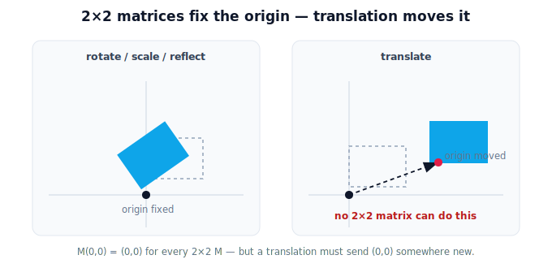

!!! abstract "You are here"
    **Module 2 — Spatial Transformations and SE(3)**  ·  **Unit 1 — Why Transformations Matter**  ·  **Lesson 1.3 — The Limit We Hit in Module 1**

# Lesson 1.3 — The Limit We Hit in Module 1

## 1. Why This Matters

In Module 1 a matrix could turn space, resize it, and mirror it. But every one of those actions left the **origin fixed** — apply any $2\times2$ matrix to $(0,0)$ and you get $(0,0)$ back. That's a problem, because moving from a camera frame to an arm frame is mostly a **shift** (a translation): the two origins are in different places. So the very operation a robot needs most often is the one a plain matrix *can't* do. Naming this limit precisely is what motivates the fix in Unit 2.

## 2. Physical Intuition

A rotation spins the world around a pin at the origin; a scaling stretches outward from the origin; a reflection flips across a line through the origin. In all three, the origin is the anchor that never moves. But "the arm is 0.3 m below and 0.05 m behind the camera" is a pure **move** of the origin — exactly what those origin-anchored actions can't express. You can't slide the world with a turn-or-stretch; you need a genuinely different kind of action.

## 3. Mathematical Foundations

For any $2\times2$ matrix $M$, $M\,(0,0) = (0,0)$ — the origin is a fixed point of every linear map. Translation by $(t_x, t_y)$ sends $(0,0) \to (t_x, t_y)$, which is nonzero, so **translation is not a linear map** and cannot be written as a $2\times2$ matrix times a point:

$$\text{no } 2\times2\ M \text{ satisfies } M\mathbf{p} = \mathbf{p} + \mathbf{t} \text{ for all } \mathbf{p}\ (\text{when } \mathbf{t}\neq 0).$$

Module 1 handled translation *conceptually* in the composition lesson for exactly this reason. The fix (Unit 2): **homogeneous coordinates** add one extra coordinate so that translation *also* becomes a matrix multiply — letting rotation and translation finally live in one matrix.

## 4. Visual Explanation

<figure markdown>
  { width="680" }
</figure>

## 5. Engineering Example

Every camera-to-arm handoff is dominated by a translation (the sensor and the gripper are bolted in different places), usually plus a rotation (the camera is tilted). Module 1's matrices could express the tilt but not the offset. A robot stuck with only $2\times2$ matrices could *reorient* a detection but never *relocate* it to the arm's origin — useless for picking. The missing piece is translation-as-a-matrix.

## 6. Worked Example

Take the rotation $R(90°)=\begin{bmatrix}0&-1\\1&0\end{bmatrix}$. Apply to the origin: $R(90°)(0,0)=(0,0)$ — origin fixed. Now try to "move everything right by 1" with a $2\times2$ matrix: you'd need $M(0,0)=(1,0)$, but $M(0,0)=(0,0)$ always. No $2\times2$ matrix can do it. Translation simply isn't expressible this way — which is the whole reason Unit 2 exists.

## 7. Interactive Demonstration

<iframe src="../../demos/module02/lesson03_the_2x2_limit.html" title="The Limit We Hit in Module 1 interactive demo" style="width:100%;height:520px;border:1px solid #e2e8f0;border-radius:12px"></iframe>

[Open this demo in a new tab ↗](../demos/module02/lesson03_the_2x2_limit.html)

*(Unit 2's translation-as-a-matrix demo shows the fix directly: switch from a 2×2 that can't move the origin to a homogeneous 3×3 that can.)*

## 8. Coding Exercise

!!! tip "Run the hands-on notebook"
    `modules/module02/notebooks/M02_U01_L1_3_The_Limit_We_Hit_In_Module_1.ipynb` — open in JupyterLab and run **Kernel → Restart & Run All**.

Show numerically that several 2×2 matrices all map (0,0) to (0,0), and that "add a translation vector" is a separate operation a 2×2 matrix can't absorb.

## 9. Knowledge Check

Formative — unlimited attempts, immediate feedback; does not affect your grade.

<iframe src="../../quizzes/module02/lesson03_quiz.html" title="The Limit We Hit in Module 1 knowledge check" style="width:100%;height:720px;border:1px solid #e2e8f0;border-radius:12px"></iframe>

[Open this quiz in a new tab ↗](../quizzes/module02/lesson03_quiz.html)

A check that 2×2 matrices fix the origin, that translation moves the origin, and that translation is therefore not a 2×2 matrix.

## 10. Challenge Problem

Explain, without homogeneous coordinates yet, why "rotate then add a translation vector" can model a frame change but isn't a *single* matrix — and why a robot would prefer it to be one matrix.

## 11. Common Mistakes

- Believing some clever 2×2 matrix can translate (none can — the origin is always fixed).
- Conflating "move the shape" via scaling/rotation with an actual translation.
- Forgetting this is exactly why Module 1 kept translation conceptual.

## 12. Key Takeaways

- Every $2\times2$ matrix **fixes the origin**: $M(0,0)=(0,0)$.
- **Translation moves the origin**, so it is *not* a $2\times2$ matrix.
- Frame changes are mostly translation — the operation Module 1 couldn't matrix-ify.
- **Homogeneous coordinates** (Unit 2) fix this, uniting rotation and translation in one matrix.

---

## AI Learning Companion

Copy any prompt below into ChatGPT, Claude, or another AI assistant.

**Tutor prompt** — explain it another way
```
Explain Lesson 1.3 (Module 2) — The Limit We Hit in Module 1 — by showing that rotation, scaling, and reflection all pin the origin, so none can translate. Make clear why frame changes need translation and why that motivates homogeneous coordinates.
```

**Practice prompt** — generate more exercises
```
Give me 5 exercises demonstrating that 2x2 matrices fix the origin and cannot translate, with short explanations. Include answers.
```

**Explore prompt** — connect it to the real world
```
Show me why a camera-to-arm handoff is mostly translation, and why a robot limited to 2x2 matrices could reorient but never relocate a detection.
```

## Global Learning Support

Need this lesson explained in another language? Copy one of the prompts below into an AI assistant. English remains the authoritative source.

**Supported languages (initial):** English · Español · 中文 (Simplified Chinese) · Türkçe

**Español**
```
I just completed Lesson 1.3 (Module 2) — The Limit We Hit in Module 1.
Explain this lesson in Spanish. Keep robotics and mathematical terminology in English when appropriate.
Then provide: a summary, three practice questions, and one challenge problem.
```

**中文 (Simplified Chinese)**
```
I just completed Lesson 1.3 (Module 2) — The Limit We Hit in Module 1.
Explain this lesson in Simplified Chinese. Keep mathematical notation unchanged.
Then provide: a summary, three practice questions, and one challenge problem.
```

**Türkçe**
```
I just completed Lesson 1.3 (Module 2) — The Limit We Hit in Module 1.
Explain this lesson in Turkish. Keep robotics terminology in English where commonly used.
Then provide: a summary, three practice questions, and one challenge problem.
```

---

*Next lesson: 1.4 — Why Transformations Matter (Unit 1 recap and bridge to homogeneous coordinates).*
