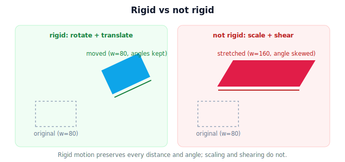

!!! abstract "You are here"
    **Module 2 — Spatial Transformations and SE(3)**  ·  **Unit 3 — SE(2) Transformations**  ·  **Lesson 3.1 — What "Rigid" Means**

# Lesson 3.1 — What "Rigid" Means

## 1. Why This Matters

Unit 2 gave us one matrix that rotates *and* translates. Now we name the family of motions that matters most for robots: **rigid** ones. When the harvesting arm swings a tomato from the vine to the bin, the tomato doesn't stretch, shrink, or warp — it just moves and turns. That "moves without deforming" property is what **rigid** means, and it's the defining feature of **SE(2)** (and later SE(3)). Getting this idea first tells you exactly which transformations describe real physical motion.

## 2. Physical Intuition

Pick up a rigid object — a wrench, a tomato, a phone — and move it anywhere in the room, turning it however you like. Two things never change: the **distance** between any two points on it (the wrench doesn't get longer), and the **angles** between its features (the jaws stay square). It is the same object; it has only changed *where it is* and *which way it faces*. That is a rigid transformation: any combination of **rotation and translation**, and nothing else.

Now contrast: stretching it (scaling) or slanting it (shearing) would change distances or angles — those are *not* rigid. A robot arm can't stretch a tomato, so its motions are rigid by nature.

## 3. Mathematical Foundations

A transformation is **rigid** (a *rigid-body motion*, or *isometry*) if it preserves the distance between every pair of points:

$$\lVert T(\mathbf{p}) - T(\mathbf{q}) \rVert = \lVert \mathbf{p} - \mathbf{q} \rVert \quad \text{for all } \mathbf{p}, \mathbf{q}.$$

Preserving distances also preserves angles and shape. In 2D, every rigid motion is exactly a **rotation followed by a translation** — precisely the combined matrix from Lesson 2.4, with a *pure rotation* in the upper-left block (no scaling, no shear). Rotation preserves length (Module 1, 4.5) and translation moves everything equally, so together they preserve all distances. Scaling and reflection-with-scaling are excluded; reflection alone preserves distance but flips handedness, so the orientation-preserving rigid motions (rotation + translation) form the group **SE(2)**, named next lesson.

## 4. Visual Explanation

<figure markdown>
  { width="680" }
</figure>

## 5. Engineering Example

The arm carrying a tomato applies a rigid transformation to it: the fruit's position and orientation change, but its size and shape do not. This is why a robot can plan motion as a single rigid transform of the gripper-and-payload — it never has to model the object deforming. The same holds for moving the robot's base across the greenhouse: the chassis is rigid, so its motion is a rigid transform of every point on it.

## 6. Worked Example

Two points on a wrench are 0.20 m apart. Rotate the wrench 50° and move it 1.3 m across the bench. Measure the two points again: still 0.20 m apart. The transformation changed both points' coordinates, but their separation is invariant — the signature of a rigid motion. If instead the operation reported the points as 0.30 m apart, the transformation included a stretch and was *not* rigid.

## 7. Interactive Demonstration

<iframe src="../../demos/module02/lesson10_what_rigid_means.html" title="What "Rigid" Means interactive demo" style="width:100%;height:520px;border:1px solid #e2e8f0;border-radius:12px"></iframe>

[Open this demo in a new tab ↗](../demos/module02/lesson10_what_rigid_means.html)

**Guided prediction.** Picture a shape moved two ways: (a) rotated 90° and slid across the bench; (b) stretched to twice its width. Predict which one keeps every edge length and every corner angle, and which changes them. Then predict what a robot arm physically can and cannot do to a tomato it is carrying — and confirm that real arm motion matches the rigid case.

## 8. Coding Exercise

!!! tip "Run the hands-on notebook"
    `modules/module02/notebooks/M02_U03_L3_1_What_Rigid_Means.ipynb` — open in JupyterLab and run **Kernel → Restart & Run All**.

Take a set of shape points, apply a rotation+translation, and confirm pairwise distances are unchanged; then apply a scaling and show distances change — distinguishing rigid from non-rigid numerically.

## 9. Knowledge Check

Formative — unlimited attempts, immediate feedback; does not affect your grade.

<iframe src="../../quizzes/module02/lesson10_quiz.html" title="What "Rigid" Means knowledge check" style="width:100%;height:720px;border:1px solid #e2e8f0;border-radius:12px"></iframe>

[Open this quiz in a new tab ↗](../quizzes/module02/lesson10_quiz.html)

A check that rigid = distances/angles preserved, that 2D rigid motion = rotation + translation, and that scaling/shearing are not rigid.

## 10. Challenge Problem

A transformation reports that two points 0.5 m apart are now 0.5 m apart, but a right angle between three points has become 80°. Is it rigid? Explain what must be true of *all* measurements, not just one, for a transformation to be rigid.

## 11. Common Mistakes

- Assuming any matrix transform is rigid (scaling and shear are not).
- Checking one distance and concluding rigidity — *every* distance and angle must be preserved.
- Forgetting reflection preserves distance but flips handedness (excluded from SE(2)).

## 12. Key Takeaways

- A **rigid** transformation preserves all distances and angles — the object moves without deforming.
- In 2D, rigid motion = **rotation + translation** (pure rotation block, no scaling/shear).
- Robot motion is rigid: arms and bases move objects without stretching them.
- The orientation-preserving rigid motions form **SE(2)** (next lesson).

---

## AI Learning Companion

Copy any prompt below into ChatGPT, Claude, or another AI assistant.

**Tutor prompt** — explain it another way
```
Explain Lesson 3.1 (Module 2) — What "Rigid" Means — using the example of picking up a wrench and moving it anywhere. Make clear that rigid motion preserves all distances and angles, and contrast it with scaling and shearing.
```

**Practice prompt** — generate more exercises
```
Give me 6 exercises classifying transformations as rigid or not rigid by checking whether distances and angles are preserved, in a greenhouse-robot context. Include answers.
```

**Explore prompt** — connect it to the real world
```
Show me why a robot arm's motion is a rigid transformation and what would have to be true physically for a motion to be non-rigid.
```

## Global Learning Support

Need this lesson explained in another language? Copy one of the prompts below into an AI assistant. English remains the authoritative source.

**Supported languages (initial):** English · Español · 中文 (Simplified Chinese) · Türkçe

**Español**
```
I just completed Lesson 3.1 (Module 2) — What "Rigid" Means.
Explain this lesson in Spanish. Keep robotics and mathematical terminology in English when appropriate.
Then provide: a summary, three practice questions, and one challenge problem.
```

**中文 (Simplified Chinese)**
```
I just completed Lesson 3.1 (Module 2) — What "Rigid" Means.
Explain this lesson in Simplified Chinese. Keep mathematical notation unchanged.
Then provide: a summary, three practice questions, and one challenge problem.
```

**Türkçe**
```
I just completed Lesson 3.1 (Module 2) — What "Rigid" Means.
Explain this lesson in Turkish. Keep robotics terminology in English where commonly used.
Then provide: a summary, three practice questions, and one challenge problem.
```

---

*Next lesson: 3.2 — The SE(2) Transformation (rigid motion as a 3×3 matrix).*
