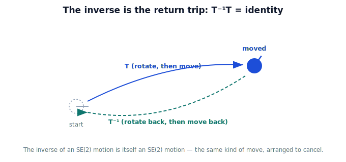

!!! abstract "You are here"
    **Module 2 — Spatial Transformations and SE(3)**  ·  **Unit 3 — SE(2) Transformations**  ·  **Lesson 3.4 — Inverse Transformations**

# Lesson 3.4 — Inverse Transformations

## 1. Why This Matters

Every frame conversion has a return trip. If $T$ takes a point from the robot frame to the world frame, something must take it back — that something is the **inverse**, written $T^{-1}$. Robots need this constantly: a camera gives a detection in the camera frame, but sometimes you need to ask "where is the robot, as seen from that detection?" — the reverse direction. The good news, kept geometric here: the inverse of a rigid move is just *another rigid move* — the one that undoes it.

## 2. Physical Intuition

You walked 3 steps east and turned to face north. How do you get back to exactly where and how you started? **Undo it in reverse**: turn back to your original facing, then walk 3 steps west. That return journey is the inverse. It's not a strange new operation — it's the same *kind* of motion (a turn and a slide), just arranged to cancel the first. So the inverse of an SE(2) move is itself an SE(2) move. Apply a transform and then its inverse and you're back where you began, as if nothing happened (the identity).

## 3. Mathematical Foundations

The **inverse** $T^{-1}$ satisfies $T^{-1}T = T T^{-1} = I$ (do it, then undo it = do nothing). For an SE(2) transform $T = \begin{bmatrix} R & \mathbf{t} \\ \mathbf{0}^\top & 1 \end{bmatrix}$, the inverse is also SE(2):

$$T^{-1} = \begin{bmatrix} R^{\top} & -R^{\top}\mathbf{t} \\ \mathbf{0}^\top & 1 \end{bmatrix}.$$

Geometrically: **undo the rotation** (a rotation by $-\theta$, which is $R^\top$ since rotation matrices are orthogonal), then **undo the translation** in that rotated frame. You don't need to memorize the formula to use the idea — "rotate back, then move back" is the inverse. Crucially, $T^{-1}$ is itself a valid rigid motion (its block is still a pure rotation), so going back is the same kind of operation as going forward. If $T$ maps frame A → frame B, then $T^{-1}$ maps frame B → frame A.

## 4. Visual Explanation

<figure markdown>
  { width="680" }
</figure>

## 5. Engineering Example

If $T$ is "robot frame → world frame," then $T^{-1}$ is "world frame → robot frame." A robot that knows its pose in the world ($T$) can convert any world-frame waypoint into its own frame to act on it, using $T^{-1}$. Both directions are needed all the time: forward to report where things are in the world, inverse to bring world goals into the robot's own coordinates.

## 6. Worked Example

$T$ moves a point by rotating $90°$ and translating $(2, 1)$; it sent $(0,0) \to (2,1)$ and $(1,0)\to(2,2)$ (Lesson 3.3). Apply $T^{-1}$ to $(2,1)$: undo the rotation and translation and you return to $(0,0)$; apply $T^{-1}$ to $(2,2)$ and you return to $(1,0)$. Do-then-undo lands exactly on the originals — confirming $T^{-1}T = I$. The return trip is itself "rotate by $-90°$, then move back," another SE(2) motion.

## 7. Interactive Demonstration

<iframe src="../../demos/module02/lesson13_inverse_transformations.html" title="Inverse Transformations interactive demo" style="width:100%;height:520px;border:1px solid #e2e8f0;border-radius:12px"></iframe>

[Open this demo in a new tab ↗](../demos/module02/lesson13_inverse_transformations.html)

**Guided prediction.** A shape is moved by an SE(2) transform $T$ (rotate, then slide). Predict the *sequence* that brings it back: which do you undo first, the slide or the turn, and what are their reversed values? Predict where the shape lands after applying $T$ and then $T^{-1}$ in turn. Confirm it returns exactly to the start — the inverse is the return trip.

## 8. Coding Exercise

!!! tip "Run the hands-on notebook"
    `modules/module02/notebooks/M02_U03_L3_4_Inverse_Transformations.ipynb` — open in JupyterLab and run **Kernel → Restart & Run All**.

Build an SE(2) matrix $T$ and its inverse (via the rotate-back/move-back rule or a matrix inverse), apply $T$ then $T^{-1}$ to several points, and assert you recover the originals.

## 9. Knowledge Check

Formative — unlimited attempts, immediate feedback; does not affect your grade.

<iframe src="../../quizzes/module02/lesson13_quiz.html" title="Inverse Transformations knowledge check" style="width:100%;height:720px;border:1px solid #e2e8f0;border-radius:12px"></iframe>

[Open this quiz in a new tab ↗](../quizzes/module02/lesson13_quiz.html)

A check that the inverse undoes a transform ($T^{-1}T=I$), that the SE(2) inverse is itself SE(2), and that it maps the frame back the other way.

## 10. Challenge Problem

Explain why "rotate back, then move back" must happen in that order to undo "move, then rotate" — and connect this to why $(AB)^{-1} = B^{-1}A^{-1}$ (undo the last thing first).

## 11. Common Mistakes

- Undoing the translation in the original frame instead of the rotated one (order matters).
- Thinking the inverse is a different kind of object — it's still a rigid SE(2) motion.
- Forgetting that inverting reverses the frame direction (A→B becomes B→A).

## 12. Key Takeaways

- The **inverse** $T^{-1}$ is the motion that undoes $T$: $T^{-1}T = I$.
- Geometrically: **rotate back, then move back** — the return trip.
- The inverse of an SE(2) transform is **itself SE(2)**.
- If $T$ maps frame A → B, then $T^{-1}$ maps B → A — both directions a robot needs.

---

## AI Learning Companion

Copy any prompt below into ChatGPT, Claude, or another AI assistant.

**Tutor prompt** — explain it another way
```
Explain Lesson 3.4 (Module 2) — Inverse Transformations — using "walk 3 steps east, turn north; now get back." Make clear the inverse is the return trip (rotate back, then move back) and is itself a rigid SE(2) motion.
```

**Practice prompt** — generate more exercises
```
Give me 6 exercises: given an SE(2) transform, describe and apply its inverse to bring points back to the start; confirm T-inverse times T is the identity. Include answers.
```

**Explore prompt** — connect it to the real world
```
Show me how a robot uses T (robot->world) and its inverse (world->robot) to both report object locations and bring world goals into its own frame.
```

## Global Learning Support

Need this lesson explained in another language? Copy one of the prompts below into an AI assistant. English remains the authoritative source.

**Supported languages (initial):** English · Español · 中文 (Simplified Chinese) · Türkçe

**Español**
```
I just completed Lesson 3.4 (Module 2) — Inverse Transformations.
Explain this lesson in Spanish. Keep robotics and mathematical terminology in English when appropriate.
Then provide: a summary, three practice questions, and one challenge problem.
```

**中文 (Simplified Chinese)**
```
I just completed Lesson 3.4 (Module 2) — Inverse Transformations.
Explain this lesson in Simplified Chinese. Keep mathematical notation unchanged.
Then provide: a summary, three practice questions, and one challenge problem.
```

**Türkçe**
```
I just completed Lesson 3.4 (Module 2) — Inverse Transformations.
Explain this lesson in Turkish. Keep robotics terminology in English where commonly used.
Then provide: a summary, three practice questions, and one challenge problem.
```

---

*Next lesson: 3.5 — Rigid Motion in the Plane (Unit 3 recap).*
