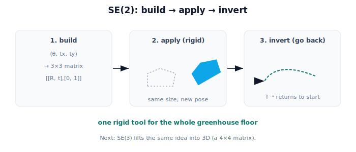

!!! abstract "You are here"
    **Module 2 — Spatial Transformations and SE(3)**  ·  **Unit 3 — SE(2) Transformations**  ·  **Lesson 3.5 — Rigid Motion in the Plane (Unit 3 Recap)**

# Lesson 3.5 — Rigid Motion in the Plane (Unit 3 Recap)

*A short synthesis — no new mathematics. It ties Unit 3 together and points into SE(3).*

---

## One tool for planar motion

Unit 2 gave us a matrix that rotates and translates. Unit 3 named the family that matters and made it usable end to end:

> **SE(2) is planar rigid motion as a single 3×3 matrix — one you can build, apply to anything, and run backwards.**

Every pose, base move, and planar frame relationship on the greenhouse floor is one SE(2) element.

## What Unit 3 established

| Lesson | Point |
|---|---|
| 3.1 What "Rigid" Means | Rigid = distances and angles preserved; in 2D that's rotation + translation, nothing else. |
| 3.2 The SE(2) Transformation | A 3×3 matrix: pure-rotation block + translation column + [0 0 1]; three numbers $(\theta, t_x, t_y)$. |
| 3.3 Applying SE(2) | Multiply by a point to move it; apply to all points to move a whole shape, rigidly. |
| 3.4 Inverse Transformations | The return trip — rotate back, then move back; the inverse of SE(2) is itself SE(2). |

Together: build a rigid motion, carry points and shapes through it, and reverse it to go back a frame — the complete planar toolkit.

## Why this matters

A robot driving and turning on the floor, a sensor mounted at an offset and angle, a detected cluster that must move into the planning frame and back — all are SE(2) matrices multiplied and inverted. Because every SE(2) element and its inverse is rigid, nothing the robot computes ever distorts the world; it only re-poses and re-frames it.

## Visual Explanation

<figure markdown>
  { width="680" }
</figure>

## Interactive Demonstration

<iframe src="../../demos/module02/lesson14_rigid_motion_recap.html" title="Rigid Motion in the Plane (Unit 3 Recap) interactive demo" style="width:100%;height:520px;border:1px solid #e2e8f0;border-radius:12px"></iframe>

[Open this demo in a new tab ↗](../demos/module02/lesson14_rigid_motion_recap.html)

Unit 3 in one tool: slide θ, t_x, t_y and watch a single SE(2) transform rigidly move the shape — heading and position together, lengths preserved.

## Coding Exercise

!!! tip "Run the hands-on notebook"
    `modules/module02/notebooks/M02_U03_L3_5_Rigid_Motion_In_The_Plane_Unit_3_Recap.ipynb` — open in JupyterLab and run **Kernel → Restart & Run All**.

A short capstone: build an SE(2) matrix from $(\theta, t_x, t_y)$, apply it to a shape and confirm distances are preserved, then apply its inverse and confirm you recover the original points.

## Knowledge Check

Formative — unlimited attempts, immediate feedback; does not affect your grade.

<iframe src="../../quizzes/module02/lesson14_quiz.html" title="Rigid Motion in the Plane (Unit 3 Recap) knowledge check" style="width:100%;height:720px;border:1px solid #e2e8f0;border-radius:12px"></iframe>

[Open this quiz in a new tab ↗](../quizzes/module02/lesson14_quiz.html)

A brief consolidation quiz across Unit 3 (formative — unlimited attempts).

## Key Takeaways

- **SE(2)** = planar rigid motion as a 3×3 matrix: build it, apply it, invert it.
- Structure: pure-rotation block + translation column + $[0\ 0\ 1]$; specified by $(\theta, t_x, t_y)$.
- Applying it moves points and shapes **rigidly**; the **inverse** (itself SE(2)) goes back a frame.
- Next: **SE(3)** lifts this exact idea into 3D — a 4×4 matrix for rigid motion in space.

---

## AI Learning Companion

Copy any prompt below into ChatGPT, Claude, or another AI assistant.

**Tutor prompt** — explain it another way
```
Summarize Unit 3 of Module 2 as one story: rigid motion, the SE(2) 3x3 matrix, applying it to points and shapes, and inverting it to go back — all for a robot on the greenhouse floor.
```

**Practice prompt** — generate more exercises
```
Give me a 10-question mixed review of SE(2): what rigid means, building a 3x3 from (theta, tx, ty), applying it to points/shapes, and using the inverse to return. Include answers.
```

**Explore prompt** — connect it to the real world
```
Show me a planar robot workflow where SE(2) matrices and their inverses move a base, a sensor mount, and a detected object between frames.
```

## Global Learning Support

Need this lesson explained in another language? Copy one of the prompts below into an AI assistant. English remains the authoritative source.

**Supported languages (initial):** English · Español · 中文 (Simplified Chinese) · Türkçe

**Español**
```
I just completed Lesson 3.5 (Module 2) — Rigid Motion in the Plane (Unit 3 Recap).
Explain this lesson in Spanish. Keep robotics and mathematical terminology in English when appropriate.
Then provide: a summary, three practice questions, and one challenge problem.
```

**中文 (Simplified Chinese)**
```
I just completed Lesson 3.5 (Module 2) — Rigid Motion in the Plane (Unit 3 Recap).
Explain this lesson in Simplified Chinese. Keep mathematical notation unchanged.
Then provide: a summary, three practice questions, and one challenge problem.
```

**Türkçe**
```
I just completed Lesson 3.5 (Module 2) — Rigid Motion in the Plane (Unit 3 Recap).
Explain this lesson in Turkish. Keep robotics terminology in English where commonly used.
Then provide: a summary, three practice questions, and one challenge problem.
```

---

*Next: Unit 4 — SE(3) Transformations (rigid motion in 3D as a 4×4 matrix).*
