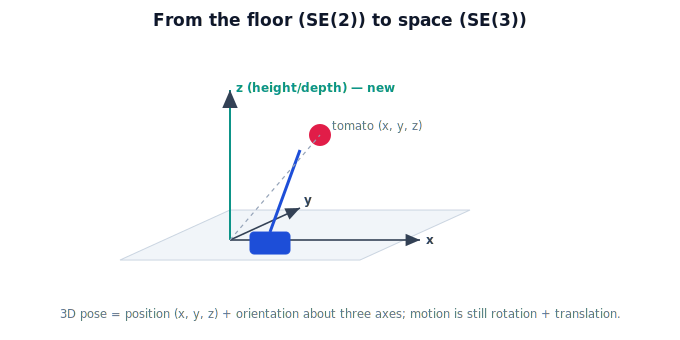

!!! abstract "You are here"
    **Module 2 — Spatial Transformations and SE(3)**  ·  **Unit 4 — SE(3) Transformations**  ·  **Lesson 4.1 — From 2D to 3D Rigid Motion**

# Lesson 4.1 — From 2D to 3D Rigid Motion

## 1. Why This Matters

SE(2) handled the greenhouse *floor* — a robot driving and turning on a flat plane. But a harvesting robot reaches *up* into the canopy, and its camera looks at fruit hanging at many heights and depths. The world is three-dimensional, and so is the motion. This lesson makes the jump: rigid motion in 3D is the same idea — rotation plus translation — but with a third axis and a richer notion of rotation. Everything you built for SE(2) generalizes; nothing is thrown away.

## 2. Physical Intuition

On the floor, a pose needed three numbers: where (x, y) and which way (one heading angle). Lift into 3D and two things grow. Position gains a third coordinate — **height/depth (z)** — so location is (x, y, z). And orientation becomes richer: on a plane you can only spin about one axis (the vertical), but in space an object can **tilt and turn about three different axes** (think of an aircraft's pitch, roll, and yaw). A tomato can hang tilted in any direction; the gripper must match that full 3D orientation. The motion is still "turn and move" — there's just more room to do both.

## 3. Mathematical Foundations

A 3D point is $(x, y, z)$. A 3D rigid motion still preserves all distances and angles, and is still a **rotation followed by a translation** — but the rotation now lives in 3D (a $3\times3$ rotation matrix instead of $2\times2$) and the translation is a 3-vector $(t_x, t_y, t_z)$. The homogeneous representation grows by one row and column: points become $(x, y, z, 1)$ and transforms become $4\times4$ matrices. The block form is unchanged in spirit:

$$\begin{bmatrix} R_{3\times3} & \mathbf{t}_{3\times1} \\ \mathbf{0}^\top & 1 \end{bmatrix}.$$

This family of 3D rigid motions is **SE(3)**, the subject of this unit. The "one extra coordinate makes translation a matrix" trick from Unit 2 is exactly the same — just in 3D.

## 4. Visual Explanation

<figure markdown>
  { width="680" }
</figure>

## 5. Engineering Example

The harvesting arm must reach a tomato at a specific height in the canopy and approach it at the angle its stem hangs — a full 3D pose. A floor-only (SE(2)) description can't even name the fruit's height, let alone the gripper's tilt. Every real pick is an SE(3) problem: position in space plus orientation about three axes.

## 6. Worked Example

On the floor, the robot's pose was $(\theta, x, y)$ — three numbers. In the canopy, a tomato's pose is $(x, y, z)$ for position plus a 3D orientation (three more numbers, introduced next lesson) — six numbers in all. For instance, a fruit at $(0.4, 0.3, 0.9)$ m tilted forward needs the gripper placed at that point *and* rotated to meet the tilt. SE(2)'s single heading angle simply cannot express "tilted forward."

## 7. Interactive Demonstration

<iframe src="../../demos/module02/lesson15_2d_to_3d.html" title="From 2D to 3D Rigid Motion interactive demo" style="width:100%;height:520px;border:1px solid #e2e8f0;border-radius:12px"></iframe>

[Open this demo in a new tab ↗](../demos/module02/lesson15_2d_to_3d.html)

**Guided prediction.** Using the isometric scene above, predict what extra information a 3D pose needs compared to a floor pose: how many position numbers, and how many independent ways can the object be oriented? Then predict which real harvesting situations (reaching up, a tilted fruit, a slanted camera) are impossible to describe on a flat plane — and why the third axis fixes each.

## 8. Coding Exercise

!!! tip "Run the hands-on notebook"
    `modules/module02/notebooks/M02_U04_L4_1_From_2D_To_3D_Rigid_Motion.ipynb` — open in JupyterLab and run **Kernel → Restart & Run All**.

Represent a 2D pose (x, y, θ) and a 3D point (x, y, z); list what's missing from the 2D representation to describe a tomato hanging tilted in the canopy.

## 9. Knowledge Check

Formative — unlimited attempts, immediate feedback; does not affect your grade.

<iframe src="../../quizzes/module02/lesson15_quiz.html" title="From 2D to 3D Rigid Motion knowledge check" style="width:100%;height:720px;border:1px solid #e2e8f0;border-radius:12px"></iframe>

[Open this quiz in a new tab ↗](../quizzes/module02/lesson15_quiz.html)

A check that 3D adds a third position axis and richer (three-axis) orientation, and that 3D rigid motion is still rotation + translation.

## 10. Challenge Problem

A robot's planner uses only SE(2). Describe two specific harvesting failures this causes in a 3D canopy, and state the minimum extra information SE(3) supplies to fix each.

## 11. Common Mistakes

- Thinking 3D just adds a z-number to position (orientation also gains two degrees of freedom).
- Assuming a single angle describes 3D orientation (it needs three).
- Believing SE(3) is a brand-new idea — it's SE(2)'s rotation+translation, generalized.

## 12. Key Takeaways

- Real robot motion is **3D**: position $(x, y, z)$ plus orientation about **three** axes.
- 3D rigid motion is still **rotation + translation**, with a $3\times3$ rotation and a 3-vector translation.
- Homogeneous form grows to **$4\times4$**; points become $(x, y, z, 1)$.
- This family is **SE(3)** — the same block structure as SE(2), lifted into space.

---

## AI Learning Companion

Copy any prompt below into ChatGPT, Claude, or another AI assistant.

**Tutor prompt** — explain it another way
```
Explain Lesson 4.1 (Module 2) — From 2D to 3D Rigid Motion — using a harvesting robot reaching up into the canopy. Make clear what the third axis adds to position and why orientation now needs three axes, while the motion is still rotation + translation.
```

**Practice prompt** — generate more exercises
```
Give me 5 scenarios in a 3D greenhouse and for each state what a floor-only SE(2) description cannot capture and what SE(3) adds. Include answers.
```

**Explore prompt** — connect it to the real world
```
Show me why real robot manipulation requires full 3D pose (position + 3-axis orientation) and where a planar-only model breaks down.
```

## Global Learning Support

Need this lesson explained in another language? Copy one of the prompts below into an AI assistant. English remains the authoritative source.

**Supported languages (initial):** English · Español · 中文 (Simplified Chinese) · Türkçe

**Español**
```
I just completed Lesson 4.1 (Module 2) — From 2D to 3D Rigid Motion.
Explain this lesson in Spanish. Keep robotics and mathematical terminology in English when appropriate.
Then provide: a summary, three practice questions, and one challenge problem.
```

**中文 (Simplified Chinese)**
```
I just completed Lesson 4.1 (Module 2) — From 2D to 3D Rigid Motion.
Explain this lesson in Simplified Chinese. Keep mathematical notation unchanged.
Then provide: a summary, three practice questions, and one challenge problem.
```

**Türkçe**
```
I just completed Lesson 4.1 (Module 2) — From 2D to 3D Rigid Motion.
Explain this lesson in Turkish. Keep robotics terminology in English where commonly used.
Then provide: a summary, three practice questions, and one challenge problem.
```

---

*Next lesson: 4.2 — 3D Rotation (axis + angle intuition).*
