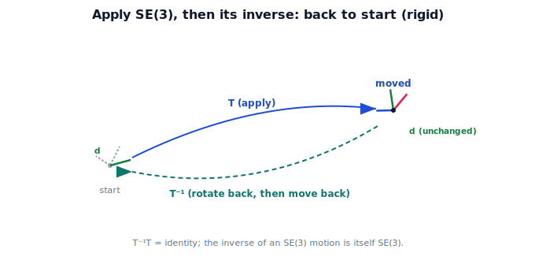

!!! abstract "You are here"
    **Module 2 — Spatial Transformations and SE(3)**  ·  **Unit 4 — SE(3) Transformations**  ·  **Lesson 4.5 — Applying SE(3); Inverses in 3D**

# Lesson 4.5 — Applying SE(3); Inverses in 3D

## 1. Why This Matters

SE(3) earns its keep when you *apply* it — moving a 3D point, a whole object, or an entire frame — and when you *invert* it to go back. These are the two operations the camera→robot→world pipeline runs constantly: forward to place things in another frame, inverse to bring goals into your own. The inverse rule you learned for SE(2) — "rotate back, then move back" — carries over unchanged into 3D.

## 2. Physical Intuition

Applying SE(3) is "stamp the 3D move onto each point": every point of the gripper-and-fruit gets rotated and offset together, arriving turned and repositioned but the same size and shape. The inverse is again the **return trip**: undo the rotation, then undo the translation in that rotated frame, and you're exactly back where you started. If $T$ says "camera as seen from the world," $T^{-1}$ says "world as seen from the camera" — same kind of rigid move, arranged to cancel.

## 3. Mathematical Foundations

Apply SE(3) $T = \begin{bmatrix} R & \mathbf{t} \\ \mathbf{0}^\top & 1 \end{bmatrix}$ to a homogeneous point: $T(\mathbf{p}, 1) = (R\mathbf{p} + \mathbf{t},\ 1)$. To a frame: multiply the frame's SE(3) matrix on the appropriate side. The **inverse** is itself SE(3):

$$T^{-1} = \begin{bmatrix} R^{\top} & -R^{\top}\mathbf{t} \\ \mathbf{0}^\top & 1 \end{bmatrix},$$

exactly the SE(2) formula with a $3\times3$ rotation. Geometrically: undo the rotation ($R^\top$, since $R$ is orthogonal) and undo the translation in the rotated frame. $T^{-1}T = I$, and if $T$ maps frame A → B then $T^{-1}$ maps B → A. Because $R^\top$ is still a rotation, $T^{-1}$ is a valid rigid motion. Rigidity is preserved: $\lVert T\mathbf{p} - T\mathbf{q}\rVert = \lVert \mathbf{p} - \mathbf{q}\rVert$.

## 4. Visual Explanation

<figure markdown>
  { width="680" }
</figure>

## 5. Engineering Example

If $T$ is "gripper pose in the world," the robot uses $T$ to report where the gripper is and $T^{-1}$ to convert a world-frame waypoint into the gripper's own frame to act on it. The fixed camera→arm mount $T_{ca}$ and its inverse let the robot move detections in and answers out. Forward and inverse SE(3) multiplications are the entire language of the perception-to-action chain.

## 6. Worked Example

$T$ has $R = R_z(90°)$ and $\mathbf{t} = (1, 0, 0)$. Apply to the point $(1, 0, 0, 1)$: rotate $(1,0,0)$ about $z$ by $90°$ → $(0,1,0)$, then add $\mathbf{t}$ → $(1, 1, 0)$. Now apply $T^{-1}$ to $(1, 1, 0)$: undo gives back $(1, 0, 0)$. Do-then-undo returns the original — $T^{-1}T = I$. Distances are preserved throughout: the move never stretched anything.

## 7. Interactive Demonstration

<iframe src="../../demos/module02/lesson19_applying_se3_inverses.html" title="Applying SE(3); Inverses in 3D interactive demo" style="width:100%;height:520px;border:1px solid #e2e8f0;border-radius:12px"></iframe>

[Open this demo in a new tab ↗](../demos/module02/lesson19_applying_se3_inverses.html)

**Guided prediction.** A frame is moved by an SE(3) transform $T$ (a 3D rotation, then a translation). Predict the order to undo it — which first, the rotation or the translation, and with what reversed values? Predict where a point lands after $T$ then $T^{-1}$. Confirm it returns exactly to start, and that every edge length is unchanged because SE(3) is rigid.

## 8. Coding Exercise

!!! tip "Run the hands-on notebook"
    `modules/module02/notebooks/M02_U04_L4_5_Applying_SE3_And_Inverses.ipynb` — open in JupyterLab and run **Kernel → Restart & Run All**.

Implement `se3_inv(T)` via the rotate-back/move-back rule; apply `T` then `T_inv` to several 3D points and assert you recover the originals and that pairwise distances are preserved.

## 9. Knowledge Check

Formative — unlimited attempts, immediate feedback; does not affect your grade.

<iframe src="../../quizzes/module02/lesson19_quiz.html" title="Applying SE(3); Inverses in 3D knowledge check" style="width:100%;height:720px;border:1px solid #e2e8f0;border-radius:12px"></iframe>

[Open this quiz in a new tab ↗](../quizzes/module02/lesson19_quiz.html)

A check that applying SE(3) gives R·p + t, that the inverse is itself SE(3) ("rotate back, then move back"), and that motion is rigid.

## 10. Challenge Problem

Show that $(T_1 T_2)^{-1} = T_2^{-1} T_1^{-1}$ for SE(3) transforms, and explain in robot terms why you must undo the *last* applied transform first when reversing a camera→arm→world chain.

## 11. Common Mistakes

- Undoing the translation before the rotation, or in the wrong frame.
- Forgetting the inverse is itself a valid SE(3) (rigid) motion.
- Applying translation to a 3D direction (w=0) and expecting it to move.

## 12. Key Takeaways

- Applying SE(3): $T(\mathbf{p}) = R\mathbf{p} + \mathbf{t}$; whole frames transform by matrix multiplication.
- The **inverse** is itself SE(3): **rotate back, then move back** ($T^{-1}T = I$).
- If $T$ maps A → B, then $T^{-1}$ maps B → A — both directions the pipeline needs.
- SE(3) motion is **rigid**: distances and angles preserved.

---

## AI Learning Companion

Copy any prompt below into ChatGPT, Claude, or another AI assistant.

**Tutor prompt** — explain it another way
```
Explain Lesson 4.5 (Module 2) — Applying SE(3) and Inverses in 3D — by stamping a 3D move onto points and using the inverse as the return trip (rotate back, then move back). Use a gripper-pose-in-the-world example.
```

**Practice prompt** — generate more exercises
```
Give me 6 exercises applying SE(3) transforms to 3D points and using the inverse to return them, confirming T-inverse times T is the identity. Include answers.
```

**Explore prompt** — connect it to the real world
```
Show me how a robot uses T (gripper->world) and its inverse (world->gripper), and why reversing a camera->arm->world chain undoes the last transform first.
```

## Global Learning Support

Need this lesson explained in another language? Copy one of the prompts below into an AI assistant. English remains the authoritative source.

**Supported languages (initial):** English · Español · 中文 (Simplified Chinese) · Türkçe

**Español**
```
I just completed Lesson 4.5 (Module 2) — Applying SE(3); Inverses in 3D.
Explain this lesson in Spanish. Keep robotics and mathematical terminology in English when appropriate.
Then provide: a summary, three practice questions, and one challenge problem.
```

**中文 (Simplified Chinese)**
```
I just completed Lesson 4.5 (Module 2) — Applying SE(3); Inverses in 3D.
Explain this lesson in Simplified Chinese. Keep mathematical notation unchanged.
Then provide: a summary, three practice questions, and one challenge problem.
```

**Türkçe**
```
I just completed Lesson 4.5 (Module 2) — Applying SE(3); Inverses in 3D.
Explain this lesson in Turkish. Keep robotics terminology in English where commonly used.
Then provide: a summary, three practice questions, and one challenge problem.
```

---

*Next lesson: 4.6 — Rigid Motion in 3D (Unit 4 recap).*
