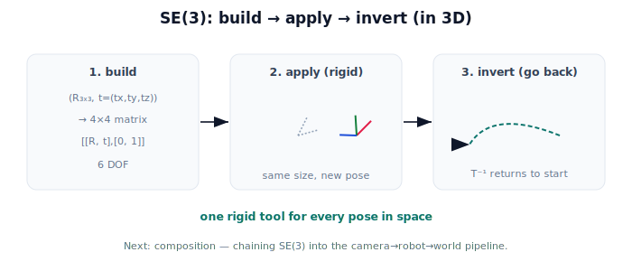

!!! abstract "You are here"
    **Module 2 — Spatial Transformations and SE(3)**  ·  **Unit 4 — SE(3) Transformations**  ·  **Lesson 4.6 — Rigid Motion in 3D (Unit 4 Recap)**

# Lesson 4.6 — Rigid Motion in 3D (Unit 4 Recap)

*A short synthesis — no new mathematics. It ties Unit 4 together and points into composition.*

---

## One tool for motion in space

Unit 3 made planar rigid motion a single 3×3 matrix. Unit 4 lifted the whole idea into three dimensions:

> **SE(3) is 3D rigid motion as a single 4×4 matrix — build it, apply it to anything, run it backwards.**

Every pose in space — the gripper, the camera, a fruit in the canopy — is one SE(3) element.

## What Unit 4 established

| Lesson | Point |
|---|---|
| 4.1 From 2D to 3D | The world is 3D: position gains height/depth (z); orientation gains two more axes. Still rotation + translation. |
| 4.2 3D Rotation | A spin about an axis by an angle; a $3\times3$ orthogonal matrix (det +1) preserving length and handedness. |
| 4.3 The SE(3) Transformation | A $4\times4$ matrix: $3\times3$ rotation block + 3D translation column + $[0\ 0\ 0\ 1]$; 6 DOF. |
| 4.4 Translation Vectors in 3D | Position is $(t_x,t_y,t_z)$ in the last column; points (w=1) translate, directions (w=0) only rotate. |
| 4.5 Applying SE(3); Inverses | $T(\mathbf p)=R\mathbf p+\mathbf t$; the inverse — rotate back, then move back — is itself SE(3). |

## Why this matters

A six-degree-of-freedom pose — three for position, three for orientation — is exactly what a real harvesting robot needs to place a gripper on a tilted fruit at a given height. SE(3) packs all six into one matrix you can apply and invert, and (next unit) **chain**. Because every SE(3) element and its inverse is rigid, the robot's spatial math never distorts the world.

## Visual Explanation

<figure markdown>
  { width="680" }
</figure>

## Interactive Demonstration

<iframe src="../../demos/module02/lesson20_rigid_motion_3d_recap.html" title="Rigid Motion in 3D (Unit 4 Recap) interactive demo" style="width:100%;height:520px;border:1px solid #e2e8f0;border-radius:12px"></iframe>

[Open this demo in a new tab ↗](../demos/module02/lesson20_rigid_motion_3d_recap.html)

Unit 4 in one tool: rotate about z and lift in height, and watch a real 3D SE(3) rigid motion — orientation and position together, shape preserved.

## Coding Exercise

!!! tip "Run the hands-on notebook"
    `modules/module02/notebooks/M02_U04_L4_6_Rigid_Motion_In_3D_Unit_4_Recap.ipynb` — open in JupyterLab and run **Kernel → Restart & Run All**.

A short capstone: build an SE(3) from a rotation and translation, apply it to a small 3D shape and confirm distances are preserved, then apply its inverse and confirm you recover the original points.

## Knowledge Check

Formative — unlimited attempts, immediate feedback; does not affect your grade.

<iframe src="../../quizzes/module02/lesson20_quiz.html" title="Rigid Motion in 3D (Unit 4 Recap) knowledge check" style="width:100%;height:720px;border:1px solid #e2e8f0;border-radius:12px"></iframe>

[Open this quiz in a new tab ↗](../quizzes/module02/lesson20_quiz.html)

A brief consolidation quiz across Unit 4 (formative — unlimited attempts).

## Key Takeaways

- **SE(3)** = 3D rigid motion as a $4\times4$ matrix: build it, apply it, invert it.
- Structure: $3\times3$ rotation block + 3D translation column + $[0\ 0\ 0\ 1]$; **6 DOF**.
- Applying it moves points/frames **rigidly**; the **inverse** (itself SE(3)) goes back a frame.
- Next: **composition** — chaining SE(3) transforms to build the camera→robot→world pipeline.

---

## AI Learning Companion

Copy any prompt below into ChatGPT, Claude, or another AI assistant.

**Tutor prompt** — explain it another way
```
Summarize Unit 4 of Module 2 as one story: 3D rotation (axis + angle), the SE(3) 4x4 matrix, applying it to 3D points and frames, and inverting it — all for a robot reaching into a 3D canopy.
```

**Practice prompt** — generate more exercises
```
Give me a 10-question mixed review of SE(3): 3D rotation, the 4x4 structure, the 3D translation vector, applying it, and the inverse. Include answers.
```

**Explore prompt** — connect it to the real world
```
Show me a 3D harvesting workflow where SE(3) matrices and their inverses move the camera, arm, and a detected fruit between frames.
```

## Global Learning Support

Need this lesson explained in another language? Copy one of the prompts below into an AI assistant. English remains the authoritative source.

**Supported languages (initial):** English · Español · 中文 (Simplified Chinese) · Türkçe

**Español**
```
I just completed Lesson 4.6 (Module 2) — Rigid Motion in 3D (Unit 4 Recap).
Explain this lesson in Spanish. Keep robotics and mathematical terminology in English when appropriate.
Then provide: a summary, three practice questions, and one challenge problem.
```

**中文 (Simplified Chinese)**
```
I just completed Lesson 4.6 (Module 2) — Rigid Motion in 3D (Unit 4 Recap).
Explain this lesson in Simplified Chinese. Keep mathematical notation unchanged.
Then provide: a summary, three practice questions, and one challenge problem.
```

**Türkçe**
```
I just completed Lesson 4.6 (Module 2) — Rigid Motion in 3D (Unit 4 Recap).
Explain this lesson in Turkish. Keep robotics terminology in English where commonly used.
Then provide: a summary, three practice questions, and one challenge problem.
```

---

*Next: Unit 5 — Transformation Composition (chaining rigid motions).*
