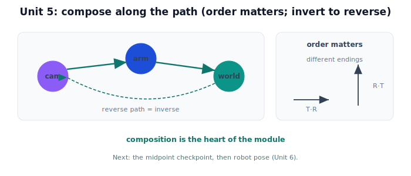

!!! abstract "You are here"
    **Module 2 — Spatial Transformations and SE(3)**  ·  **Unit 5 — Transformation Composition**  ·  **Lesson 5.4 — Composing Rigid Motions (Unit 5 Recap)**

# Lesson 5.4 — Composing Rigid Motions (Unit 5 Recap)

*A short synthesis — no new mathematics. It ties Unit 5 together and points into pose.*

---

## The heart of the module

Units 3–4 built single rigid motions (SE(2), SE(3)). Unit 5 is where they become a system:

> **Chain transforms by multiplying them — mind the order, invert to go backward, and treat frames as a graph so any pose query is a composed path.**

This is the conceptual heart of Module 2: everything a robot does spatially is a composition of rigid motions.

## What Unit 5 established

| Lesson | Point |
|---|---|
| 5.1 Chaining Transforms | Doing transforms in sequence = multiplying them; the chain collapses into one matrix ($T_2 T_1$, apply $T_1$ first). |
| 5.2 Order Matters | Composition is non-commutative: $T_2 T_1 \neq T_1 T_2$; "rotate then move" ≠ "move then rotate." |
| 5.3 Frames as a Graph | Frames are nodes, transforms are edges; relate any two by composing along the path, inverting backward edges. |

A chain of rigid motions is itself rigid, so every composed path is a valid SE(2)/SE(3) transform.

## Why this matters

The camera→robot→world pipeline is a path through the frame graph, composed into one transform. Get the **order** right and the gripper lands on the fruit; get it wrong and it reaches empty air. Need the reverse direction? Invert the path. Composition + inversion + the graph view are the complete toolkit for moving any quantity between any two frames.

## Visual Explanation

<figure markdown>
  { width="680" }
</figure>

## Interactive Demonstration

<iframe src="../../demos/module02/lesson24_composing_rigid_motions_recap.html" title="Composing Rigid Motions (Unit 5 Recap) interactive demo" style="width:100%;height:520px;border:1px solid #e2e8f0;border-radius:12px"></iframe>

[Open this demo in a new tab ↗](../demos/module02/lesson24_composing_rigid_motions_recap.html)

Unit 5 in one tool: chain two rigid motions, swap the order, and watch the combined transform land the shape differently.

## Coding Exercise

!!! tip "Run the hands-on notebook"
    `modules/module02/notebooks/M02_U05_L5_4_Composing_Rigid_Motions_Unit_5_Recap.ipynb` — open in JupyterLab and run **Kernel → Restart & Run All**.

A short capstone: build two SE(3) edges, compose them along a path (camera→world), show that swapping the order changes the result, and invert the path to recover world→camera.

## Knowledge Check

Formative — unlimited attempts, immediate feedback; does not affect your grade.

<iframe src="../../quizzes/module02/lesson24_quiz.html" title="Composing Rigid Motions (Unit 5 Recap) knowledge check" style="width:100%;height:720px;border:1px solid #e2e8f0;border-radius:12px"></iframe>

[Open this quiz in a new tab ↗](../quizzes/module02/lesson24_quiz.html)

A brief consolidation quiz across Unit 5 (formative — unlimited attempts).

## Key Takeaways

- **Composition = matrix multiplication**; the chain is one matrix ($T_2 T_1$, $T_1$ first).
- **Order matters**: $T_2 T_1 \neq T_1 T_2$ in general.
- **Frames as a graph**: relate any two by composing the path; **invert** backward edges.
- This is the heart of the module and the backbone of the perception-to-pose pipeline (Units 7–8). Next: **robot pose** (Unit 6).

---

## AI Learning Companion

Copy any prompt below into ChatGPT, Claude, or another AI assistant.

**Tutor prompt** — explain it another way
```
Summarize Unit 5 of Module 2 as one story: chaining transforms by multiplication, why order matters, and frames-as-a-graph where any pose query is a composed path (with inverses for backward edges).
```

**Practice prompt** — generate more exercises
```
Give me a 10-question mixed review of composition: chaining as a product, non-commutativity, and composing along a frame-graph path with inverses. Include answers.
```

**Explore prompt** — connect it to the real world
```
Show me how a robot composes the camera→world transform along a frame-graph path and why order and inverses are critical to getting the gripper to the right place.
```

## Global Learning Support

Need this lesson explained in another language? Copy one of the prompts below into an AI assistant. English remains the authoritative source.

**Supported languages (initial):** English · Español · 中文 (Simplified Chinese) · Türkçe

**Español**
```
I just completed Lesson 5.4 (Module 2) — Composing Rigid Motions (Unit 5 Recap).
Explain this lesson in Spanish. Keep robotics and mathematical terminology in English when appropriate.
Then provide: a summary, three practice questions, and one challenge problem.
```

**中文 (Simplified Chinese)**
```
I just completed Lesson 5.4 (Module 2) — Composing Rigid Motions (Unit 5 Recap).
Explain this lesson in Simplified Chinese. Keep mathematical notation unchanged.
Then provide: a summary, three practice questions, and one challenge problem.
```

**Türkçe**
```
I just completed Lesson 5.4 (Module 2) — Composing Rigid Motions (Unit 5 Recap).
Explain this lesson in Turkish. Keep robotics terminology in English where commonly used.
Then provide: a summary, three practice questions, and one challenge problem.
```

---

*Next: the Module 2 Midpoint Checkpoint, then Unit 6 — Robot Pose Representation.*
