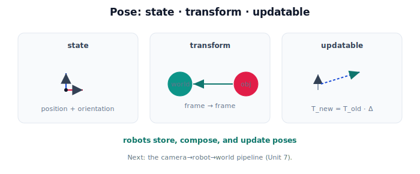

!!! abstract "You are here"
    **Module 2 — Spatial Transformations and SE(3)**  ·  **Unit 6 — Robot Pose Representation**  ·  **Lesson 6.4 — Pose in Physical AI (Unit 6 Recap)**

# Lesson 6.4 — Pose in Physical AI (Unit 6 Recap)

*A short synthesis — no new mathematics. It ties Unit 6 together and points into the pipeline.*

---

## Pose ties the module together

Unit 6 turned the abstract machinery into the thing robots actually track:

> **A pose is an SE(2)/SE(3) element — position + orientation — that doubles as a frame-to-frame transform. Robots store poses, compose them, and update them as they move.**

Everything the robot knows about *where things are* is a set of poses.

## What Unit 6 established

| Lesson | Point |
|---|---|
| 6.1 What Is a Pose? | Position + orientation as one object = one SE(2)/SE(3) element (3 or 6 numbers). |
| 6.2 A Pose Is a Transformation | An object's pose in a frame **is** the transform between those frames; poses compose like transforms. |
| 6.3 Reading and Writing Poses | Read position/orientation off the matrix; write a pose; update it by composing a motion (right/left multiply). |

## Why this matters

A grasp target is a pose. The robot's base, arm, gripper, and camera each have a pose. Because a pose *is* a transform, the Unit 5 toolkit — compose along the frame graph, invert to reverse — applies directly: "gripper in world" is "gripper in base" composed with "base in world." Updating poses as the robot moves keeps the whole picture current with one matrix multiply per step. Pose is where representation meets the live robot.

## Visual Explanation

<figure markdown>
  { width="680" }
</figure>

## Interactive Demonstration

<iframe src="../../demos/module02/lesson28_pose_recap.html" title="Pose in Physical AI (Unit 6 Recap) interactive demo" style="width:100%;height:520px;border:1px solid #e2e8f0;border-radius:12px"></iframe>

[Open this demo in a new tab ↗](../demos/module02/lesson28_pose_recap.html)

Unit 6 in one tool: drag for position, slide for orientation, and read the full pose matrix — translation column plus rotation block.

## Coding Exercise

!!! tip "Run the hands-on notebook"
    `modules/module02/notebooks/M02_U06_L6_4_Pose_In_Physical_AI_Unit_6_Recap.ipynb` — open in JupyterLab and run **Kernel → Restart & Run All**.

A short capstone: build a robot pose, compose a child pose (gripper→base with base→world) to locate the gripper in the world, then update the base pose with a motion and recompute.

## Knowledge Check

Formative — unlimited attempts, immediate feedback; does not affect your grade.

<iframe src="../../quizzes/module02/lesson28_quiz.html" title="Pose in Physical AI (Unit 6 Recap) knowledge check" style="width:100%;height:720px;border:1px solid #e2e8f0;border-radius:12px"></iframe>

[Open this quiz in a new tab ↗](../quizzes/module02/lesson28_quiz.html)

A brief consolidation quiz across Unit 6 (formative — unlimited attempts).

## Key Takeaways

- A **pose** = position + orientation = one SE(2)/SE(3) element.
- A pose **is** a frame-to-frame transform, so poses **compose** and **invert** like transforms.
- **Read/write/update**: position = translation column, orientation = rotation block; update by composing a motion.
- Next: the **camera→robot→world** pipeline (Unit 7), built from poses and composition.

---

## AI Learning Companion

Copy any prompt below into ChatGPT, Claude, or another AI assistant.

**Tutor prompt** — explain it another way
```
Summarize Unit 6 of Module 2 as one story: a pose is position + orientation as one SE(3) element, it doubles as a frame-to-frame transform, and robots store/compose/update poses to track where everything is.
```

**Practice prompt** — generate more exercises
```
Give me a 10-question mixed review of pose: definition, pose-as-transform, composing poses, and reading/writing/updating a pose. Include answers.
```

**Explore prompt** — connect it to the real world
```
Show me how a robot tracks the poses of its base, arm, gripper, and camera, and composes them to know the gripper's pose in the world.
```

## Global Learning Support

Need this lesson explained in another language? Copy one of the prompts below into an AI assistant. English remains the authoritative source.

**Supported languages (initial):** English · Español · 中文 (Simplified Chinese) · Türkçe

**Español**
```
I just completed Lesson 6.4 (Module 2) — Pose in Physical AI (Unit 6 Recap).
Explain this lesson in Spanish. Keep robotics and mathematical terminology in English when appropriate.
Then provide: a summary, three practice questions, and one challenge problem.
```

**中文 (Simplified Chinese)**
```
I just completed Lesson 6.4 (Module 2) — Pose in Physical AI (Unit 6 Recap).
Explain this lesson in Simplified Chinese. Keep mathematical notation unchanged.
Then provide: a summary, three practice questions, and one challenge problem.
```

**Türkçe**
```
I just completed Lesson 6.4 (Module 2) — Pose in Physical AI (Unit 6 Recap).
Explain this lesson in Turkish. Keep robotics terminology in English where commonly used.
Then provide: a summary, three practice questions, and one challenge problem.
```

---

*Next: Unit 7 — Camera-to-Robot Transformations (extrinsics).*
