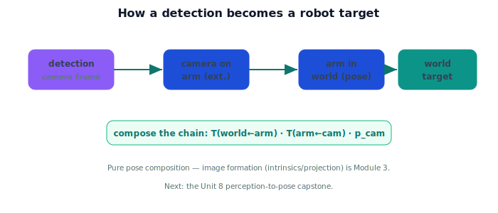

!!! abstract "You are here"
    **Module 2 — Spatial Transformations and SE(3)**  ·  **Unit 7 — Camera-to-Robot Transformations**  ·  **Lesson 7.4 — Camera-to-Robot Reasoning (Unit 7 Recap)**

# Lesson 7.4 — Camera-to-Robot Reasoning (Unit 7 Recap)

*A short synthesis — no new mathematics. It ties Unit 7 together and sets up the capstone.*

---

## From "the camera sees it" to "the robot can reach it"

Unit 7 connected perception to the robot's frames using only poses and composition:

> **A detection lives in the camera frame; the camera's extrinsics place it on the robot; the arm's pose places the camera in the world; composing the chain turns the detection into a world target.**

No lenses, no pixels, no projection — just the SE(3) toolkit you already have. (Image formation is Module 3.)

## What Unit 7 established

| Lesson | Point |
|---|---|
| 7.1 The Camera Sees Its Own World | Detections arrive in the **camera frame**; the robot must re-express them. |
| 7.2 Camera Extrinsics | The camera's **pose** on the robot, an SE(3) transform $T_{\text{arm}\leftarrow\text{cam}}$ (offset + orientation); distinct from intrinsics. |
| 7.3 Building the Transformation Chain | camera→world $= T_{\text{world}\leftarrow\text{arm}}\,T_{\text{arm}\leftarrow\text{cam}}$; convert a detection in one multiply; invert to go back. |

## Why this matters

This is the answer to the question that has driven the module: *how does a detected object become a robot pose?* The detection is a pose in the camera frame; compose it through the extrinsics and the arm's world pose, and you have its pose in the world — ready for the planner. Get the chain's **order**, **factors**, and **inverses** right and the arm reaches the fruit; that discipline is exactly what Units 5–6 built. The capstone now puts it all together end to end.

## Visual Explanation

<figure markdown>
  { width="680" }
</figure>

## Interactive Demonstration

<iframe src="../../demos/module02/lesson32_camera_to_robot_recap.html" title="Camera-to-Robot Reasoning (Unit 7 Recap) interactive demo" style="width:100%;height:520px;border:1px solid #e2e8f0;border-radius:12px"></iframe>

[Open this demo in a new tab ↗](../demos/module02/lesson32_camera_to_robot_recap.html)

Unit 7 in one tool: tune arm pose, extrinsics, and the detection, and watch a camera reading flow through the chain to a world target.

## Coding Exercise

!!! tip "Run the hands-on notebook"
    `modules/module02/notebooks/M02_U07_L7_4_Camera_To_Robot_Reasoning_Unit_7_Recap.ipynb` — open in JupyterLab and run **Kernel → Restart & Run All**.

A short capstone-prep: given a detection, camera extrinsics, and an arm pose (all SE(3)), compose the chain to get the detection's world pose, and invert to confirm the round trip.

## Knowledge Check

Formative — unlimited attempts, immediate feedback; does not affect your grade.

<iframe src="../../quizzes/module02/lesson32_quiz.html" title="Camera-to-Robot Reasoning (Unit 7 Recap) knowledge check" style="width:100%;height:720px;border:1px solid #e2e8f0;border-radius:12px"></iframe>

[Open this quiz in a new tab ↗](../quizzes/module02/lesson32_quiz.html)

A brief consolidation quiz across Unit 7 (formative — unlimited attempts).

## Key Takeaways

- A detection is a pose in the **camera frame**.
- **Extrinsics** place the camera on the robot; the **arm pose** places the camera in the world.
- **Compose** the chain to turn the detection into a world target (invert to reverse).
- It's pure pose composition — image formation (intrinsics/projection) is **Module 3**. Next: the **Unit 8 capstone**.

---

## AI Learning Companion

Copy any prompt below into ChatGPT, Claude, or another AI assistant.

**Tutor prompt** — explain it another way
```
Summarize Unit 7 of Module 2 as one story: a detection in the camera frame, the camera's extrinsics on the robot, the arm's pose in the world, all composed into a world target — using only SE(3) poses and composition.
```

**Practice prompt** — generate more exercises
```
Give me a 10-question mixed review of camera-to-robot reasoning: camera frame, extrinsics vs intrinsics, and composing the camera→world chain (with an inverse). Include answers.
```

**Explore prompt** — connect it to the real world
```
Show me end-to-end how a harvesting robot turns a detected tomato into a world-frame target using extrinsics and the arm's pose, and where Module 3's image-formation step will plug in later.
```

## Global Learning Support

Need this lesson explained in another language? Copy one of the prompts below into an AI assistant. English remains the authoritative source.

**Supported languages (initial):** English · Español · 中文 (Simplified Chinese) · Türkçe

**Español**
```
I just completed Lesson 7.4 (Module 2) — Camera-to-Robot Reasoning (Unit 7 Recap).
Explain this lesson in Spanish. Keep robotics and mathematical terminology in English when appropriate.
Then provide: a summary, three practice questions, and one challenge problem.
```

**中文 (Simplified Chinese)**
```
I just completed Lesson 7.4 (Module 2) — Camera-to-Robot Reasoning (Unit 7 Recap).
Explain this lesson in Simplified Chinese. Keep mathematical notation unchanged.
Then provide: a summary, three practice questions, and one challenge problem.
```

**Türkçe**
```
I just completed Lesson 7.4 (Module 2) — Camera-to-Robot Reasoning (Unit 7 Recap).
Explain this lesson in Turkish. Keep robotics terminology in English where commonly used.
Then provide: a summary, three practice questions, and one challenge problem.
```

---

*Next: Unit 8 — Mini Project: Perception-to-Pose Pipeline (Module 2 capstone).*
