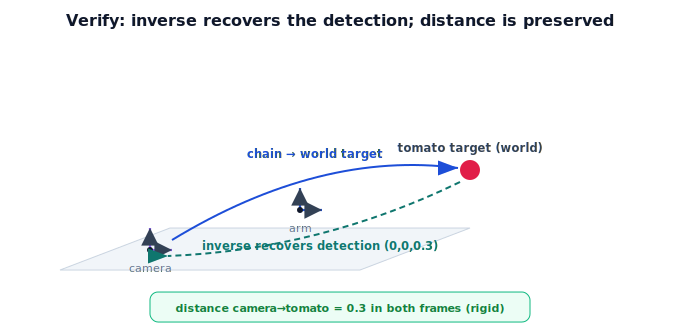

!!! abstract "You are here"
    **Module 2 — Spatial Transformations and SE(3)**  ·  **Unit 8 — Mini Project: Perception-to-Pose Pipeline**  ·  **Lesson 8.3 — Verifying and Visualizing**

# Lesson 8.3 — Verifying and Visualizing

## 1. Why This Matters

A pipeline you can't check is a pipeline you can't trust. Before a robot reaches on a computed pose, you confirm the math: invert the chain to see if you recover the original detection, check that distances are preserved (the motion was rigid), and look at a picture of the frames and target to catch gross errors. Verification is what separates a demo from something you'd run on real hardware — and it reuses inverses and rigidity from Units 3–5.

## 2. Physical Intuition

Two kinds of checking. **Numerical:** if "tomato → world" is right, then "world → tomato" (the inverse chain) should bring you exactly back to where the camera saw it — a round trip that lands home. And since every transform was rigid, the distance from the camera to the tomato must equal the distance from the camera's world position to the tomato's world position; if those disagree, something stretched and the math is wrong. **Visual:** drawing the camera, arm, world frames and the target lets your eye catch a tomato that landed behind the robot or underground — errors numbers alone might hide.

## 3. Verification methods

**Round-trip (inverse) check.** With $T_{\text{world}\leftarrow\text{tomato}}$ computed, applying the inverse chain must recover the detection:

$$\big(T_{\text{world}\leftarrow\text{arm}}\,T_{\text{arm}\leftarrow\text{cam}}\big)^{-1}\,T_{\text{world}\leftarrow\text{tomato}} = T_{\text{cam}\leftarrow\text{tomato}}.$$

**Rigidity / distance check.** The camera-to-tomato distance in the camera frame equals the distance between the camera's and tomato's world positions (rigid motions preserve distance). 

**Frame sanity.** Confirm the bottom row of every matrix is $[0\ 0\ 0\ 1]$ and each rotation block is orthogonal with $\det=+1$ — i.e. still valid poses.

**Visualization.** Plot the world, arm, camera, and tomato frames (origins + axes) and the target point; verify it sits where the scene says it should.

## 4. Visual Explanation

<figure markdown>
  { width="680" }
</figure>

## 5. Engineering Example

Production pipelines run these checks automatically: a transform library validates that matrices are proper rigid transforms, and tests assert round-trip identity to numerical tolerance. A failed check flags a stale arm pose, a bad extrinsics calibration, or a malformed detection before the arm ever moves — turning a silent mis-reach into a caught error.

## 6. Worked Example

From 8.2: $T_{\text{world}\leftarrow\text{tomato}} = \text{translate}(1.0, 0.5, 0.4)$, detection $= \text{translate}(0,0,0.3)$, camera→world $= \text{translate}(1.0,0.5,0.1)$. Round trip: $(\text{camera→world})^{-1}\,T_{\text{world}\leftarrow\text{tomato}} = \text{translate}(0,0,0.3)$ — recovers the detection. ✓ Distance check: tomato is $0.3$ from the camera in-frame; camera world position $(1.0,0.5,0.1)$ to tomato world position $(1.0,0.5,0.4)$ is also $0.3$. ✓

## 7. Interactive Demonstration

<iframe src="../../demos/module02/lesson35_verifying_visualizing.html" title="Verifying and Visualizing interactive demo" style="width:100%;height:520px;border:1px solid #e2e8f0;border-radius:12px"></iframe>

[Open this demo in a new tab ↗](../demos/module02/lesson35_verifying_visualizing.html)

The flagship **perception-to-pose** demo includes a verification view: after composing the target, it shows the inverse round-trip recovering the detection and the preserved distance, and plots the frames. Toggle the inputs and watch both the target and the checks update live.

## 8. Coding Exercise

!!! tip "Run the hands-on notebook"
    `modules/module02/notebooks/M02_U08_L8_3_Verifying_And_Visualizing.ipynb` — open in JupyterLab and run **Kernel → Restart & Run All**.

Extend your 8.2 pipeline: assert the inverse chain recovers the detection (to tolerance), assert the camera-to-tomato distance is preserved, and produce a simple frame plot (or printed frame origins) of world, arm, camera, and tomato.

## 9. Knowledge Check

Formative — unlimited attempts, immediate feedback; does not affect your grade.

<iframe src="../../quizzes/module02/lesson35_quiz.html" title="Verifying and Visualizing knowledge check" style="width:100%;height:720px;border:1px solid #e2e8f0;border-radius:12px"></iframe>

[Open this quiz in a new tab ↗](../quizzes/module02/lesson35_quiz.html)

A check on the round-trip inverse test, the distance/rigidity check, and why visualization catches errors numbers may hide.

## 10. Challenge Problem

You intentionally corrupt the arm pose (wrong translation). Show which checks fail (round trip? distance? frame validity?) and explain why each does or doesn't catch this particular error.

## 11. Common Mistakes

- Skipping verification and trusting a single number.
- Inverting only one factor instead of the whole camera→world chain.
- Forgetting numerical tolerance in equality checks (use `allclose`, not `==`).

## 12. Key Takeaways

- **Verify** before you trust: the inverse chain must recover the detection.
- Rigidity gives a **distance check**; valid poses have $[0\ 0\ 0\ 1]$ bottom rows and orthogonal rotation blocks.
- **Visualize** the frames and target to catch gross errors.
- These checks reuse inverses (Unit 3/5) and rigidity (Unit 3). Next: wrap up and bridge to kinematics.

---

## AI Learning Companion

Copy any prompt below into ChatGPT, Claude, or another AI assistant.

**Tutor prompt** — explain it another way
```
Explain Lesson 8.3 (Module 2) — Verifying and Visualizing — using the round-trip idea (world→tomato should invert back to the camera detection) and a distance check from rigidity, plus why plotting the frames catches errors.
```

**Practice prompt** — generate more exercises
```
Give me 5 verification scenarios for a perception-to-pose result (some correct, some with a corrupted factor); ask which checks pass or fail. Include answers.
```

**Explore prompt** — connect it to the real world
```
Show me how production robot pipelines validate transforms and assert round-trip identity to catch calibration or stale-pose errors before the arm moves.
```

## Global Learning Support

Need this lesson explained in another language? Copy one of the prompts below into an AI assistant. English remains the authoritative source.

**Supported languages (initial):** English · Español · 中文 (Simplified Chinese) · Türkçe

**Español**
```
I just completed Lesson 8.3 (Module 2) — Verifying and Visualizing.
Explain this lesson in Spanish. Keep robotics and mathematical terminology in English when appropriate.
Then provide: a summary, three practice questions, and one challenge problem.
```

**中文 (Simplified Chinese)**
```
I just completed Lesson 8.3 (Module 2) — Verifying and Visualizing.
Explain this lesson in Simplified Chinese. Keep mathematical notation unchanged.
Then provide: a summary, three practice questions, and one challenge problem.
```

**Türkçe**
```
I just completed Lesson 8.3 (Module 2) — Verifying and Visualizing.
Explain this lesson in Turkish. Keep robotics terminology in English where commonly used.
Then provide: a summary, three practice questions, and one challenge problem.
```

---

*Next lesson: 8.4 — Wrap-Up and the Road to Kinematics.*
