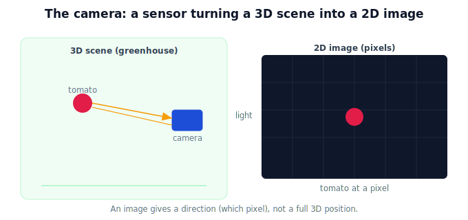

!!! abstract "You are here"
    **Module 3 — Camera Geometry and Robotic Perception**  ·  **Unit 1 — Why Perception**  ·  **Lesson 1.1 — The Robot Needs to See**

# Lesson 1.1 — The Robot Needs to See

## 1. Why This Matters

In Module 2 we computed a tomato's world pose — but we *assumed* someone handed us its 3D position in the camera frame. Where did that number come from? From the camera. Before a robot can transform, plan, or reach, it has to **see**: find the fruit in the visible world and turn that into numbers. This module is about the eye of the robot. Lesson 1 sets the stage — why seeing is the first link in the chain, and what a camera actually does.

## 2. Physical Intuition

Close your eyes and try to pick a tomato. You can't — you don't know where it is. Vision is what makes reaching possible: your eyes gather light bouncing off the fruit, your brain turns that into "it's there, about arm's length, slightly left," and only then do you reach. A harvesting robot is the same. Its camera gathers light from the greenhouse and produces an **image** — a grid of brightness/color values. That image is the robot's only window onto where the fruit is. Everything downstream (transform, plan, grasp) depends on first turning light into usable data.

## 3. Mathematical Foundations

A camera is a **sensor**: it maps the 3D scene in front of it to a 2D **image**, an array of pixels. Each pixel holds a measured value (intensity, or color channels). Formally, image formation is a function

$$\text{scene (3D world)} \;\xrightarrow{\text{camera}}\; \text{image (2D array of pixels)}.$$

This module unpacks that arrow: the **geometry** of how a 3D point lands at a particular pixel (projection, intrinsics) and the **inverse** question of recovering 3D information from pixels (back-projection with depth). We focus on the *geometry of seeing* — where things appear — rather than the photometry (how bright/what color), which is enough to locate fruit. The endpoint connects back to Module 2: a located fruit becomes a 3D point we can transform into the world.

## 4. Visual Explanation

<figure markdown>
  { width="680" }
</figure>

## 5. Engineering Example

The harvesting robot's camera captures frames of the canopy. A detector finds the tomato in the image — a pixel location (and, with a depth sensor or stereo, a distance). That pixel-and-depth is the raw perception output. The rest of the pipeline (this module's later units, then Module 2's transforms) converts it into a world-frame target the arm can reach. Without the camera, the robot is blind and the entire downstream pipeline has no input.

## 6. Worked Example

Suppose the camera produces a $640\times480$ image. A tomato detector reports the fruit centered at pixel $(u, v) = (320, 240)$ — the middle of the image. That tells us *which direction* the fruit lies along, but not yet *how far*. This is the core theme we'll develop: an image gives direction (a pixel), and we need more (geometry + depth) to get a 3D position. For now, note that "the fruit is at pixel (320, 240)" is the kind of data the camera makes available.

## 7. Interactive Demonstration

<iframe src="../../demos/module03/lesson01_robot_needs_to_see.html" title="The Robot Needs to See interactive demo" style="width:100%;height:520px;border:1px solid #e2e8f0;border-radius:12px"></iframe>

[Open this demo in a new tab ↗](../demos/module03/lesson01_robot_needs_to_see.html)

**Guided prediction.** Look at the figure: light from the tomato enters the camera and lands on the image grid. Predict what the image gives you directly (a direction/pixel, or a full 3D position?) and what is missing to actually reach the fruit. Predict why a robot with a camera but no notion of distance still cannot grasp reliably.

## 8. Coding Exercise

!!! tip "Run the hands-on notebook"
    `modules/module03/notebooks/M03_U01_L1_1_The_Robot_Needs_To_See.ipynb` — open in JupyterLab and run **Kernel → Restart & Run All**.

Represent an image as a 2D NumPy array; place a bright "fruit" blob at a pixel; find its pixel location (argmax/centroid). Observe you recover a 2D pixel, not a 3D position — motivating the rest of the module.

## 9. Knowledge Check

Formative — unlimited attempts, immediate feedback; does not affect your grade.

<iframe src="../../quizzes/module03/lesson01_quiz.html" title="The Robot Needs to See knowledge check" style="width:100%;height:720px;border:1px solid #e2e8f0;border-radius:12px"></iframe>

[Open this quiz in a new tab ↗](../quizzes/module03/lesson01_quiz.html)

A check that the camera is a sensor mapping 3D scene → 2D image, that an image is a pixel array, and that perception is the first stage before transform/plan/act.

## 10. Challenge Problem

A teammate says "the camera sees the tomato, so we know where it is." Explain precisely what the camera does and does not tell us from a single image, and what additional ingredient is needed to get a 3D position.

## 11. Common Mistakes

- Assuming an image directly gives 3D positions (it gives pixels/directions).
- Conflating *detecting* the fruit (which pixel) with *locating* it (where in 3D).
- Forgetting that perception is the required first stage of the whole pipeline.

## 12. Key Takeaways

- The robot must **see** before it can act; the camera is its sensor.
- A camera maps the **3D scene → a 2D image** (a grid of pixels).
- An image gives **direction** (a pixel), not a full 3D position by itself.
- Perception is the **first stage** feeding Module 2's transforms and beyond.

---

## AI Learning Companion

Copy any prompt below into ChatGPT, Claude, or another AI assistant.

**Tutor prompt** — explain it another way
```
Explain Lesson 1.1 (Module 3) — The Robot Needs to See — using the "try to pick a tomato with your eyes closed" idea. Make clear the camera is a sensor turning a 3D scene into a 2D pixel image, and that an image gives direction, not a full 3D position.
```

**Practice prompt** — generate more exercises
```
Give me 5 questions about what a camera image does and doesn't tell a robot, in a greenhouse-harvesting context. Include answers.
```

**Explore prompt** — connect it to the real world
```
Show me where perception sits in a robot's perception-to-action pipeline and why every later stage depends on the camera first turning light into data.
```

## Global Learning Support

Need this lesson explained in another language? Copy one of the prompts below into an AI assistant. English remains the authoritative source.

**Supported languages (initial):** English · Español · 中文 (Simplified Chinese) · Türkçe

**Español**
```
I just completed Lesson 1.1 (Module 3) — The Robot Needs to See.
Explain this lesson in Spanish. Keep robotics and mathematical terminology in English when appropriate.
Then provide: a summary, three practice questions, and one challenge problem.
```

**中文 (Simplified Chinese)**
```
I just completed Lesson 1.1 (Module 3) — The Robot Needs to See.
Explain this lesson in Simplified Chinese. Keep mathematical notation unchanged.
Then provide: a summary, three practice questions, and one challenge problem.
```

**Türkçe**
```
I just completed Lesson 1.1 (Module 3) — The Robot Needs to See.
Explain this lesson in Turkish. Keep robotics terminology in English where commonly used.
Then provide: a summary, three practice questions, and one challenge problem.
```

---

*Next lesson: 1.2 — World → Pixels → World: the perception problem.*
