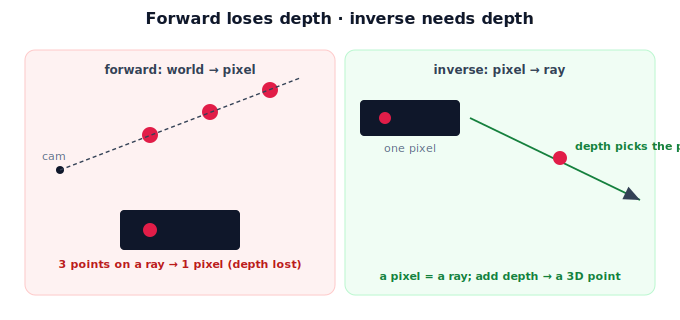

!!! abstract "You are here"
    **Module 3 — Camera Geometry and Robotic Perception**  ·  **Unit 1 — Why Perception**  ·  **Lesson 1.2 — World → Pixels → World: The Perception Problem**

# Lesson 1.2 — World → Pixels → World: The Perception Problem

## 1. Why This Matters

Perception has two directions, and confusing them causes most early mistakes. **Forward:** the camera turns the 3D world into pixels — this is what physics does automatically. **Inverse:** the robot must turn pixels back into a 3D position — this is what we have to *solve*, and it's harder because the forward step threw information away. Naming these two directions, and seeing why the inverse is incomplete without help, frames everything Module 3 does.

## 2. Physical Intuition

Hold up a thumb and look at it with one eye. Move it closer and farther — its image gets bigger and smaller, but at any single glance you can't be fully sure how far it is; a small thumb nearby and a big thumb far away can look identical. That's the catch: turning the world into a flat picture (forward) is easy and automatic, but reading distance back out of one flat picture (inverse) is ambiguous. Two eyes, or knowing the thumb's real size, or a depth sensor — some **extra information** — resolves it. The robot faces exactly this: pixels are easy to get, but recovering 3D from them needs more.

## 3. Mathematical Foundations

The **forward problem** (image formation) is a well-defined map:

$$\mathbf{p}_{\text{world}} \;\xrightarrow{\text{extrinsics}}\; \mathbf{p}_{\text{cam}} \;\xrightarrow{\text{projection } K}\; (u, v)\ \text{pixel}.$$

It is *many-to-one*: every 3D point along a given ray projects to the **same** pixel, so the pixel alone cannot say *which* point — depth is lost. The **inverse problem** (perception) tries to go $(u,v) \to \mathbf{p}_{\text{cam}} \to \mathbf{p}_{\text{world}}$, but the first step $(u,v)\to\mathbf{p}_{\text{cam}}$ is **under-determined**: a pixel back-projects to a whole **ray**, not a point. Adding **depth** (one extra number) picks the point on the ray. So:

$$\underbrace{(u,v) + \text{depth}}_{\text{pixel + extra info}} \;\to\; \mathbf{p}_{\text{cam}} \;\xrightarrow{\text{Module 2 extrinsics}}\; \mathbf{p}_{\text{world}}.$$

Module 3 owns the camera part (projection forward; back-projection with depth); Module 2 owns the camera-frame→world part.

## 4. Visual Explanation

<figure markdown>
  { width="680" }
</figure>

## 5. Engineering Example

The harvesting robot's camera makes pixels for free, every frame. To act, it must solve the inverse problem for the fruit's pixel: back-project to a ray, then use a depth value (from a depth camera, stereo, or a known fruit size) to fix the 3D point in the camera frame. That camera-frame point then rides the Module 2 extrinsics chain to a world pose. The whole perception system is engineered around supplying the depth that projection discarded.

## 6. Worked Example

A tomato projects to pixel $(320, 240)$. Forward, that's deterministic. Inverse: $(320, 240)$ corresponds to a ray leaving the camera; the fruit could be 0.3 m or 0.6 m along it — same pixel. Supply depth $= 0.3$ m and the ray gives one camera-frame point (computed properly in Unit 6). Without the depth, the pixel pins down direction but not distance — the ambiguity the inverse problem must resolve.

## 7. Interactive Demonstration

<iframe src="../../demos/module03/lesson02_perception_problem.html" title="World → Pixels → World: The Perception Problem interactive demo" style="width:100%;height:520px;border:1px solid #e2e8f0;border-radius:12px"></iframe>

[Open this demo in a new tab ↗](../demos/module03/lesson02_perception_problem.html)

**Guided prediction.** Using the figure, predict: if two tomatoes sit at different distances but along the same ray, what pixels do they produce? Then predict what single extra number turns a pixel back into a unique 3D point. Confirm that forward is many-to-one and inverse needs depth.

## 8. Coding Exercise

!!! tip "Run the hands-on notebook"
    `modules/module03/notebooks/M03_U01_L1_2_World_Pixels_World.ipynb` — open in JupyterLab and run **Kernel → Restart & Run All**.

Demonstrate many-to-one projection numerically: project several 3D points that share a ray and show they map to the same pixel; then show that recovering the point from the pixel requires choosing a depth.

## 9. Knowledge Check

Formative — unlimited attempts, immediate feedback; does not affect your grade.

<iframe src="../../quizzes/module03/lesson02_quiz.html" title="World → Pixels → World: The Perception Problem knowledge check" style="width:100%;height:720px;border:1px solid #e2e8f0;border-radius:12px"></iframe>

[Open this quiz in a new tab ↗](../quizzes/module03/lesson02_quiz.html)

A check distinguishing forward (world→pixel, many-to-one, loses depth) from inverse (pixel→ray, needs depth), and the Module 3 / Module 2 split of the pipeline.

## 10. Challenge Problem

Explain why a single ordinary photo cannot, by itself, give the absolute 3D position of an object, and list three different "extra information" sources that resolve the ambiguity.

## 11. Common Mistakes

- Believing a single image determines 3D position (it gives a ray).
- Treating projection as invertible without depth.
- Mixing up which stage is Module 3 (camera) vs Module 2 (camera-frame→world).

## 12. Key Takeaways

- Perception is a **round trip**: forward (world→pixels) and inverse (pixels→world).
- Forward is **many-to-one** — projection discards **depth**.
- The inverse needs **extra information** (depth) to turn a pixel (a ray) into a point.
- **Module 3** handles the camera (projection + back-projection); **Module 2** handles camera-frame → world.

---

## AI Learning Companion

Copy any prompt below into ChatGPT, Claude, or another AI assistant.

**Tutor prompt** — explain it another way
```
Explain Lesson 1.2 (Module 3) — World → Pixels → World — using the one-eye thumb example. Make clear forward projection is many-to-one (loses depth) and the inverse needs extra information (depth) to turn a pixel into a 3D point.
```

**Practice prompt** — generate more exercises
```
Give me 5 exercises distinguishing the forward (world→pixel) and inverse (pixel→world) problems and what extra info the inverse needs. Include answers.
```

**Explore prompt** — connect it to the real world
```
Show me how a robot supplies the depth that projection discards (depth camera, stereo, known size) and how that fits with the Module 2 transform chain.
```

## Global Learning Support

Need this lesson explained in another language? Copy one of the prompts below into an AI assistant. English remains the authoritative source.

**Supported languages (initial):** English · Español · 中文 (Simplified Chinese) · Türkçe

**Español**
```
I just completed Lesson 1.2 (Module 3) — World → Pixels → World: The Perception Problem.
Explain this lesson in Spanish. Keep robotics and mathematical terminology in English when appropriate.
Then provide: a summary, three practice questions, and one challenge problem.
```

**中文 (Simplified Chinese)**
```
I just completed Lesson 1.2 (Module 3) — World → Pixels → World: The Perception Problem.
Explain this lesson in Simplified Chinese. Keep mathematical notation unchanged.
Then provide: a summary, three practice questions, and one challenge problem.
```

**Türkçe**
```
I just completed Lesson 1.2 (Module 3) — World → Pixels → World: The Perception Problem.
Explain this lesson in Turkish. Keep robotics terminology in English where commonly used.
Then provide: a summary, three practice questions, and one challenge problem.
```

---

*Next lesson: 1.3 — What Projection Keeps and Discards.*
