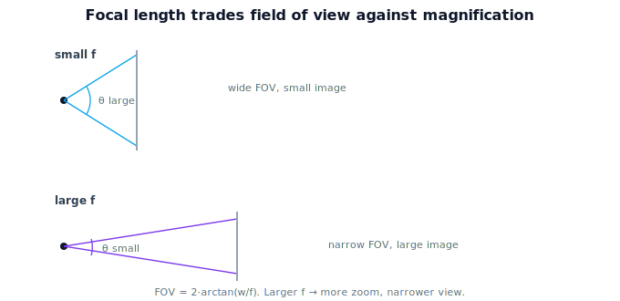

!!! abstract "You are here"
    **Module 3 — Camera Geometry and Robotic Perception**  ·  **Unit 2 — The Pinhole Camera Model**  ·  **Lesson 2.2 — The Image Plane and Focal Length**

# Lesson 2.2 — The Image Plane and Focal Length

## 1. Why This Matters

The pinhole projection $x = fX/Z$ has one free constant: $f$, the **focal length**. It's the single number that decides how "zoomed in" the camera is — how much of the world fits in the frame and how large objects appear. Understanding $f$ geometrically (a distance) and operationally (magnification, field of view) lets you reason about why a wide-angle camera and a telephoto camera image the same fruit so differently, and prepares the jump to focal length *in pixels* (the intrinsic matrix).

## 2. Physical Intuition

Move the paper closer to or farther from the pinhole. Farther back (larger $f$): the image spreads out — objects look bigger, but less of the scene fits — a **narrow** field of view, like a telephoto/zoom. Closer (smaller $f$): the image is compact — objects look small, but you capture a **wide** sweep of the scene — wide-angle. Same hole, same scene; only the image-plane distance changed. Focal length is literally that distance, and it trades **magnification against field of view**: you can't increase one without shrinking the other.

## 3. Mathematical Foundations

**Focal length** $f$ is the distance from the center of projection to the image plane, along the optical axis. In $x = f\,X/Z$, $f$ is the proportionality constant: for a fixed scene point, image displacement scales **linearly** with $f$ (magnification). The **field of view** (angular extent the image plane spans) for a sensor of half-width $w$ is

$$\theta_{\text{half}} = \arctan\!\left(\frac{w}{f}\right),$$

so larger $f$ → smaller FOV (more zoom), smaller $f$ → larger FOV (wide angle). Magnification $\propto f$ and FOV $\propto \arctan(w/f)$ move oppositely — the geometric trade-off. ($f$ here is a metric distance; Unit 3 converts it to pixels using the sensor's pixel size.)

## 4. Visual Explanation

<figure markdown>
  { width="680" }
</figure>

## 5. Engineering Example

Choosing the harvesting camera's focal length is a design decision: a wide-angle lens (small $f$) sees many tomatoes at once but each is small and less precisely located; a longer lens (large $f$) sees fewer but localizes each more finely. The robot's perception accuracy and how often it must reposition the camera both follow from $f$. Knowing the FOV/magnification trade-off lets engineers match the lens to the canopy and the working distance.

## 6. Worked Example

A sensor half-width $w = 12$ mm. With $f = 12$ mm: $\theta_{\text{half}} = \arctan(12/12) = 45°$ → a $90°$ field of view (wide). With $f = 36$ mm: $\theta_{\text{half}} = \arctan(12/36) \approx 18.4°$ → about $37°$ FOV (narrow, more zoom). The same tomato spans three times more image displacement at $f=36$ than at $f=12$ (magnification $\propto f$), but the wider lens captures far more of the canopy.

## 7. Interactive Demonstration

<iframe src="../../demos/module03/lesson06_image_plane_focal_length.html" title="The Image Plane and Focal Length interactive demo" style="width:100%;height:520px;border:1px solid #e2e8f0;border-radius:12px"></iframe>

[Open this demo in a new tab ↗](../demos/module03/lesson06_image_plane_focal_length.html)

Adjust the focal length and watch the field of view and a tomato's apparent image size change together — larger $f$ zooms in (narrow FOV, bigger image), smaller $f$ widens out. The projected position $x = fX/Z$ and the FOV angle update live, showing the magnification-vs-FOV trade-off.

## 8. Coding Exercise

!!! tip "Run the hands-on notebook"
    `modules/module03/notebooks/M03_U02_L2_2_The_Image_Plane_And_Focal_Length.ipynb` — open in JupyterLab and run **Kernel → Restart & Run All**.

Compute and plot field of view $\theta = 2\arctan(w/f)$ versus focal length for a fixed sensor; also compute a fixed point's image displacement $fX/Z$ versus $f$; confirm FOV shrinks while magnification grows.

## 9. Knowledge Check

Formative — unlimited attempts, immediate feedback; does not affect your grade.

<iframe src="../../quizzes/module03/lesson06_quiz.html" title="The Image Plane and Focal Length knowledge check" style="width:100%;height:720px;border:1px solid #e2e8f0;border-radius:12px"></iframe>

[Open this quiz in a new tab ↗](../quizzes/module03/lesson06_quiz.html)

A check that focal length is the hole-to-image-plane distance, that magnification $\propto f$ and FOV $\propto \arctan(w/f)$, and that they trade off.

## 10. Challenge Problem

You need to double a tomato's apparent image size without moving the camera. What must happen to $f$, and what is the cost in field of view? Quantify the FOV change for a sensor half-width of your choice.

## 11. Common Mistakes

- Thinking focal length changes which ray a point is on (it changes scale, not direction).
- Believing you can increase magnification and FOV together.
- Confusing metric focal length (mm) with focal length in pixels (Unit 3).

## 12. Key Takeaways

- **Focal length** $f$ = distance from center of projection to image plane.
- Magnification scales **linearly** with $f$; field of view is $2\arctan(w/f)$.
- Larger $f$ → more zoom, narrower FOV; smaller $f$ → wider FOV, less zoom — a **trade-off**.
- $f$ here is metric; Unit 3 expresses it in **pixels**.

---

## AI Learning Companion

Copy any prompt below into ChatGPT, Claude, or another AI assistant.

**Tutor prompt** — explain it another way
```
Explain Lesson 2.2 (Module 3) — The Image Plane and Focal Length — by moving the paper behind a pinhole. Make clear focal length is that distance and it trades magnification against field of view (FOV = 2·arctan(w/f)).
```

**Practice prompt** — generate more exercises
```
Give me 6 exercises relating focal length to field of view and magnification, with numeric FOV calculations. Include answers.
```

**Explore prompt** — connect it to the real world
```
Show me how choosing a harvesting camera's focal length trades seeing many tomatoes (wide) against localizing each precisely (zoom).
```

## Global Learning Support

Need this lesson explained in another language? Copy one of the prompts below into an AI assistant. English remains the authoritative source.

**Supported languages (initial):** English · Español · 中文 (Simplified Chinese) · Türkçe

**Español**
```
I just completed Lesson 2.2 (Module 3) — The Image Plane and Focal Length.
Explain this lesson in Spanish. Keep robotics and mathematical terminology in English when appropriate.
Then provide: a summary, three practice questions, and one challenge problem.
```

**中文 (Simplified Chinese)**
```
I just completed Lesson 2.2 (Module 3) — The Image Plane and Focal Length.
Explain this lesson in Simplified Chinese. Keep mathematical notation unchanged.
Then provide: a summary, three practice questions, and one challenge problem.
```

**Türkçe**
```
I just completed Lesson 2.2 (Module 3) — The Image Plane and Focal Length.
Explain this lesson in Turkish. Keep robotics terminology in English where commonly used.
Then provide: a summary, three practice questions, and one challenge problem.
```

---

*Next lesson: 2.3 — Perspective Projection of a 3D Point.*
