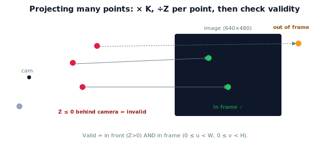

!!! abstract "You are here"
    **Module 3 — Camera Geometry and Robotic Perception**  ·  **Unit 4 — Projection in Practice**  ·  **Lesson 4.2 — Projecting Points with K**

# Lesson 4.2 — Projecting Points with K

## 1. Why This Matters

Perception rarely projects one point — it projects many: a grid of candidate grasp points, the corners of a bounding box, a whole point cloud. Doing this cleanly and correctly (especially the divide-by-$Z$ and the "behind the camera" case) is a small skill with big payoff: it's how you overlay predictions on images, build reprojection error for calibration, and reason about what's visible. This lesson makes projecting with $K$ routine.

## 2. Physical Intuition

If you can image one tomato, you can image a basketful: each point independently follows the same rule — multiply by $K$, divide by its own depth. The only wrinkles are practical. A point with $Z \le 0$ is *behind* the camera and has no valid image (the math would produce a meaningless pixel), so it must be flagged or dropped. And a point can project to a pixel *outside* the image bounds — it's geometrically valid but not actually captured. Thinking of projection as "apply the rule per point, then check validity" keeps a whole-scene projection correct.

## 3. Mathematical Foundations

For camera-frame points $\mathbf{P}_i = (X_i, Y_i, Z_i)$, projection is per-point:

$$u_i = f_x\frac{X_i}{Z_i} + c_x, \qquad v_i = f_y\frac{Y_i}{Z_i} + c_y, \quad \text{valid only if } Z_i > 0.$$

In matrix form, stack points as columns of a $3\times N$ array $\mathbf{P}$; then $\tilde{\mathbf{p}} = K\mathbf{P}$ is $3\times N$, and dividing each column by its third row gives pixel coordinates. Two validity checks: **in front** ($Z_i > 0$) and **in frame** ($0 \le u_i < W,\ 0 \le v_i < H$). The divide-by-$Z$ is element-wise per point — never a single global scale. This vectorized form is exactly what libraries use; it's the same math as Lesson 3.2 applied to many points at once.

## 4. Visual Explanation

<figure markdown>
  { width="680" }
</figure>

## 5. Engineering Example

To draw predicted fruit markers on the live feed, the robot projects each candidate 3D point with $K$, keeps those with $Z>0$ and inside the image, and renders them. The same vectorized projection computes **reprojection error** during calibration (project known 3D corners, compare to detected pixels). Efficient batch projection with validity filtering is everyday perception plumbing.

## 6. Worked Example

$K$: $f_x=f_y=800$, $(c_x,c_y)=(320,240)$, image $640\times480$. Points (camera frame): $A=(0,0,0.5)$, $B=(0.2,0,0.4)$, $C=(0,0,-0.3)$.
- $A$: $u=320, v=240$ — center, valid.
- $B$: $u=800\cdot0.2/0.4+320=400+320=720$, $v=240$. $720 \ge 640$ → **out of frame** (valid geometry, not captured).
- $C$: $Z=-0.3 \le 0$ → **behind camera, invalid** (no image).
So only $A$ is both in front and in frame; $B$ is in front but off-image; $C$ is discarded.

## 7. Interactive Demonstration

<iframe src="../../demos/module03/lesson14_projecting_points_with_k.html" title="Projecting Points with K interactive demo" style="width:100%;height:520px;border:1px solid #e2e8f0;border-radius:12px"></iframe>

[Open this demo in a new tab ↗](../demos/module03/lesson14_projecting_points_with_k.html)

**Guided prediction.** Using the worked-example $K$, predict the pixel and validity (in front? in frame?) for points $(0,0,0.5)$, $(0.2,0,0.4)$, and $(0,0,-0.3)$. Predict what happens to $B$'s validity if you lower $f_x$. Confirm projection is per-point with two validity checks.

## 8. Coding Exercise

!!! tip "Run the hands-on notebook"
    `modules/module03/notebooks/M03_U04_L4_2_Projecting_Points_With_K.ipynb` — open in JupyterLab and run **Kernel → Restart & Run All**.

Vectorize projection: build a $3\times N$ array of camera-frame points, compute $K\mathbf{P}$ then divide each column by its $Z$, and return pixels plus boolean masks for in-front and in-frame; reproduce the worked-example classifications.

## 9. Knowledge Check

Formative — unlimited attempts, immediate feedback; does not affect your grade.

<iframe src="../../quizzes/module03/lesson14_quiz.html" title="Projecting Points with K knowledge check" style="width:100%;height:720px;border:1px solid #e2e8f0;border-radius:12px"></iframe>

[Open this quiz in a new tab ↗](../quizzes/module03/lesson14_quiz.html)

A check on per-point projection, the $Z>0$ and in-frame validity conditions, and the vectorized form.

## 10. Challenge Problem

A point projects to a valid in-frame pixel, but moving the camera slightly makes its $Z$ go negative. Explain physically what happened and why its pixel becomes meaningless, and how code should handle the transition.

## 11. Common Mistakes

- Applying a single global divide instead of per-point ÷Z.
- Forgetting to reject points with $Z \le 0$.
- Treating an out-of-frame pixel as if it were captured.

## 12. Key Takeaways

- Project many points by **× K then per-point ÷Z**; vectorize as $K\mathbf{P}$, divide columns by $Z$.
- Validity: **in front** ($Z>0$) and **in frame** ($0\le u<W,\ 0\le v<H$).
- Out-of-frame is valid geometry but not captured; behind-camera is invalid.
- This batch projection underlies overlays and reprojection error.

---

## AI Learning Companion

Copy any prompt below into ChatGPT, Claude, or another AI assistant.

**Tutor prompt** — explain it another way
```
Explain Lesson 4.2 (Module 3) — Projecting Points with K — as imaging a whole basket of tomatoes: per-point × K then ÷Z, plus checks for in-front (Z>0) and in-frame. Use a small numeric example.
```

**Practice prompt** — generate more exercises
```
Give me 6 exercises projecting sets of camera-frame points with K, classifying each as in-frame, out-of-frame, or behind the camera. Include answers.
```

**Explore prompt** — connect it to the real world
```
Show me how a robot projects candidate 3D points to overlay markers and how reprojection error is computed during calibration.
```

## Global Learning Support

Need this lesson explained in another language? Copy one of the prompts below into an AI assistant. English remains the authoritative source.

**Supported languages (initial):** English · Español · 中文 (Simplified Chinese) · Türkçe

**Español**
```
I just completed Lesson 4.2 (Module 3) — Projecting Points with K.
Explain this lesson in Spanish. Keep robotics and mathematical terminology in English when appropriate.
Then provide: a summary, three practice questions, and one challenge problem.
```

**中文 (Simplified Chinese)**
```
I just completed Lesson 4.2 (Module 3) — Projecting Points with K.
Explain this lesson in Simplified Chinese. Keep mathematical notation unchanged.
Then provide: a summary, three practice questions, and one challenge problem.
```

**Türkçe**
```
I just completed Lesson 4.2 (Module 3) — Projecting Points with K.
Explain this lesson in Turkish. Keep robotics terminology in English where commonly used.
Then provide: a summary, three practice questions, and one challenge problem.
```

---

*Next lesson: 4.3 — Seeing It in Code (OpenCV intro).*
