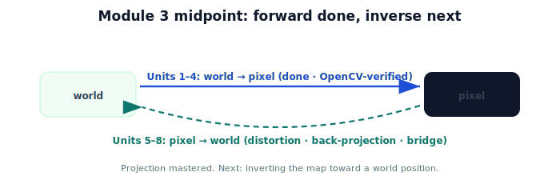

!!! abstract "You are here"
    **Module 3 — Camera Geometry and Robotic Perception**  ·  **Unit 4 — Projection in Practice**  ·  **Lesson 4.4 — Projection in Practice (Unit 4 Recap · Midpoint Checkpoint)**

# Lesson 4.4 — Projection in Practice (Unit 4 Recap · Midpoint Checkpoint)

*A short synthesis and a readiness check. No new mathematics. This marks the midpoint of Module 3.*

---

## The forward map, complete

Units 1–4 built the entire **forward** map — world point to pixel — and made it runnable:

> **world → (extrinsics, Module 2) → camera frame → (intrinsics $K$, ÷Z) → pixel,** and `cv2.projectPoints` computes exactly this.

You can now predict where any 3D point appears in any calibrated camera.

## What the first half established

| Unit | Idea |
|---|---|
| 1 — Why Perception | Camera = sensor; forward loses depth, inverse needs it; projection keeps direction. |
| 2 — Pinhole Model | $x=fX/Z$; focal length; the divide-by-$Z$ is perspective. |
| 3 — Camera Intrinsics | $K$ packages $f_x,f_y,c_x,c_y$; projection in pixels = $K(X,Y,Z)$ then ÷Z. |
| 4 — Projection in Practice | Full pipeline (extrinsics + $K$); batch projection with validity; OpenCV matches by hand. |

## Midpoint checkpoint — can you do all of these?

- [ ] Explain why a single image gives direction, not 3D position (forward is many-to-one).
- [ ] Project a 3D point with the pinhole rule $x=fX/Z$ and state what the divide-by-$Z$ does.
- [ ] Build $K$ from $f_x,f_y,c_x,c_y$ and project a camera-frame point to a pixel.
- [ ] Run the full world→camera→pixel pipeline for a non-identity camera pose.
- [ ] Match a hand-built projection to `cv2.projectPoints` and explain the arguments.

If any box is unchecked, revisit that unit before the second half — back-projection (the inverse) depends on all of it.

## Why this matters

The second half **inverts** the map. **Unit 5** corrects lens **distortion** (real lenses bend the ideal pinhole geometry). **Unit 6** does **back-projection**: a pixel is a ray, and depth turns it into a 3D camera-frame point. **Unit 7** bridges that point to Module 2's extrinsics to get a **world position**. **Unit 8** does the whole round trip for a real fruit. Everything ahead assumes the forward map you just mastered.

## Visual Explanation

<figure markdown>
  { width="680" }
</figure>

## Interactive Demonstration

<iframe src="../../demos/module03/lesson16_projection_in_practice_recap.html" title="Projection in Practice (Unit 4 Recap · Midpoint Checkpoint) interactive demo" style="width:100%;height:520px;border:1px solid #e2e8f0;border-radius:12px"></iframe>

[Open this demo in a new tab ↗](../demos/module03/lesson16_projection_in_practice_recap.html)

The full pipeline, hands-on: move a 3D point and intrinsics and watch 3D → divide by Z → apply K → pixel.

## Coding Exercise

!!! tip "Run the hands-on notebook"
    `modules/module03/notebooks/M03_U04_L4_4_Projection_In_Practice_Unit_4_Recap_Midpoint_Checkpoint.ipynb` — open in JupyterLab and run **Kernel → Restart & Run All**.

A consolidation: run the full pipeline for a chosen camera pose and $K$, confirm against OpenCV (or the NumPy fallback), and classify a few points as in-frame / out-of-frame / behind-camera.

## Knowledge Check

Formative — unlimited attempts, immediate feedback; does not affect your grade.

<iframe src="../../quizzes/module03/lesson16_quiz.html" title="Projection in Practice (Unit 4 Recap · Midpoint Checkpoint) knowledge check" style="width:100%;height:720px;border:1px solid #e2e8f0;border-radius:12px"></iframe>

[Open this quiz in a new tab ↗](../quizzes/module03/lesson16_quiz.html)

A midpoint synthesis quiz across Units 1–4 (formative — unlimited attempts).

## Key Takeaways

- The **forward** map is complete: world → extrinsics → camera → $K$ → pixel, and OpenCV matches it.
- You can project any 3D point into any calibrated camera, with validity checks.
- **Midpoint reached** — projection mastered.
- Next: **distortion** and **back-projection** — inverting the map toward a world position.

---

## AI Learning Companion

Copy any prompt below into ChatGPT, Claude, or another AI assistant.

**Tutor prompt** — explain it another way
```
Summarize the first half of Module 3: the complete forward map world → extrinsics → camera → K → pixel, verified against OpenCV. Then preview the inverse half (distortion, back-projection, bridge to the world).
```

**Practice prompt** — generate more exercises
```
Give me a 12-question midpoint review of Module 3 Units 1–4: perception framing, pinhole projection, intrinsics K, the full pipeline, and OpenCV. Include answers.
```

**Explore prompt** — connect it to the real world
```
Show me how the forward projection pipeline I just learned gets inverted in the second half to estimate a fruit's world position.
```

## Global Learning Support

Need this lesson explained in another language? Copy one of the prompts below into an AI assistant. English remains the authoritative source.

**Supported languages (initial):** English · Español · 中文 (Simplified Chinese) · Türkçe

**Español**
```
I just completed Lesson 4.4 (Module 3) — Projection in Practice (Unit 4 Recap, Midpoint).
Explain this lesson in Spanish. Keep robotics and mathematical terminology in English when appropriate.
Then provide: a summary, three practice questions, and one challenge problem.
```

**中文 (Simplified Chinese)**
```
I just completed Lesson 4.4 (Module 3) — Projection in Practice (Unit 4 Recap, Midpoint).
Explain this lesson in Simplified Chinese. Keep mathematical notation unchanged.
Then provide: a summary, three practice questions, and one challenge problem.
```

**Türkçe**
```
I just completed Lesson 4.4 (Module 3) — Projection in Practice (Unit 4 Recap, Midpoint).
Explain this lesson in Turkish. Keep robotics terminology in English where commonly used.
Then provide: a summary, three practice questions, and one challenge problem.
```

---

*Next: Unit 5 — Lens Distortion. (Module 3 midpoint checkpoint complete.)*
