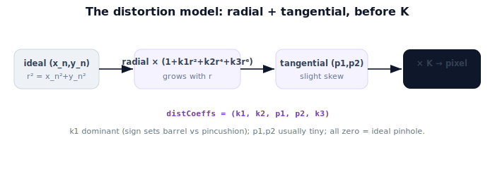

!!! abstract "You are here"
    **Module 3 — Camera Geometry and Robotic Perception**  ·  **Unit 5 — Lens Distortion**  ·  **Lesson 5.2 — Radial and Tangential Distortion**

# Lesson 5.2 — Radial and Tangential Distortion

## 1. Why This Matters

To correct distortion we first need a **model** of it — a small set of numbers that calibration can estimate and code can apply. The standard model (used by OpenCV and most toolkits) has two parts: **radial** distortion, the dominant barrel/pincushion bending from Lesson 5.1, and **tangential** distortion, a smaller effect from the lens and sensor not being perfectly parallel. Five coefficients usually suffice. Knowing the model lets you read a calibration file, apply distortion in projection, and remove it in undistortion (next lesson).

## 2. Physical Intuition

Radial distortion is the "balloon" effect: points get pushed outward or pulled inward depending on how far they are from the center, and the further out, the stronger the push. Tangential distortion is subtler — imagine the lens glued on at a very slight tilt, so the image is shifted a touch in one direction more than the symmetric radial model predicts. Radial is about *distance from center*; tangential is about *a slight sideways skew*. For most cameras radial dominates and tangential is a small correction, but precise work keeps both.

## 3. Mathematical Foundations

Start from the ideal normalized point $(x_n, y_n)$ with radius $r^2 = x_n^2 + y_n^2$. The **radial** model scales the point by a polynomial in $r^2$:

$$x_r = x_n\,(1 + k_1 r^2 + k_2 r^4 + k_3 r^6), \qquad y_r = y_n\,(1 + k_1 r^2 + k_2 r^4 + k_3 r^6).$$

The **tangential** model adds a small asymmetric term from lens/sensor misalignment:

$$x_d = x_r + \big[\,2 p_1 x_n y_n + p_2 (r^2 + 2 x_n^2)\,\big], \qquad y_d = y_r + \big[\,p_1 (r^2 + 2 y_n^2) + 2 p_2 x_n y_n\,\big].$$

The distorted normalized point $(x_d, y_d)$ then goes through $K$ to pixels. The coefficient vector is usually written $(k_1, k_2, p_1, p_2, k_3)$ — OpenCV's `distCoeffs` order. $k_1$ is the dominant term (sign sets barrel vs pincushion); $k_2, k_3$ refine the edges; $p_1, p_2$ are typically tiny. All zero recovers the ideal pinhole of Unit 4.

## 4. Visual Explanation

<figure markdown>
  { width="680" }
</figure>

## 5. Engineering Example

A calibration file for the robot's camera stores $K$ and `distCoeffs = (k1,k2,p1,p2,k3)`. The perception code passes both to OpenCV. A wide greenhouse lens might show $k_1 \approx -0.3$ (noticeable barrel), with $k_2, k_3$ small and $p_1, p_2$ near zero. Reading these tells an engineer at a glance how distorted the lens is and whether tangential terms matter for this camera.

## 6. Worked Example

Normalized point $(x_n, y_n) = (0.4, 0.3)$, so $r^2 = 0.16 + 0.09 = 0.25$. With $k_1 = -0.2$ and other coefficients zero: radial factor $= 1 + (-0.2)(0.25) = 0.95$. So $x_r = 0.4(0.95) = 0.38$, $y_r = 0.3(0.95) = 0.285$. Negative $k_1$ pulled the point *inward* (toward center) — pincushion-style for this sign convention on the forward map. With $k_1 = 0$ the point is unchanged (ideal). Tangential terms (here zero) would add a small sideways nudge.

## 7. Interactive Demonstration

<iframe src="../../demos/module03/lesson18_radial_tangential_distortion.html" title="Radial and Tangential Distortion interactive demo" style="width:100%;height:520px;border:1px solid #e2e8f0;border-radius:12px"></iframe>

[Open this demo in a new tab ↗](../demos/module03/lesson18_radial_tangential_distortion.html)

**Guided prediction.** For $(x_n,y_n)=(0.4,0.3)$, predict the radial factor with $k_1 = -0.2$ (others zero), then the distorted point. Predict the effect of doubling $r$ (a point twice as far from center) on the size of the correction. Confirm radial scales with $r^2$ and that $k_1=0$ leaves the point unchanged.

## 8. Coding Exercise

!!! tip "Run the hands-on notebook"
    `modules/module03/notebooks/M03_U05_L5_2_Radial_And_Tangential_Distortion.ipynb` — open in JupyterLab and run **Kernel → Restart & Run All**.

Implement `distort(x_n, y_n, k1,k2,k3, p1,p2)` returning $(x_d, y_d)$; verify all-zero coefficients are identity; show a grid of points warps outward/inward as $k_1$ flips sign; confirm the worked example gives $(0.38, 0.285)$.

## 9. Knowledge Check

Formative — unlimited attempts, immediate feedback; does not affect your grade.

<iframe src="../../quizzes/module03/lesson18_quiz.html" title="Radial and Tangential Distortion knowledge check" style="width:100%;height:720px;border:1px solid #e2e8f0;border-radius:12px"></iframe>

[Open this quiz in a new tab ↗](../quizzes/module03/lesson18_quiz.html)

A check on the radial polynomial, the tangential terms, the coefficient ordering, and that zeros recover the ideal pinhole.

## 10. Challenge Problem

Two lenses have $k_1 = +0.15$ and $k_1 = -0.15$ respectively (others zero). Describe how a grid of edge points moves for each, and which lens is barrel vs pincushion under this forward-map convention.

## 11. Common Mistakes

- Forgetting distortion acts on **normalized** coordinates, before $K$.
- Mixing up the coefficient order (it's $k_1,k_2,p_1,p_2,k_3$ in OpenCV).
- Expecting tangential terms to be large (they're usually tiny).

## 12. Key Takeaways

- **Radial:** $\times(1 + k_1 r^2 + k_2 r^4 + k_3 r^6)$; grows with radius; $k_1$ dominant.
- **Tangential:** small $(p_1, p_2)$ terms from lens/sensor misalignment.
- Coefficient vector $(k_1, k_2, p_1, p_2, k_3)$ = OpenCV's `distCoeffs`; all zero = ideal pinhole.
- Distortion is applied to normalized coordinates, **then** $K$ maps to pixels.

---

## AI Learning Companion

Copy any prompt below into ChatGPT, Claude, or another AI assistant.

**Tutor prompt** — explain it another way
```
Explain Lesson 5.2 (Module 3) — Radial and Tangential Distortion — with the radial polynomial (1+k1 r²+k2 r⁴+k3 r⁶) and the small tangential (p1,p2) terms. Show the coefficient order (k1,k2,p1,p2,k3) and that zeros = ideal pinhole.
```

**Practice prompt** — generate more exercises
```
Give me 6 exercises applying the radial+tangential distortion model to normalized points and interpreting coefficients. Include answers.
```

**Explore prompt** — connect it to the real world
```
Show me how a calibration file's distCoeffs are read and used by OpenCV, and when tangential terms actually matter.
```

## Global Learning Support

Need this lesson explained in another language? Copy one of the prompts below into an AI assistant. English remains the authoritative source.

**Supported languages (initial):** English · Español · 中文 (Simplified Chinese) · Türkçe

**Español**
```
I just completed Lesson 5.2 (Module 3) — Radial and Tangential Distortion.
Explain this lesson in Spanish. Keep robotics and mathematical terminology in English when appropriate.
Then provide: a summary, three practice questions, and one challenge problem.
```

**中文 (Simplified Chinese)**
```
I just completed Lesson 5.2 (Module 3) — Radial and Tangential Distortion.
Explain this lesson in Simplified Chinese. Keep mathematical notation unchanged.
Then provide: a summary, three practice questions, and one challenge problem.
```

**Türkçe**
```
I just completed Lesson 5.2 (Module 3) — Radial and Tangential Distortion.
Explain this lesson in Turkish. Keep robotics terminology in English where commonly used.
Then provide: a summary, three practice questions, and one challenge problem.
```

---

*Next lesson: 5.3 — Undistortion.*
