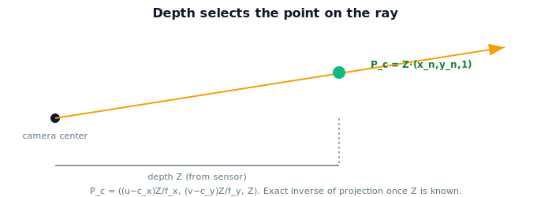

!!! abstract "You are here"
    **Module 3 — Camera Geometry and Robotic Perception**  ·  **Unit 6 — Back-Projection: Pixels to 3D**  ·  **Lesson 6.2 — Adding Depth Recovers a Point**

# Lesson 6.2 — Adding Depth Recovers a Point

## 1. Why This Matters

The ray told us *direction*; depth tells us *distance*. Put them together and the 3D point is fully determined — the inverse of projection is finally complete (in the camera frame). This is the moment perception becomes actionable: a pixel plus a depth becomes a real 3D location the robot can reach toward. Knowing exactly how depth slots into the ray is the core skill of this unit.

## 2. Physical Intuition

You're looking out along the ray through a fruit's pixel; you know the direction but not how far. Now someone hands you the distance — "that fruit is 0.3 m away in $Z$." Slide along the ray to that depth and you've located the fruit in 3D. Where does the distance come from? A **depth camera** (like a RealSense) measures $Z$ per pixel directly; **stereo** computes it from two views; sometimes **known geometry** (a fruit sits on a known plane) supplies it. The ray is from the lens math; depth is an extra measurement that completes the point.

## 3. Mathematical Foundations

From Lesson 6.1, the ray direction (undistorted) is $(x_n, y_n, 1)$ with $x_n=(u-c_x)/f_x$, $y_n=(v-c_y)/f_y$. If a depth sensor gives the camera-frame depth $Z_c = Z$ (the distance along the optical axis, i.e. the third coordinate), the 3D camera-frame point is simply

$$\mathbf{P}_c = Z \begin{bmatrix} x_n \\ y_n \\ 1 \end{bmatrix} = \begin{bmatrix} Z\,x_n \\ Z\,y_n \\ Z \end{bmatrix} = \begin{bmatrix} (u-c_x)\,Z/f_x \\ (v-c_y)\,Z/f_y \\ Z \end{bmatrix}.$$

This is exactly the projection of Unit 3 solved for $(X,Y,Z)$: from $u = f_x X/Z + c_x$ we get $X = (u-c_x)Z/f_x$, and likewise for $Y$. So **depth + pixel = camera-frame point**, an exact inverse once $Z$ is known. (Note: most depth cameras report $Z$ along the axis; some report range along the ray — convert if so. We assume axial $Z$.) This $\mathbf{P}_c$ is in the *camera* frame; Unit 7 moves it to the world.

## 4. Visual Explanation

<figure markdown>
  { width="680" }
</figure>

## 5. Engineering Example

The greenhouse robot's RGB-D camera gives, for each pixel, both a color (for the detector) and a depth $Z$. When the detector fires on a tomato at pixel $(480,160)$, the code reads the depth there (say $Z=0.3$ m) and computes $\mathbf{P}_c = (0.06, -0.03, 0.3)$ — the fruit's position *in the camera frame*. That single step, deproject-with-depth, is the workhorse of RGB-D perception and the bridge from "pixel detection" to "3D target."

## 6. Worked Example

Pixel $(480, 160)$, $K$ ($f_x=f_y=800$, principal point $(320,240)$), depth $Z = 0.3$ m. Direction: $x_n = (480-320)/800 = 0.2$, $y_n=(160-240)/800=-0.1$. Point: $\mathbf{P}_c = 0.3\,(0.2, -0.1, 1) = (0.06, -0.03, 0.3)$ m. If the depth reading were $Z=0.6$ instead, $\mathbf{P}_c = (0.12, -0.06, 0.6)$ — same pixel, the depth alone moved the recovered point. Round-trip: projecting $(0.06,-0.03,0.3)$ with $K$ returns $(480,160)$ ✓.

## 7. Interactive Demonstration

<iframe src="../../demos/module03/lesson22_adding_depth_recovers_point.html" title="Adding Depth Recovers a Point interactive demo" style="width:100%;height:520px;border:1px solid #e2e8f0;border-radius:12px"></iframe>

[Open this demo in a new tab ↗](../demos/module03/lesson22_adding_depth_recovers_point.html)

**Guided prediction.** For pixel $(480,160)$ and $K$ above, predict $\mathbf{P}_c$ at $Z=0.3$ and at $Z=0.5$. Predict what happens to $X$ and $Y$ as $Z$ grows (does the point move outward?). Confirm $\mathbf{P}_c = Z(x_n,y_n,1)$ and that projecting it returns the pixel.

## 8. Coding Exercise

!!! tip "Run the hands-on notebook"
    `modules/module03/notebooks/M03_U06_L6_2_Adding_Depth_Recovers_A_Point.ipynb` — open in JupyterLab and run **Kernel → Restart & Run All**.

Implement `deproject(u,v,Z,K)` returning $\mathbf{P}_c$; verify the worked example gives $(0.06,-0.03,0.3)$; round-trip with the Unit 4 projector to recover $(u,v)$; show two depths give two collinear points on the same ray.

## 9. Knowledge Check

Formative — unlimited attempts, immediate feedback; does not affect your grade.

<iframe src="../../quizzes/module03/lesson22_quiz.html" title="Adding Depth Recovers a Point knowledge check" style="width:100%;height:720px;border:1px solid #e2e8f0;border-radius:12px"></iframe>

[Open this quiz in a new tab ↗](../quizzes/module03/lesson22_quiz.html)

A check on combining ray + depth, the deprojection formula, and where depth comes from.

## 10. Challenge Problem

A depth sensor reports the **range along the ray** (Euclidean distance to the point), not the axial $Z$. Given that range $\rho$ and the ray direction, derive $Z$ and then $\mathbf{P}_c$. Why does using $\rho$ directly as $Z$ cause a (small, radius-dependent) error?

## 11. Common Mistakes

- Using range-along-ray as if it were axial $Z$ (off by the ray angle).
- Forgetting to undistort the pixel before deprojecting.
- Reporting $\mathbf{P}_c$ as a world point (it's still in the camera frame until Unit 7).

## 12. Key Takeaways

- **Ray + depth = point:** $\mathbf{P}_c = Z(x_n, y_n, 1) = ((u-c_x)Z/f_x,\ (v-c_y)Z/f_y,\ Z)$.
- This is the exact inverse of Unit 3's projection once $Z$ is known.
- Depth comes from a depth camera, stereo, or known geometry.
- $\mathbf{P}_c$ is in the **camera frame**; Unit 7 transforms it to the world.

---

## AI Learning Companion

Copy any prompt below into ChatGPT, Claude, or another AI assistant.

**Tutor prompt** — explain it another way
```
Explain Lesson 6.2 (Module 3) — Adding Depth Recovers a Point — as sliding along the ray to the measured depth. Show P_c = Z·(x_n,y_n,1) and where depth comes from (depth camera, stereo, geometry).
```

**Practice prompt** — generate more exercises
```
Give me 6 exercises deprojecting pixels with given depth and K into camera-frame points, including round-trip checks. Include answers.
```

**Explore prompt** — connect it to the real world
```
Show me how an RGB-D camera deprojects a fruit detection into a camera-frame 3D point and why this is the workhorse of perception.
```

## Global Learning Support

Need this lesson explained in another language? Copy one of the prompts below into an AI assistant. English remains the authoritative source.

**Supported languages (initial):** English · Español · 中文 (Simplified Chinese) · Türkçe

**Español**
```
I just completed Lesson 6.2 (Module 3) — Adding Depth Recovers a Point.
Explain this lesson in Spanish. Keep robotics and mathematical terminology in English when appropriate.
Then provide: a summary, three practice questions, and one challenge problem.
```

**中文 (Simplified Chinese)**
```
I just completed Lesson 6.2 (Module 3) — Adding Depth Recovers a Point.
Explain this lesson in Simplified Chinese. Keep mathematical notation unchanged.
Then provide: a summary, three practice questions, and one challenge problem.
```

**Türkçe**
```
I just completed Lesson 6.2 (Module 3) — Adding Depth Recovers a Point.
Explain this lesson in Turkish. Keep robotics terminology in English where commonly used.
Then provide: a summary, three practice questions, and one challenge problem.
```

---

*Next lesson: 6.3 — Back-Projection in Code.*
