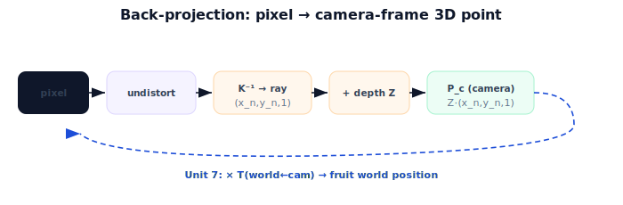

!!! abstract "You are here"
    **Module 3 — Camera Geometry and Robotic Perception**  ·  **Unit 6 — Back-Projection: Pixels to 3D**  ·  **Lesson 6.4 — Back-Projection (Unit 6 Recap)**

# Lesson 6.4 — Back-Projection (Unit 6 Recap)

*A short synthesis — no new mathematics. It ties Unit 6 together and points toward the world.*

---

## From pixel to 3D point

Unit 6 inverted the camera, as far as the camera frame:

> **A pixel back-projects to a ray $(x_n,y_n,1)$ via $K^{-1}$; depth $Z$ selects the point $\mathbf{P}_c = Z(x_n,y_n,1)$.**

Direction from the lens math, distance from a depth measurement — together a 3D camera-frame point.

## What Unit 6 established

| Lesson | Point |
|---|---|
| 6.1 A Pixel Is a Ray | Inverse of a pixel is a ray (many-to-one projection); direction $(x_n,y_n,1)$; depth unknown from one image. |
| 6.2 Adding Depth Recovers a Point | $\mathbf{P}_c = Z(x_n,y_n,1)$; depth from RGB-D / stereo / geometry. |
| 6.3 Back-Projection in Code | Vectorized deprojection, depth filtering, point clouds, round-trip verification. |

## Why this matters

The point $\mathbf{P}_c$ is in the **camera frame** — useful, but the robot acts in the **world/arm frame**. **Unit 7** carries $\mathbf{P}_c$ across the extrinsics chain from Module 2 ($T_{\text{world}\leftarrow\text{cam}}$) to get the fruit's world position. **Unit 8** runs the entire round trip end to end — detect, undistort, deproject, transform, reach — the module capstone. Back-projection is the inverse half's engine; Unit 7 connects it to where the robot lives.

## Visual Explanation

<figure markdown>
  { width="680" }
</figure>

## Interactive Demonstration

<iframe src="../../demos/module03/lesson24_back_projection_recap.html" title="Back-Projection (Unit 6 Recap) interactive demo" style="width:100%;height:520px;border:1px solid #e2e8f0;border-radius:12px"></iframe>

[Open this demo in a new tab ↗](../demos/module03/lesson24_back_projection_recap.html)

Unit 6 in one tool: project a 3D point to a pixel, then back-project with the same depth and recover it exactly.

## Coding Exercise

!!! tip "Run the hands-on notebook"
    `modules/module03/notebooks/M03_U06_L6_4_Back_Projection_Unit_6_Recap.ipynb` — open in JupyterLab and run **Kernel → Restart & Run All**.

A short consolidation: deproject a couple of pixels with depth to camera-frame points, verify round-trips, and note that the points are not yet in the world frame.

## Knowledge Check

Formative — unlimited attempts, immediate feedback; does not affect your grade.

<iframe src="../../quizzes/module03/lesson24_quiz.html" title="Back-Projection (Unit 6 Recap) knowledge check" style="width:100%;height:720px;border:1px solid #e2e8f0;border-radius:12px"></iframe>

[Open this quiz in a new tab ↗](../quizzes/module03/lesson24_quiz.html)

A brief consolidation quiz across Unit 6 (formative — unlimited attempts).

## Key Takeaways

- Pixel → ray $(x_n,y_n,1)$ via $K^{-1}$; **depth** selects the point.
- $\mathbf{P}_c = Z(x_n,y_n,1)$; verify with a round-trip to the pixel.
- The result is in the **camera frame**.
- Next: **Unit 7** transforms $\mathbf{P}_c$ to the world via Module 2 extrinsics.

---

## AI Learning Companion

Copy any prompt below into ChatGPT, Claude, or another AI assistant.

**Tutor prompt** — explain it another way
```
Summarize Unit 6 of Module 3: a pixel back-projects to a ray (x_n,y_n,1) via K⁻¹, and depth Z selects the camera-frame point P_c = Z(x_n,y_n,1). Note the point is still in the camera frame.
```

**Practice prompt** — generate more exercises
```
Give me a 10-question review of back-projection: rays, depth, deprojection, point clouds, and round-trip checks. Include answers.
```

**Explore prompt** — connect it to the real world
```
Show me how back-projection feeds the extrinsics chain to put a fruit detection into the robot's world frame.
```

## Global Learning Support

Need this lesson explained in another language? Copy one of the prompts below into an AI assistant. English remains the authoritative source.

**Supported languages (initial):** English · Español · 中文 (Simplified Chinese) · Türkçe

**Español**
```
I just completed Lesson 6.4 (Module 3) — Back-Projection (Unit 6 Recap).
Explain this lesson in Spanish. Keep robotics and mathematical terminology in English when appropriate.
Then provide: a summary, three practice questions, and one challenge problem.
```

**中文 (Simplified Chinese)**
```
I just completed Lesson 6.4 (Module 3) — Back-Projection (Unit 6 Recap).
Explain this lesson in Simplified Chinese. Keep mathematical notation unchanged.
Then provide: a summary, three practice questions, and one challenge problem.
```

**Türkçe**
```
I just completed Lesson 6.4 (Module 3) — Back-Projection (Unit 6 Recap).
Explain this lesson in Turkish. Keep robotics terminology in English where commonly used.
Then provide: a summary, three practice questions, and one challenge problem.
```

---

*Next: Unit 7 — From Pixels to the Robot.*
