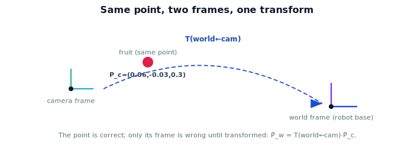

!!! abstract "You are here"
    **Module 3 — Camera Geometry and Robotic Perception**  ·  **Unit 7 — From Pixels to the Robot**  ·  **Lesson 7.1 — The Camera-Frame 3D Point**

# Lesson 7.1 — The Camera-Frame 3D Point

## 1. Why This Matters

Unit 6 ended with a 3D point $\mathbf{P}_c$ — the fruit, located. But "located" in *whose* coordinates? The camera's. The robot arm doesn't think in camera coordinates; it moves in the **world** (or its base) frame. A perfectly correct camera-frame point is useless to the arm until it's expressed in a frame the arm shares. This lesson nails down that distinction — the last gap between seeing and acting — and frames the transform problem that Unit 7 solves using Module 2.

## 2. Physical Intuition

Imagine the camera says "the tomato is 6 cm to my right, 3 cm up, 30 cm in front of me." That's a complete description — *relative to the camera*. But the arm is bolted somewhere else on the robot, possibly looking from a different angle. For the arm to reach the tomato, "6 cm to *my* right" (the camera's right) has to be re-expressed as "X cm along the world's axes." Same physical tomato, different coordinate description — exactly the change-of-frame idea from Module 1 ("the tomato has not moved, only the observer changed") and the machinery of Module 2.

## 3. Mathematical Foundations

From Unit 6, for an undistorted pixel with depth $Z$:

$$\mathbf{P}_c = \begin{bmatrix} (u-c_x)Z/f_x \\ (v-c_y)Z/f_y \\ Z \end{bmatrix} \quad\text{(camera frame)}.$$

The subscript $c$ is not decoration — it records the frame. The arm needs the same point in the world frame, $\mathbf{P}_w$. From Module 2, frames are related by a rigid transform $T \in SE(3)$:

$$\tilde{\mathbf{P}}_w = T_{w \leftarrow c}\,\tilde{\mathbf{P}}_c,$$

where $\tilde{\cdot}$ denotes homogeneous coordinates $(X,Y,Z,1)$ and $T_{w\leftarrow c}$ is the camera's **pose in the world** (the extrinsics). The camera-frame point is correct; it is simply *expressed in the wrong frame for acting*. Unit 7 supplies $T_{w\leftarrow c}$ and applies it. (Note: $T_{w\leftarrow c}$ is exactly the inverse of the $T_{c\leftarrow w}$ extrinsics used in the forward projection pipeline of Unit 4.)

## 4. Visual Explanation

<figure markdown>
  { width="680" }
</figure>

## 5. Engineering Example

The robot's perception node publishes detections in the camera frame (that's all the camera can know). A separate transform — measured once by calibration, or read from the robot's kinematics — relates the camera to the world. Software like ROS 2's `tf2` exists precisely to track these frame relationships so a camera-frame point can be looked up in any other frame on demand. Getting the frame label right is a constant source of real bugs: a correct number in the wrong frame sends the arm to the wrong place.

## 6. Worked Example

The camera reports $\mathbf{P}_c = (0.06, -0.03, 0.3)$ m for a tomato. The arm is asked to move there and misses by ~10 cm. Why? The number was handed to the arm controller *as if* it were a world-frame point, but it was a camera-frame point. The fix is not better detection — it's applying $T_{w\leftarrow c}$ first. Identifying "this is a frame error, not a perception error" is the lesson's core diagnostic skill.

## 7. Interactive Demonstration

<iframe src="../../demos/module03/lesson25_camera_frame_3d_point.html" title="The Camera-Frame 3D Point interactive demo" style="width:100%;height:520px;border:1px solid #e2e8f0;border-radius:12px"></iframe>

[Open this demo in a new tab ↗](../demos/module03/lesson25_camera_frame_3d_point.html)

**Guided prediction.** Using the figure, state in words what $T_{w\leftarrow c}$ must do to $\mathbf{P}_c$ (rotate + translate into world axes). Predict what happens if you skip it (point interpreted in the wrong frame). Confirm: the point is correct, only its frame is wrong.

## 8. Coding Exercise

!!! tip "Run the hands-on notebook"
    `modules/module03/notebooks/M03_U07_L7_1_The_Camera_Frame_3D_Point.ipynb` — open in JupyterLab and run **Kernel → Restart & Run All**.

Represent $\mathbf{P}_c$ as a homogeneous vector $(X,Y,Z,1)$; given a placeholder identity $T_{w\leftarrow c}=I$, confirm $\mathbf{P}_w=\mathbf{P}_c$ (camera coincides with world); then with a translation-only $T$, show $\mathbf{P}_w$ shifts accordingly. (Full chain in 7.2–7.3.)

## 9. Knowledge Check

Formative — unlimited attempts, immediate feedback; does not affect your grade.

<iframe src="../../quizzes/module03/lesson25_quiz.html" title="The Camera-Frame 3D Point knowledge check" style="width:100%;height:720px;border:1px solid #e2e8f0;border-radius:12px"></iframe>

[Open this quiz in a new tab ↗](../quizzes/module03/lesson25_quiz.html)

A check that a back-projected point is in the camera frame, why that's not actionable, and that a rigid transform $T_{w\leftarrow c}$ fixes it.

## 10. Challenge Problem

An engineer "fixes" arm misses by tweaking the detector. Explain why this can mask but not solve a frame error, and how you'd test whether the bug is in perception or in the frame transform.

## 11. Common Mistakes

- Treating $\mathbf{P}_c$ as a world point (the classic frame bug).
- Forgetting homogeneous coordinates when applying $T$.
- Confusing $T_{w\leftarrow c}$ (point camera→world) with $T_{c\leftarrow w}$ (its inverse, used in projection).

## 12. Key Takeaways

- Back-projection yields $\mathbf{P}_c$ in the **camera frame**.
- The arm needs $\mathbf{P}_w$; relate frames by a rigid transform $\tilde{\mathbf{P}}_w = T_{w\leftarrow c}\tilde{\mathbf{P}}_c$.
- The point is correct — only its **frame** is wrong until transformed.
- $T_{w\leftarrow c}$ is the camera's pose in the world (inverse of the projection extrinsics).

---

## AI Learning Companion

Copy any prompt below into ChatGPT, Claude, or another AI assistant.

**Tutor prompt** — explain it another way
```
Explain Lesson 7.1 (Module 3) — The Camera-Frame 3D Point — using "the tomato is 6cm to MY right" (camera frame) vs world frame. Show that P_c is correct but needs T(world←cam) to be actionable by the arm.
```

**Practice prompt** — generate more exercises
```
Give me 6 exercises distinguishing camera-frame from world-frame points and identifying frame errors. Include answers.
```

**Explore prompt** — connect it to the real world
```
Show me how ROS 2 tf2 tracks camera-to-world frames and why frame errors are a common robotics bug.
```

## Global Learning Support

Need this lesson explained in another language? Copy one of the prompts below into an AI assistant. English remains the authoritative source.

**Supported languages (initial):** English · Español · 中文 (Simplified Chinese) · Türkçe

**Español**
```
I just completed Lesson 7.1 (Module 3) — The Camera-Frame 3D Point.
Explain this lesson in Spanish. Keep robotics and mathematical terminology in English when appropriate.
Then provide: a summary, three practice questions, and one challenge problem.
```

**中文 (Simplified Chinese)**
```
I just completed Lesson 7.1 (Module 3) — The Camera-Frame 3D Point.
Explain this lesson in Simplified Chinese. Keep mathematical notation unchanged.
Then provide: a summary, three practice questions, and one challenge problem.
```

**Türkçe**
```
I just completed Lesson 7.1 (Module 3) — The Camera-Frame 3D Point.
Explain this lesson in Turkish. Keep robotics terminology in English where commonly used.
Then provide: a summary, three practice questions, and one challenge problem.
```

---

*Next lesson: 7.2 — Bridging to Module 2 (the extrinsics chain).*
