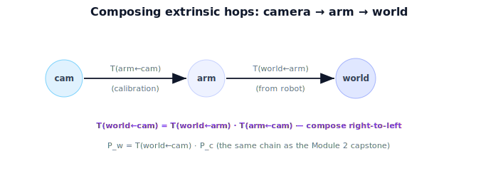

!!! abstract "You are here"
    **Module 3 — Camera Geometry and Robotic Perception**  ·  **Unit 7 — From Pixels to the Robot**  ·  **Lesson 7.2 — Bridging to Module 2 (The Extrinsics Chain)**

# Lesson 7.2 — Bridging to Module 2 (The Extrinsics Chain)

## 1. Why This Matters

We need $T_{w\leftarrow c}$ — and we already built exactly this machinery in Module 2. The camera's pose, frame composition, and the world←arm←camera chain are all SE(3) transforms. This lesson explicitly connects Module 3's perception output to Module 2's transform algebra so you reuse, not reinvent. By the end you can write the full chain that turns a camera-frame point into a world-frame point.

## 2. Physical Intuition

The camera sits on the robot — often on the arm or a mast. So "camera relative to world" naturally splits into hops you already know: camera relative to the arm mount, and arm mount relative to the world. Chaining hops is what Module 2 composition does: walk from the camera frame, through the arm frame, to the world frame, multiplying the transform for each hop. Each hop is a rigid motion; their product is the single transform $T_{w\leftarrow c}$.

## 3. Mathematical Foundations

In Module 2's capstone we wrote the *placement* chain. The perception direction uses the same poses to express a measured point in the world. If the camera is mounted on the arm:

$$T_{w\leftarrow c} = T_{w\leftarrow a}\,T_{a\leftarrow c},$$

where $T_{a\leftarrow c}$ is the (fixed, calibrated) camera-to-arm transform and $T_{w\leftarrow a}$ is the arm's pose in the world (from the robot). Then the fruit's world position is

$$\tilde{\mathbf{P}}_w = T_{w\leftarrow c}\,\tilde{\mathbf{P}}_c = T_{w\leftarrow a}\,T_{a\leftarrow c}\,\tilde{\mathbf{P}}_c.$$

Each $T$ is a $4\times4$ SE(3) matrix $\begin{bmatrix} R & \mathbf{t} \\ \mathbf{0} & 1\end{bmatrix}$ from Module 2; composition is matrix multiplication, read right-to-left (camera → arm → world). This is the *same* chain as the Module 2 capstone, now feeding a perceived point instead of a planned one. If the camera is world-fixed (on a mast), $T_{w\leftarrow c}$ is a single calibrated pose with no arm hop.

## 4. Visual Explanation

<figure markdown>
  { width="680" }
</figure>

## 5. Engineering Example

On the greenhouse robot, $T_{a\leftarrow c}$ comes from a one-time hand-eye calibration (camera bolted to the arm), and $T_{w\leftarrow a}$ is updated every cycle from the arm's joints (forward kinematics — Module 4!). The perception node composes them to publish fruit positions in the world frame. This is the seam where Module 3 (perception) meets Module 2 (transforms) and previews Module 4 (where $T_{w\leftarrow a}$ comes from).

## 6. Worked Example

Camera-frame point $\mathbf{P}_c = (0.06, -0.03, 0.3)$. Suppose $T_{a\leftarrow c}$ is identity rotation with translation $(0,0,0.1)$ (camera 10 cm in front of the arm origin along its $z$), and $T_{w\leftarrow a}$ is identity rotation with translation $(1.0, 0.5, 0)$ (arm origin in the world). Then $T_{a\leftarrow c}\tilde{\mathbf P}_c = (0.06,-0.03,0.4,1)$, and $T_{w\leftarrow a}(0.06,-0.03,0.4,1) = (1.06, 0.47, 0.4, 1)$. So $\mathbf{P}_w = (1.06, 0.47, 0.4)$ — the same arithmetic as the Module 2 capstone, now driven by a perceived point.

## 7. Interactive Demonstration

<iframe src="../../demos/module03/lesson26_extrinsics_chain.html" title="Bridging to Module 2 (The Extrinsics Chain) interactive demo" style="width:100%;height:520px;border:1px solid #e2e8f0;border-radius:12px"></iframe>

[Open this demo in a new tab ↗](../demos/module03/lesson26_extrinsics_chain.html)

**Guided prediction.** Using the figure, predict the order of multiplication for camera→arm→world. For the worked example, predict $\mathbf{P}_w$ after each hop. Confirm composition is right-to-left and the result matches.

## 8. Coding Exercise

!!! tip "Run the hands-on notebook"
    `modules/module03/notebooks/M03_U07_L7_2_Bridging_To_Module_2.ipynb` — open in JupyterLab and run **Kernel → Restart & Run All**.

Build $4\times4$ SE(3) matrices for $T_{a\leftarrow c}$ and $T_{w\leftarrow a}$ (reuse Module 2 helpers); compose $T_{w\leftarrow c}=T_{w\leftarrow a}T_{a\leftarrow c}$; apply to $\tilde{\mathbf P}_c$; verify $\mathbf{P}_w=(1.06,0.47,0.4)$ for the worked example.

## 9. Knowledge Check

Formative — unlimited attempts, immediate feedback; does not affect your grade.

<iframe src="../../quizzes/module03/lesson26_quiz.html" title="Bridging to Module 2 (The Extrinsics Chain) knowledge check" style="width:100%;height:720px;border:1px solid #e2e8f0;border-radius:12px"></iframe>

[Open this quiz in a new tab ↗](../quizzes/module03/lesson26_quiz.html)

A check on identifying extrinsics as SE(3), composing the chain, and the right-to-left order.

## 10. Challenge Problem

The camera is on a fixed mast, not the arm. Rewrite the chain with a single $T_{w\leftarrow c}$ and explain why no arm hop is needed — and what changes if the mast itself can pan/tilt.

## 11. Common Mistakes

- Multiplying transforms in the wrong order (it's right-to-left).
- Using $T_{c\leftarrow a}$ where $T_{a\leftarrow c}$ is needed (inverse).
- Forgetting the camera-to-mount transform is from calibration, not detection.

## 12. Key Takeaways

- $T_{w\leftarrow c}$ is a **Module 2 SE(3) transform** (the camera's pose in the world).
- Compose hops: $T_{w\leftarrow c}=T_{w\leftarrow a}T_{a\leftarrow c}$, read right-to-left.
- $\mathbf{P}_w = T_{w\leftarrow c}\,\mathbf{P}_c$ — the same chain as the Module 2 capstone.
- $T_{a\leftarrow c}$ from calibration; $T_{w\leftarrow a}$ from the robot (Module 4 will compute it).

---

## AI Learning Companion

Copy any prompt below into ChatGPT, Claude, or another AI assistant.

**Tutor prompt** — explain it another way
```
Explain Lesson 7.2 (Module 3) — Bridging to Module 2 — as composing SE(3) hops camera→arm→world to get T(world←cam), then P_w = T(world←cam)·P_c. Emphasize right-to-left composition and reuse of Module 2.
```

**Practice prompt** — generate more exercises
```
Give me 6 exercises composing camera→arm→world transforms and applying them to a camera-frame point. Include answers.
```

**Explore prompt** — connect it to the real world
```
Show me how hand-eye calibration gives T(arm←cam) and how forward kinematics (Module 4) gives T(world←arm) on a real robot.
```

## Global Learning Support

Need this lesson explained in another language? Copy one of the prompts below into an AI assistant. English remains the authoritative source.

**Supported languages (initial):** English · Español · 中文 (Simplified Chinese) · Türkçe

**Español**
```
I just completed Lesson 7.2 (Module 3) — Bridging to Module 2 (the extrinsics chain).
Explain this lesson in Spanish. Keep robotics and mathematical terminology in English when appropriate.
Then provide: a summary, three practice questions, and one challenge problem.
```

**中文 (Simplified Chinese)**
```
I just completed Lesson 7.2 (Module 3) — Bridging to Module 2 (the extrinsics chain).
Explain this lesson in Simplified Chinese. Keep mathematical notation unchanged.
Then provide: a summary, three practice questions, and one challenge problem.
```

**Türkçe**
```
I just completed Lesson 7.2 (Module 3) — Bridging to Module 2 (the extrinsics chain).
Explain this lesson in Turkish. Keep robotics terminology in English where commonly used.
Then provide: a summary, three practice questions, and one challenge problem.
```

---

*Next lesson: 7.3 — Estimating the Fruit's World Position.*
