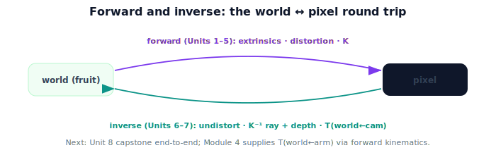

!!! abstract "You are here"
    **Module 3 — Camera Geometry and Robotic Perception**  ·  **Unit 7 — From Pixels to the Robot**  ·  **Lesson 7.4 — From Pixels to the Robot (Unit 7 Recap)**

# Lesson 7.4 — From Pixels to the Robot (Unit 7 Recap)

*A short synthesis — no new mathematics. It ties Unit 7 together and sets up the capstone.*

---

## Perception meets transforms

Unit 7 closed the loop between Module 3 and Module 2:

> **A back-projected point is in the camera frame; the Module 2 extrinsics chain $T_{w\leftarrow c}=T_{w\leftarrow a}T_{a\leftarrow c}$ carries it to the world frame — the fruit's actionable position.**

## What Unit 7 established

| Lesson | Point |
|---|---|
| 7.1 The Camera-Frame 3D Point | $\mathbf{P}_c$ is correct but in the camera frame; not actionable until transformed. |
| 7.2 Bridging to Module 2 | $T_{w\leftarrow c}$ is an SE(3) pose; compose camera→arm→world (right-to-left). |
| 7.3 Estimating the Fruit's World Position | Full pipeline: undistort → back-project (+depth) → transform; sanity-check. |

## The full pipeline (Module 3 in one line)

$$\tilde{\mathbf{P}}_w = T_{w\leftarrow c}\,\big[\,Z\cdot K^{-1}\,\text{undistort}(u,v)\,\big].$$

Forward (Units 1–5) turned world into pixels; inverse (Units 6–7) turns pixels back into the world, given depth and the camera's pose.

## Why this matters

**Unit 8** runs this end to end as the module **mini project**: detect a fruit, undistort, back-project with depth, transform to the world, verify, and visualize — the capstone integrating Module 3 (perception) with Module 2 (transforms). It also names the open question that launches **Module 4**: where does $T_{w\leftarrow a}$ come from? From the robot's joints, via **forward kinematics** — the next module.

## Visual Explanation

<figure markdown>
  { width="680" }
</figure>

## Interactive Demonstration

<iframe src="../../demos/module03/lesson28_pixels_to_robot_recap.html" title="From Pixels to the Robot (Unit 7 Recap) interactive demo" style="width:100%;height:520px;border:1px solid #e2e8f0;border-radius:12px"></iframe>

[Open this demo in a new tab ↗](../demos/module03/lesson28_pixels_to_robot_recap.html)

Unit 7 in one tool: a pixel + depth becomes a camera-frame point, then rides the extrinsics chain to a world target.

## Coding Exercise

!!! tip "Run the hands-on notebook"
    `modules/module03/notebooks/M03_U07_L7_4_From_Pixels_To_The_Robot_Unit_7_Recap.ipynb` — open in JupyterLab and run **Kernel → Restart & Run All**.

A short consolidation: run `pixel_to_world` on the worked example, confirm $\mathbf{P}_w=(1.06,0.47,0.4)$, distance preservation, and re-projection.

## Knowledge Check

Formative — unlimited attempts, immediate feedback; does not affect your grade.

<iframe src="../../quizzes/module03/lesson28_quiz.html" title="From Pixels to the Robot (Unit 7 Recap) knowledge check" style="width:100%;height:720px;border:1px solid #e2e8f0;border-radius:12px"></iframe>

[Open this quiz in a new tab ↗](../quizzes/module03/lesson28_quiz.html)

A brief consolidation quiz across Unit 7 (formative — unlimited attempts).

## Key Takeaways

- $\mathbf{P}_c$ (camera) → $\mathbf{P}_w$ (world) via $T_{w\leftarrow c}$, composed from Module 2 poses.
- Full Module 3 pipeline: undistort → back-project (+depth) → transform.
- Next: **Unit 8** capstone end-to-end; **Module 4** supplies $T_{w\leftarrow a}$ via forward kinematics.

---

## AI Learning Companion

Copy any prompt below into ChatGPT, Claude, or another AI assistant.

**Tutor prompt** — explain it another way
```
Summarize Unit 7 of Module 3: a camera-frame point P_c becomes a world-frame target via T(world←cam) from Module 2. State the full pixel→world pipeline and preview the Unit 8 capstone and Module 4 (forward kinematics).
```

**Practice prompt** — generate more exercises
```
Give me a 10-question review of camera→world transforms and the full pixel-to-world pipeline. Include answers.
```

**Explore prompt** — connect it to the real world
```
Show me how perception (Module 3) and transforms (Module 2) combine in a real harvesting robot, and what forward kinematics (Module 4) adds.
```

## Global Learning Support

Need this lesson explained in another language? Copy one of the prompts below into an AI assistant. English remains the authoritative source.

**Supported languages (initial):** English · Español · 中文 (Simplified Chinese) · Türkçe

**Español**
```
I just completed Lesson 7.4 (Module 3) — From Pixels to the Robot (Unit 7 Recap).
Explain this lesson in Spanish. Keep robotics and mathematical terminology in English when appropriate.
Then provide: a summary, three practice questions, and one challenge problem.
```

**中文 (Simplified Chinese)**
```
I just completed Lesson 7.4 (Module 3) — From Pixels to the Robot (Unit 7 Recap).
Explain this lesson in Simplified Chinese. Keep mathematical notation unchanged.
Then provide: a summary, three practice questions, and one challenge problem.
```

**Türkçe**
```
I just completed Lesson 7.4 (Module 3) — From Pixels to the Robot (Unit 7 Recap).
Explain this lesson in Turkish. Keep robotics terminology in English where commonly used.
Then provide: a summary, three practice questions, and one challenge problem.
```

---

*Next: Unit 8 — Mini Project: See the Fruit, Place It in the World.*
