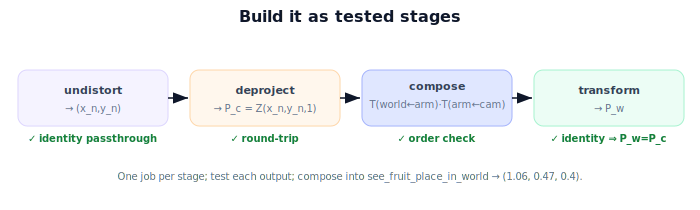

!!! abstract "You are here"
    **Module 3 — Camera Geometry and Robotic Perception**  ·  **Unit 8 — Mini Project: See the Fruit, Place It in the World**  ·  **Lesson 8.2 — Building the Perception → World Pipeline**

# Lesson 8.2 — Building the Perception → World Pipeline

## 1. Why This Matters

A pipeline you can't run isn't a capability. This lesson turns the 8.1 contract into working code: small, tested stage functions, composed into one `see_fruit_place_in_world` call. Building it stage-by-stage (each verified before the next) is how robust perception code is actually written — and how you debug it when a number looks wrong.

## 2. Physical Intuition

Think of an assembly line. Station 1 cleans the pixel (undistort). Station 2 turns it into a 3D point using depth (back-project). Station 3 carries that point into the world (transform). Each station has one job and a check at its output, so if the final position is wrong you know which station to inspect. We assemble the line, then run the canonical part through it and confirm it comes out where 8.1 said it should.

## 3. Mathematical Foundations

The stages, each a function:

- `undistort(u,v,K,dist) → (x_n,y_n)` — iterative inversion of the distortion model (Unit 5).
- `deproject(x_n,y_n,Z) → P_c = Z(x_n,y_n,1)` (Unit 6).
- `se3(R,t) → 4×4 T`; `compose(T_wa,T_ac) → T_wc` (Module 2).
- `transform(T_wc, P_c) → P_w` via homogeneous coordinates (Unit 7).

Composed:

$$\mathbf{P}_w = \text{transform}\big(T_{w\leftarrow a}T_{a\leftarrow c},\ \text{deproject}(\text{undistort}(u_d,v_d,K,\text{dist}),\ Z)\big).$$

Each stage is independently testable (identity distortion = passthrough; identity extrinsics ⇒ $\mathbf{P}_w=\mathbf{P}_c$; etc.), and the composition must reproduce the canonical $\mathbf{P}_w=(1.06,0.47,0.4)$.

## 4. Visual Explanation

<figure markdown>
  { width="680" }
</figure>

## 5. Engineering Example

Production perception nodes are built exactly this way: composable transforms (often via `tf2`), a deprojection helper, and an undistortion step, each unit-tested, then wired together. Keeping stages separate means a depth-alignment fix or a recalibration only touches one stage. The canonical reference doubles as a regression test that runs in CI.

## 6. Worked Example

Run the canonical inputs through the implemented stages: `undistort(480,160,...)` → $(0.2,-0.1)$ (no distortion in the canonical case); `deproject(...,0.3)` → $(0.06,-0.03,0.3)$; `compose(T_wa,T_ac)` → $T_{w\leftarrow c}$ with translation $(1.0,0.5,0.1)$, identity rotation; `transform(...)` → $(1.06,0.47,0.4)$. Output matches 8.1 ✓. Add a nonzero $k_1$ and confirm undistortion changes only the first stage's output, propagating predictably.

## 7. Interactive Demonstration

<iframe src="../../demos/module03/lesson30_building_perception_pipeline.html" title="Building the Perception → World Pipeline interactive demo" style="width:100%;height:520px;border:1px solid #e2e8f0;border-radius:12px"></iframe>

[Open this demo in a new tab ↗](../demos/module03/lesson30_building_perception_pipeline.html)

**Guided prediction.** Predict the output of each stage for the canonical inputs before running. Predict which stage's output changes if you set $T_{a\leftarrow c}$ rotation to a 90° yaw. Confirm by running the cells.

## 8. Coding Exercise

!!! tip "Run the hands-on notebook"
    `modules/module03/notebooks/M03_U08_L8_2_Building_The_Perception_World_Pipeline.ipynb` — open in JupyterLab and run **Kernel → Restart & Run All**.

Implement the four stage functions and `see_fruit_place_in_world`; unit-test each stage (identity cases); assert the composition yields $(1.06,0.47,0.4)$; add a distortion case and confirm only the undistort stage's output shifts.

## 9. Knowledge Check

Formative — unlimited attempts, immediate feedback; does not affect your grade.

<iframe src="../../quizzes/module03/lesson30_quiz.html" title="Building the Perception → World Pipeline knowledge check" style="width:100%;height:720px;border:1px solid #e2e8f0;border-radius:12px"></iframe>

[Open this quiz in a new tab ↗](../quizzes/module03/lesson30_quiz.html)

A check on the stage decomposition, the composition formula, and per-stage testing.

## 10. Challenge Problem

Refactor `transform` to accept and return *batches* of points (an $N\times3$ array) so the pipeline can place many detected fruits at once. What shape conventions keep the matrix multiply correct?

## 11. Common Mistakes

- Composing extrinsics in the wrong order (right-to-left: $T_{w\leftarrow a}T_{a\leftarrow c}$).
- Forgetting homogeneous coordinates in `transform`.
- Testing only the whole pipeline (test each stage so failures localize).

## 12. Key Takeaways

- Build the capstone as tested stages: undistort → deproject → compose → transform.
- Composition: $\mathbf{P}_w=\text{transform}(T_{w\leftarrow a}T_{a\leftarrow c},\text{deproject}(\text{undistort}(\cdot),Z))$.
- Reproduce the canonical $\mathbf{P}_w=(1.06,0.47,0.4)$.
- Per-stage tests localize bugs; the reference doubles as a regression test.

---

## AI Learning Companion

Copy any prompt below into ChatGPT, Claude, or another AI assistant.

**Tutor prompt** — explain it another way
```
Explain Lesson 8.2 (Module 3) — Building the Perception→World Pipeline — as composable, individually-tested stages (undistort, deproject, compose extrinsics, transform) that reproduce P_w=(1.06,0.47,0.4).
```

**Practice prompt** — generate more exercises
```
Give me 5 implementation tasks building and testing pixel-to-world pipeline stages, including identity-case tests. Include answers.
```

**Explore prompt** — connect it to the real world
```
Show me how production perception nodes structure deprojection + transforms with tf2 and unit tests, and why per-stage testing matters.
```

## Global Learning Support

Need this lesson explained in another language? Copy one of the prompts below into an AI assistant. English remains the authoritative source.

**Supported languages (initial):** English · Español · 中文 (Simplified Chinese) · Türkçe

**Español**
```
I just completed Lesson 8.2 (Module 3) — Building the Perception→World Pipeline.
Explain this lesson in Spanish. Keep robotics and mathematical terminology in English when appropriate.
Then provide: a summary, three practice questions, and one challenge problem.
```

**中文 (Simplified Chinese)**
```
I just completed Lesson 8.2 (Module 3) — Building the Perception→World Pipeline.
Explain this lesson in Simplified Chinese. Keep mathematical notation unchanged.
Then provide: a summary, three practice questions, and one challenge problem.
```

**Türkçe**
```
I just completed Lesson 8.2 (Module 3) — Building the Perception→World Pipeline.
Explain this lesson in Turkish. Keep robotics terminology in English where commonly used.
Then provide: a summary, three practice questions, and one challenge problem.
```

---

*Next lesson: 8.3 — Verifying and Visualizing.*
