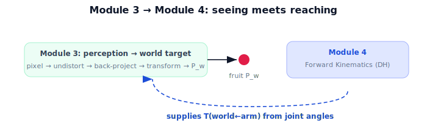

!!! abstract "You are here"
    **Module 3 — Camera Geometry and Robotic Perception**  ·  **Unit 8 — Mini Project: See the Fruit, Place It in the World**  ·  **Lesson 8.4 — Wrap-Up and the Road to Kinematics**

# Lesson 8.4 — Wrap-Up and the Road to Kinematics

*A short synthesis — no new mathematics. It closes Module 3 and points to Module 4.*

---

## What Module 3 accomplished

You can now turn a fruit detection into a **verified world position**:

> **pixel → undistort → back-project (+depth) → transform → verify → world position.**

That is the perception spine of a harvesting robot — the bridge from a camera image to a 3D target the arm can act on.

## The arc of the module

| Unit | Contribution |
|---|---|
| 1 Why Perception | Images discard depth; perception must recover 3D. |
| 2 Pinhole Camera | Projection keeps direction, divides by Z. |
| 3 Camera Intrinsics K | Metric rays → pixels via $K$. |
| 4 Projection in Practice | Full forward pipeline; OpenCV-verified (midpoint). |
| 5 Lens Distortion | Real lenses bend; model + undistort. |
| 6 Back-Projection | Pixel = ray; depth recovers the point. |
| 7 From Pixels to the Robot | Camera frame → world via Module 2 extrinsics. |
| 8 Mini Project | End-to-end, verified pixel-to-world capstone. |

## What perception gives — and what it doesn't

Module 3 delivers $\mathbf{P}_w$ *given* the camera's pose $T_{w\leftarrow c}=T_{w\leftarrow a}T_{a\leftarrow c}$. The calibration part $T_{a\leftarrow c}$ is fixed. But $T_{w\leftarrow a}$ — the **arm's pose in the world** — changes every time the arm moves, and Module 3 simply *assumed* it was available. Where does it come from? From the robot's joint angles, through the geometry of its links.

## The road to Module 4

**Module 4 — Forward Kinematics using Denavit–Hartenberg Parameters** answers exactly that: given the joint angles, compute $T_{w\leftarrow a}$ (and the pose of every link). It is the missing supplier of the transform Module 3 leaned on. With perception (Module 3) producing world targets and kinematics (Module 4) producing the arm's pose, the robot can finally connect *seeing* to *reaching*.

## Visual Explanation

<figure markdown>
  { width="680" }
</figure>

## Interactive Demonstration

<iframe src="../../demos/module03/lesson32_wrap_up_kinematics.html" title="Wrap-Up and the Road to Kinematics interactive demo" style="width:100%;height:520px;border:1px solid #e2e8f0;border-radius:12px"></iframe>

[Open this demo in a new tab ↗](../demos/module03/lesson32_wrap_up_kinematics.html)

The whole perception journey in one view: a pixel + depth becomes a world target the robot can aim at — the reach itself is the next module.

## Coding Exercise

!!! tip "Run the hands-on notebook"
    `modules/module03/notebooks/M03_U08_L8_4_Wrap_Up_And_The_Road_To_Kinematics.ipynb` — open in JupyterLab and run **Kernel → Restart & Run All**.

A short consolidation: run the full `see_fruit_place_in_world` + `verify` on the canonical inputs one last time, print $\mathbf{P}_w$ and all checks, and note (in a comment) that $T_{w\leftarrow a}$ was given — Module 4 will compute it.

## Knowledge Check

Formative — unlimited attempts, immediate feedback; does not affect your grade.

<iframe src="../../quizzes/module03/lesson32_quiz.html" title="Wrap-Up and the Road to Kinematics knowledge check" style="width:100%;height:720px;border:1px solid #e2e8f0;border-radius:12px"></iframe>

[Open this quiz in a new tab ↗](../quizzes/module03/lesson32_quiz.html)

A brief consolidation quiz across Module 3 (formative — unlimited attempts).

## Key Takeaways

- Module 3: a verified **pixel → world position** pipeline.
- Perception assumed $T_{w\leftarrow a}$; it does not produce it.
- **Module 4 (forward kinematics, DH parameters)** computes $T_{w\leftarrow a}$ from joint angles.
- Perception + kinematics together connect seeing to reaching.

---

## AI Learning Companion

Copy any prompt below into ChatGPT, Claude, or another AI assistant.

**Tutor prompt** — explain it another way
```
Summarize Module 3: the verified pixel→world pipeline (undistort, back-project+depth, transform, verify). Explain that it assumed the arm's pose T(world←arm), and that Module 4 (forward kinematics, DH parameters) computes it from joint angles.
```

**Practice prompt** — generate more exercises
```
Give me a 12-question cumulative review of Module 3 (perception): projection, intrinsics, distortion, back-projection, extrinsics, and the capstone. Include answers.
```

**Explore prompt** — connect it to the real world
```
Show me how a harvesting robot combines Module 3 perception with Module 4 forward kinematics to turn a fruit detection into a reachable arm target.
```

## Global Learning Support

Need this lesson explained in another language? Copy one of the prompts below into an AI assistant. English remains the authoritative source.

**Supported languages (initial):** English · Español · 中文 (Simplified Chinese) · Türkçe

**Español**
```
I just completed Lesson 8.4 (Module 3) — Wrap-Up and the Road to Kinematics.
Explain this lesson in Spanish. Keep robotics and mathematical terminology in English when appropriate.
Then provide: a summary, three practice questions, and one challenge problem.
```

**中文 (Simplified Chinese)**
```
I just completed Lesson 8.4 (Module 3) — Wrap-Up and the Road to Kinematics.
Explain this lesson in Simplified Chinese. Keep mathematical notation unchanged.
Then provide: a summary, three practice questions, and one challenge problem.
```

**Türkçe**
```
I just completed Lesson 8.4 (Module 3) — Wrap-Up and the Road to Kinematics.
Explain this lesson in Turkish. Keep robotics terminology in English where commonly used.
Then provide: a summary, three practice questions, and one challenge problem.
```

---

*End of Module 3. Next: Module 4 — Forward Kinematics using Denavit–Hartenberg Parameters.*
